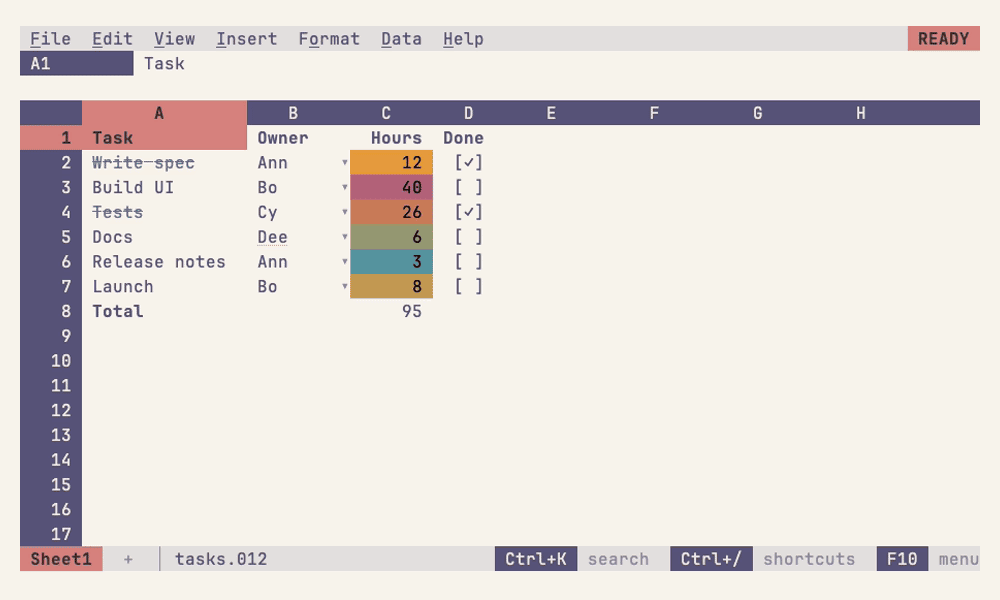
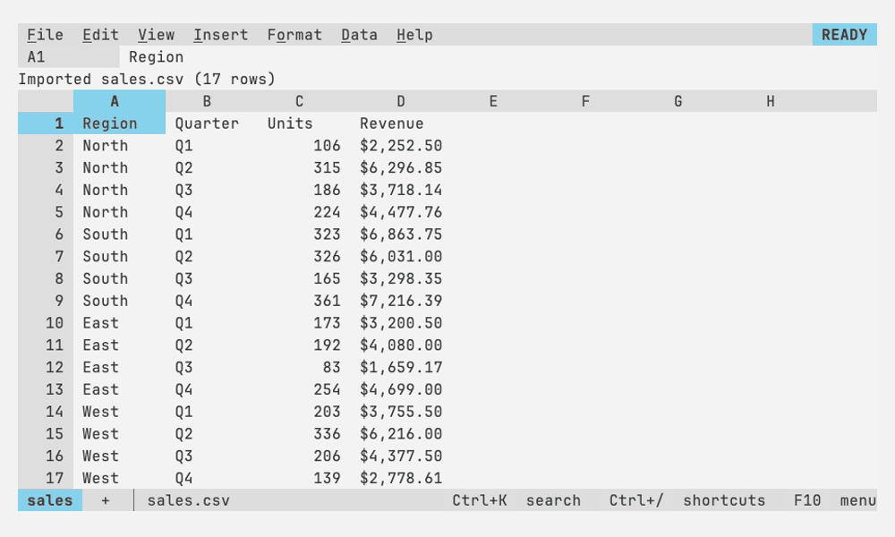
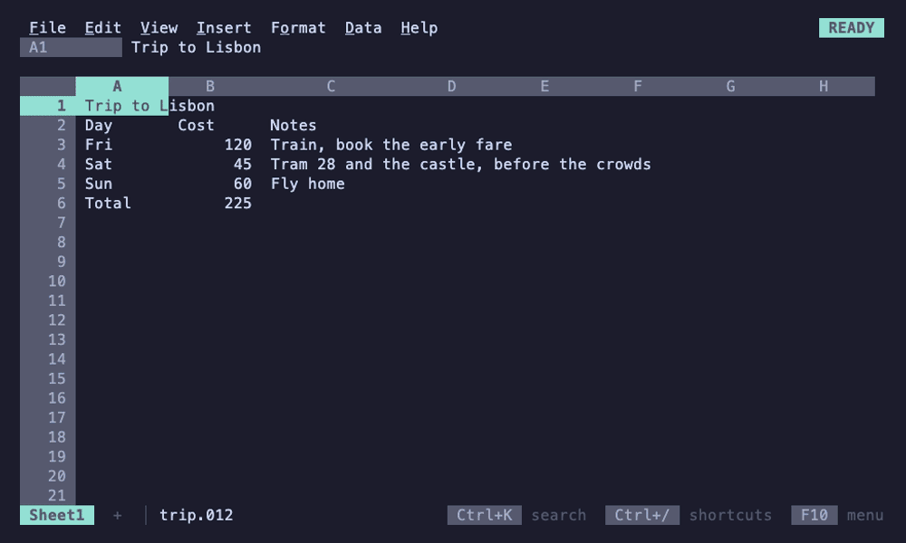
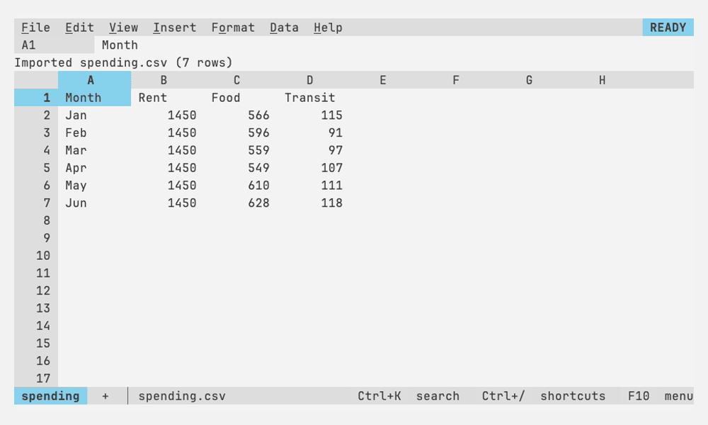
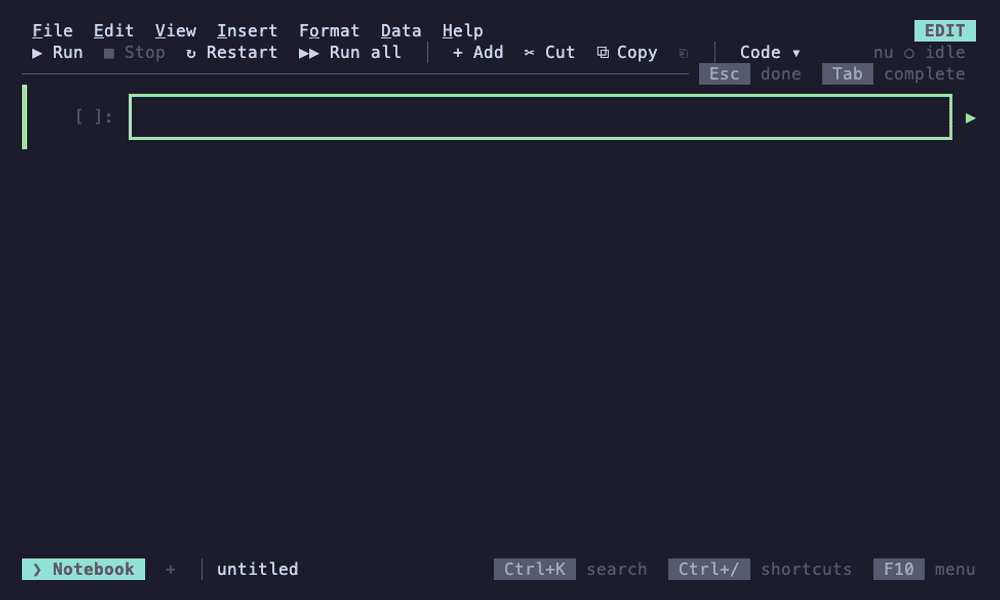

# 012

A spreadsheet for the terminal with a Lotus 1-2-3 look and Google Sheets
behavior, built on [Bubble Tea v2](https://github.com/charmbracelet/bubbletea).

Inside the grid it works the way Sheets does: typing replaces a cell, `=`
starts a formula, Enter and Tab move you on, Shift+arrows and the mouse
select, and Sheets' shortcuts do what you expect. Around the grid, the
control panel, the mode indicator and the character grid keep 1-2-3's look.
It is one pure-Go binary.


## Install

```sh
go install github.com/FelineStateMachine/012/cmd/012@latest
```

Then run `012`, or `012 budget.012` to open a sheet. F1 shows every
shortcut, F10 or Alt+letter opens the menus, and Ctrl+K searches every
command. [Install and run](docs/getting-started/install.md) has the
rest: building from a clone, importing files, `012 serve` and settings.

## A short tour

- **Formulas as in Sheets**, with [Sheets' functions](docs/reference/functions.md),
  suggestions and argument hints, pointing at cells with the arrows or the
  mouse, named ranges, references between sheets, arrays that spill
  (FILTER, SORT, UNIQUE, LAMBDA), optional decimal
  arithmetic for money, and undo for everything
  ([formulas](docs/formulas/README.md)); numbers, dates and formulas
  typed and shown in a [locale](docs/sheets/locale.md) per file.
- **Data tools**: freeze, sort, filter, find and replace, conditional
  formatting, dropdowns and checkboxes, notes, protected ranges, and live
  pivot tables ([working with data](docs/sheets/README.md)); wrapped
  text, borders and merged cells drawn with the terminal's box-drawing
  lines ([formatting](docs/sheets/formatting.md#wrapping)).
- **Charts** that float over the grid and follow their data, drawn as real
  images in kitty, Ghostty and WezTerm and as text elsewhere
  ([charts](docs/sheets/charts.md)).
- **Files**: a diff-friendly JSON format, import from CSV, TSV, JSON,
  nushell's NUON, XLSX, SQLite, Parquet and Lotus 1-2-3, export to CSV,
  TSV, JSON, NUON, XLSX and SQLite ([files](docs/files/README.md)).
- **A stage in a pipeline**: `ls | to nuon | 012 --pipe | from nuon`
  edits a table on the terminal and sends it on with its types
  ([nushell and pipelines](docs/terminal/nushell.md)).
- **Nushell notebooks**: `012 nu` (or `!` in any workbook) runs nushell
  pipelines whose tables become live, named regions of the sheet;
  `$r1` reads one in the next command, and refreshing it runs what reads
  it ([notebooks](docs/terminal/nushell.md#notebooks)).
- **Macros**, recorded or written as Starlark scripts saved with the sheet
  ([macros](docs/sheets/macros.md)).
- **Made for terminals**: the mouse, hyperlinks, the system clipboard over
  SSH, your terminal's colors or any of hundreds of schemes, optional vim
  keys, and `012 serve` to reach your sheets over SSH
  ([keys](docs/reference/keys.md), [themes](docs/terminal/themes.md), [SSH](docs/terminal/ssh.md)).
- **JEV functions** ask TypeSafe's hosted model about your data from a
  formula ([JEV](docs/formulas/jev.md)).

| | |
|---|---|
|  |  |
| Menus and the command palette (Ctrl+K) | Charts that float over the grid and follow their data |
|  |  |
| Conditional formatting and data validation | Pivot tables, live |
|  |  |
| Arrays that spill | Wrapped text, borders and merged cells |
|  |  |
| JEV functions in formulas | Macros |
|  | |
| Nushell notebooks | |

Each guide shows its own recordings too. They are
[VHS](https://github.com/charmbracelet/vhs) tapes in [`demos/`](demos),
rendered by `make demos` in the Catppuccin Mocha palette; 012 draws in
your terminal's own colors by default ([themes](docs/terminal/themes.md)).
Charts show as text here.

## More

- [Documentation](docs/README.md): every guide, for using 012 and for
  working on it, starting with [getting started](docs/getting-started/README.md)
- [Roadmap](ROADMAP.md)
- Working on 012: `make build`, then `make check` before a push; see
  [testing](docs/contributing/testing.md) and [CLAUDE.md](CLAUDE.md)

Young and moving quickly. The file format is versioned and older files
keep loading; the Go packages are internal and may change at any time.

## License

[MIT](LICENSE)
