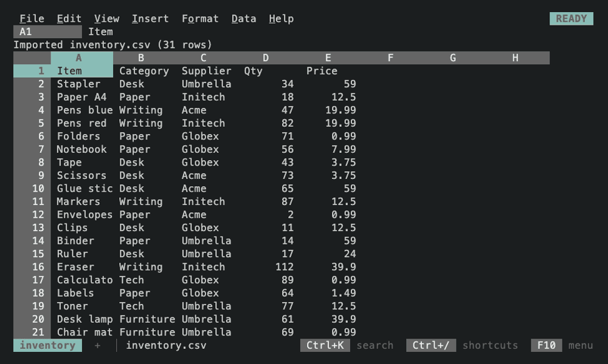
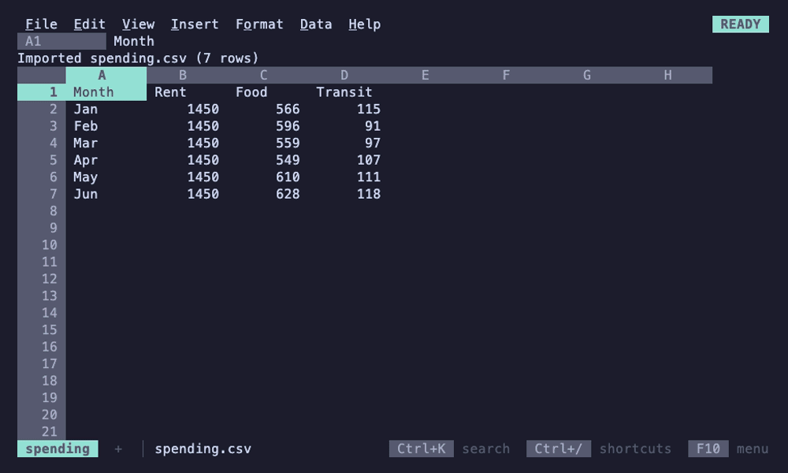
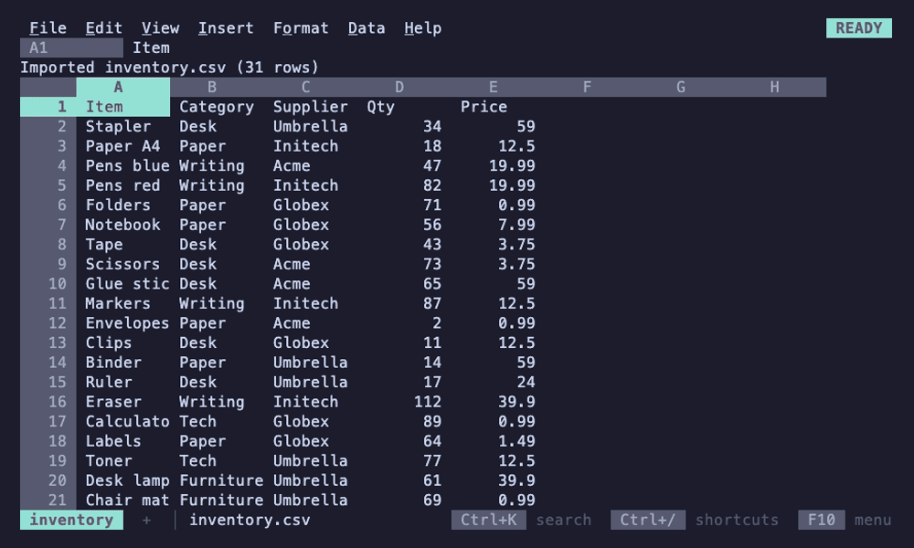
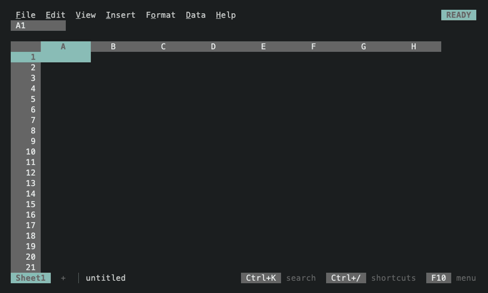
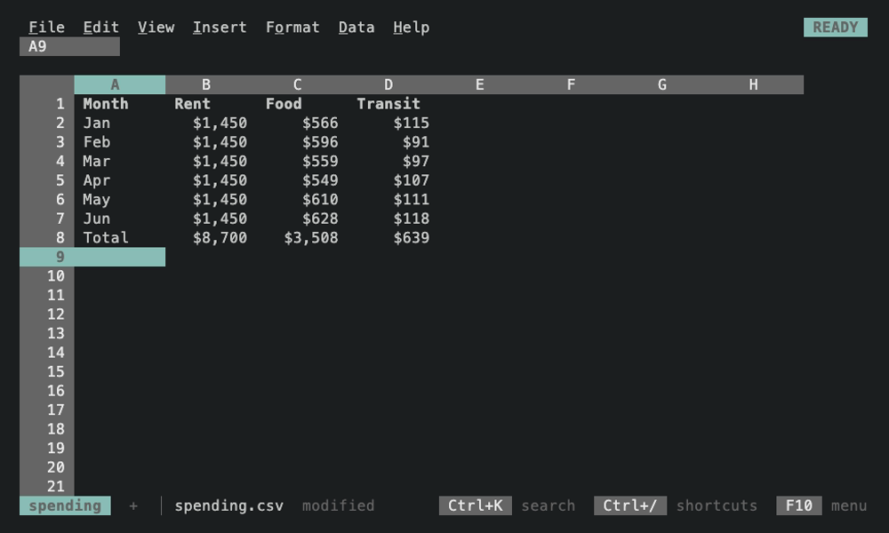

# 012

A spreadsheet for the terminal with a Lotus 1-2-3 look and Google Sheets
behavior, built on [Bubble Tea v2](https://github.com/charmbracelet/bubbletea).

Inside the grid it works the way Sheets does: typing replaces a cell, `=`
starts a formula, Enter and Tab move you on, Shift+arrows and the mouse
select, and Sheets' shortcuts do what you expect. Around the grid, the
control panel, the mode indicator and the character grid keep 1-2-3's look.
It is one pure-Go binary.


## Install

```sh
go install github.com/FelineStateMachine/012/cmd/012@latest
```

Requires Go 1.27. Or from a clone: `make build` puts the binary in `bin/012`.

```sh
012                  # a new sheet
012 budget.012       # open or create a sheet
012 sales.xlsx       # import .xlsx, .csv, .tsv, .sqlite, .parquet or Lotus .wk1
012 serve ~/sheets   # serve a directory over SSH, a 012 per session
```

F1 shows every shortcut, F10 or Alt+letter opens the menus, and Ctrl+K
searches every command.

## What it does

- **Sheets-style editing.** Formulas with 120 Sheets-compatible functions,
  autocomplete and argument hints, pointing at cells with the arrows or the
  mouse, named ranges, undo and redo for everything, copy and paste with
  reference adjustment and the system clipboard, fill series, insert and
  delete rows and columns.
- **Formats and styles.** Currency, percent, dates and times detected as you
  type; number formats, bold, italic, underline, strikethrough, alignment.
- **Several sheets.** Sheet tabs on the status line, references between
  sheets (`=Sheet2!A1`) that follow renames, pointing into another sheet
  while typing a formula, and Sheets' keys for moving between them.
- **Data tools.** Freeze rows and columns, multi-column sort, filters with
  value pickers and conditions, find and replace with regular expressions,
  tracing precedents and dependents.
- **Charts.** Column, bar, line and pie charts that float over the grid and
  update live; real images in terminals with the kitty graphics protocol
  (kitty, Ghostty, WezTerm), text elsewhere.
- **Files.** A diff-friendly JSON format, plus import from CSV, TSV, XLSX,
  SQLite, Parquet and Lotus 1-2-3 `.wk1`, and export to CSV, TSV, XLSX and
  SQLite.
- **JEV functions.** `JEV.TEST`, `JEV.PROB`, `JEV.CLASSIFY` and `JEV.SCORE`
  ask TypeSafe's hosted JEV model about your data, answered in the background
  and cached ([docs](docs/jev.md)).
- **Made for terminals.** Mouse with hover and resize handles, hyperlinks,
  light and dark themes that follow the terminal, desktop notifications,
  menus and a command palette styled like terminal software, not a GUI.

## Demos

| | |
|---|---|
|  |  |
| Menus and the command palette (Ctrl+K) | Charts that float over the grid and follow their data |
|  |  |
| Freeze, sort and filter | Find and replace |
|  |  |
| JEV functions in formulas | Formats detected as you type |

The recordings are [VHS](https://github.com/charmbracelet/vhs) tapes in
[`demos/`](demos); `make demos` renders them. Charts show as text here; in
kitty, Ghostty and WezTerm they are real images.

## Documentation

- [Keys and mouse](docs/keys.md)
- [Entries and formulas](docs/formulas.md) and [functions](docs/functions.md)
- [Working with data](docs/data.md)
- [Charts, links and the terminal](docs/charts.md)
- [Files](docs/files.md)
- [JEV functions](docs/jev.md)
- [Serving over SSH](docs/ssh.md): `012 serve`, public-key only, confined to one directory
- [Architecture](docs/architecture.md), [UX bar](docs/UX.md) and [testing](docs/testing.md)
- [Limits](docs/limits.md): how big a sheet 012 handles and where it slows down
- [Observability](docs/observability.md): event logs, DuckDB, and a local Collector, ClickHouse and Grafana stack
- [Roadmap](ROADMAP.md)

## Development

```sh
make build    # pure Go, CGO_ENABLED=0
make test     # unit tests
make e2e      # the real binary in libghostty, Ghostty's terminal core (needs Zig 0.16+ and pkg-config)
make screens  # golden screens and the review gallery
make oracle   # formulas and formats against excelize
make stress   # benchmarks on synthetic and real data; make stress-report compares runs
```

See [docs/testing.md](docs/testing.md).

## Status

Young and moving quickly. The file format is versioned and older files keep
loading; the Go packages are internal and may change at any time.

## License

[MIT](LICENSE)
