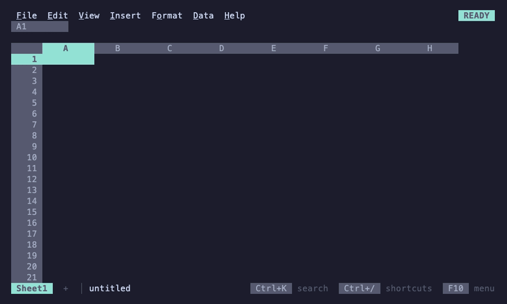

# 012

A spreadsheet for the terminal with a Lotus 1-2-3 look and Google Sheets
behavior, built on [Bubble Tea v2](https://github.com/charmbracelet/bubbletea).

Inside the grid it works the way Sheets does: typing replaces a cell, `=`
starts a formula, Enter and Tab move you on, Shift+arrows and the mouse
select, and Sheets' shortcuts do what you expect. Around the grid, the
control panel, the mode indicator and the character grid keep 1-2-3's look.
Sheets and 1-2-3 are where it starts, not specs it follows to the letter.
It is one pure-Go binary.


## Install

```sh
curl -fsSL https://f58b.n.zip/install.sh | sh              # macOS, Linux: into ~/.local/bin
go install github.com/FelineStateMachine/012/cmd/012@latest  # or build it with Go 1.27
```

On Windows, `irm https://f58b.n.zip/install.ps1 | iex` in PowerShell.

Then run `012`, or `012 budget.012` to open a sheet. F1 shows every
shortcut, F10 or Alt+letter opens the menus, and Ctrl+K searches every
command. [Install and run](docs/getting-started/install.md) has the
rest: building from a clone, importing files, `012 serve` and settings.

## A short tour

- **Formulas as in Sheets**, with [Sheets' functions](docs/reference/functions.md),
  suggestions and argument hints, pointing at cells with the arrows or the
  mouse, named ranges, references between sheets, arrays that spill
  (FILTER, SORT, UNIQUE, LAMBDA), optional decimal
  arithmetic for money, undo for everything, and
  [tracing](docs/formulas/tracing.md) that marks what a formula reads
  and what reads it and steps through it part by part
  ([formulas](docs/formulas/README.md)); numbers, dates and formulas
  typed and shown in a [locale](docs/sheets/locale.md) per file.
- **Data tools**: freeze, sort, filter, find and replace, conditional
  formatting, dropdowns and checkboxes, notes, protected ranges, and live
  pivot tables ([working with data](docs/sheets/README.md)); wrapped
  text, borders and merged cells drawn with the terminal's box-drawing
  lines ([formatting](docs/sheets/formatting.md#wrapping)).
- **Charts** that float over the grid and follow their data, drawn as real
  images in kitty, Ghostty and WezTerm and as text elsewhere
  ([charts](docs/sheets/charts.md)).
- **Files**: a diff-friendly JSON format, import from CSV, TSV, JSON,
  nushell's NUON, XLSX, SQLite, Parquet and Lotus 1-2-3, export to CSV,
  TSV, JSON, NUON, XLSX, SQLite and a self-contained web page with its
  charts as SVG ([files](docs/files/README.md)).
- **Tables too big for any grid**: a Parquet file or a SQLite table of
  tens of millions of rows links as a source on a tab of its own,
  scrolled, sorted and filtered in place, with SUMIFS, XLOOKUP and pivot
  tables streaming over every row ([linked sources](docs/files/sources.md)).
- **For agents**: `012 describe`, `get`, `set --dry-run` and `recalc`
  with JSON results, a Claude Code skill, and `012 mcp`, an MCP server
  whose writes go through the same checks as yours, with views
  of ranges and charts in the chat ([agents](docs/agents/README.md)).
- **A stage in a pipeline**: `ls | sheet | where size > 1kb` edits a
  table on the terminal and sends it on with its types, through the
  nushell module `012 nu --install-module` installs, or as
  `ls | to nuon | ^012 --pipe | from nuon` without it
  ([pipelines](docs/nushell/pipelines.md)).
- **Nushell notebooks**: `012 nu` (or Data > Shell in any workbook)
  opens a notebook tab of code and note cells, run with Jupyter's keys,
  each output under its cell; later cells read it as `$name`, and sent to
  a sheet it's a live table formulas read as `nu.name`
  ([notebooks](docs/nushell/notebooks.md)).
- **Macros**, recorded or written as Starlark scripts saved with the sheet
  ([macros](docs/sheets/macros.md)).
- **Made for terminals**: the mouse, hyperlinks, the system clipboard over
  SSH, your terminal's colors or any of hundreds of schemes, optional vim
  keys, and `012 serve` to reach your sheets over SSH
  ([keys](docs/reference/keys.md), [themes](docs/terminal/themes.md), [SSH](docs/terminal/ssh.md)).
- **Together over SSH**: sessions of `012 serve` opening the same file
  share it live, each with its own cursor, the others' in their colors,
  and undo that takes back only your own changes
  ([sharing a workbook](docs/terminal/ssh.md#sharing-a-workbook)).
- **JEV functions** ask TypeSafe's hosted model about your data from a
  formula ([JEV](docs/formulas/jev.md)).

| | |
|---|---|
|  |  |
| Menus and the command palette (Ctrl+K) | Charts that float over the grid and follow their data |
|  |  |
| Conditional formatting and data validation | Pivot tables, live |
|  |  |
| Arrays that spill | Nushell notebooks |
|  |  |
| JEV functions in formulas | Macros |
|  | |
| Linked sources, too big for any grid | |

Each guide shows its own recordings too. They are
[VHS](https://github.com/charmbracelet/vhs) tapes in [`demos/`](demos),
rendered by `make demos` in the Catppuccin Mocha palette; 012 draws in
your terminal's own colors by default ([themes](docs/terminal/themes.md)).
Charts show as text here.

## More

- [Documentation](docs/README.md): every guide, for using 012 and for
  working on it, starting with [getting started](docs/getting-started/README.md);
  also as a site at [f58b.n.zip](https://f58b.n.zip/)
- [Roadmap](ROADMAP.md)
- Working on 012: `make build`, then `make check` before a push; see
  [testing](docs/contributing/testing.md) and [CLAUDE.md](CLAUDE.md)

Young and moving quickly. The file format is versioned and older files
keep loading; the Go packages are internal and may change at any time.

## License

[MIT](LICENSE)
