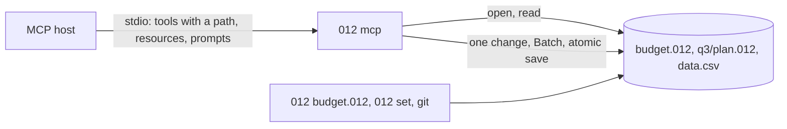

# MCP server

`012 mcp` is a [Model Context Protocol](https://modelcontextprotocol.io)
server over standard input and output, so any MCP host (Claude Code,
Codex, Claude Desktop, ChatGPT, editors) can read and change the
workbooks in the folders open to it. One server works on every
workbook: each tool takes the workbook's `path`. It is the same code as
[the commands](README.md#with-a-shell): reads are `012 describe` and
`012 get`, and every write is typed through the checks `012 set` makes,
as one change, saved atomically at once.



A file is opened afresh for every call, so what the screen, a script
or git saved meanwhile is what the next call sees. To work in a running
012 instead, on the workbook on your screen with its changes as
suggestions, attach with `012 mcp --attach`: [Live mode](live.md).

## Adding it to a host

`012 agent --install-mcp` writes the entry that starts this 012, by its
absolute path and with no workbook, into the host's configuration:

```sh
012 agent --install-mcp claude-code                        # Claude Code: ~/.claude.json, as claude mcp add --scope user does
012 agent --install-mcp codex                              # Codex: [mcp_servers.012] in ~/.codex/config.toml
012 agent --install-mcp claude-desktop                     # Claude Desktop: claude_desktop_config.json
012 agent --install-mcp codex --print                      # show the entry, write nothing
012 agent --install-mcp claude-desktop --root ~/Documents  # open these folders to it
```

The file is copied beside itself (`config.toml.bak-20260929-150405`)
before it changes, the host's other servers and settings stay as they
were, and running it again when the entry is there changes nothing.
It names other entries that start 012, such as one made earlier for a
single workbook, which the new entry replaces. Restart the host to
start the server; install again after moving 012.

Other hosts take the command and arguments `--print` shows. A file
named after `mcp` (`012 mcp budget.012`) is the workbook of tools
called without a path, open wherever it is.

## Which files it opens

A `path` is confined to the folders the host shares as its roots
(Claude Code shares the project's), or when it shares none, to the
folders `--root` names (any number of them), or else the working
directory, or the home folder when that's the file system's root, as
where Claude Desktop starts servers. A relative path is looked for in
each folder in turn; an absolute one must be inside one. Hidden files
and folders and links that lead outside are refused, as
[`012 serve`](../terminal/ssh.md#security-model) refuses them. Roots are deprecated in
the protocol's 2026-07-28 version, whose clients the server can't ask,
so they get `--root`'s folders.

`describe` without a path lists the workbooks in those folders: `.012`
files, and the files 012 [imports](../files/README.md#import-and-download) (CSV, XLSX,
JSON, SQLite and the rest), four folders deep, without hidden folders
or `node_modules`. Imported files are read as the app opens them, and
are read only: `create_workbook` with `from` makes a `.012` workbook
of one, to change. A path that doesn't exist is an error naming
`create_workbook`, which makes a new workbook and never replaces a file.

## Flags

| Flag | Does |
|---|---|
| `file.012` | The workbook of tools called without a path |
| `--root dir` | A folder workbooks may be in, when the host shares no roots; give it again for more |
| `--read-only` | Offers only the tools that read |
| `--force` | Lets writes change [protected ranges](../sheets/notes-protection.md#protected-sheets-and-ranges), as `012 set --force` |
| `--notebooks` | Offers `run_notebook_cell`, which runs a [notebook](../nushell/notebooks.md) cell with nu, if the workbook was saved on this computer |
| `--trust` | With `--notebooks`, runs the cells of a workbook saved on another computer, and marks it trusted here |
| `--jev` | Answers [JEV functions](../formulas/jev.md) over the network, each question once a session |

Without them nothing runs a program or reaches the network: notebook
outputs are read as the file keeps them, and JEV functions show `#N/A`.
`shell = off` in the [configuration](../reference/config.md#shell) keeps
notebook cells from running even with `--notebooks`.

## Tools

Every tool but `describe` takes `path`, the workbook, required unless
the server was started with a file. References are written as in
formulas (`B7`, `Q3!A1:C9`, `'Q3 plan'!A:A`, a named range, a table,
`Sales[Amount]`, a sheet's name), and inputs as a person types them, in
en-US form. Values keep their types both ways: writes take money,
percentages, dates, times, durations and sizes as
[values with their types](../reference/json.md#values)
(`{"currency": 3.5}`, `{"date": "2026-09-29"}`) as well as typed
entries (`$3.50`), and reads return them the same way beside the text
each cell shows, so a model can check what it wrote. Every write takes
`dry_run`, which returns the change without making it.

| Tool | Does |
|---|---|
| `describe` | Without a path, the workbooks open to the server; with one, its sheets, used ranges, guessed header rows and column names, tables, outputs, charts, pivots, notebook cells and names, as [`012 describe`](../reference/json.md#describe) |
| `read_range` | A range's values as rows, typed, each cell as shown, and its formulas by cell |
| `evaluate` | A formula's value, computed in the workbook (at `at`, or below the data) without writing it: its text, why it's an error, an array's spill |
| `find` | Cells by what they show or, with `in_formulas`, their formulas' text, as Edit > Find |
| `list_errors` | The formulas showing errors after recalculating, as `012 recalc` lists them, without saving |
| `create_workbook` | A new `.012` workbook at `path`, empty, made `from` a file 012 imports or another workbook, or holding `data`, a table as `write_table` writes it; it never replaces a file |
| `write_cells` | Entries typed into cells, or values with their types, and number formats, as one change, as `012 set` |
| `write_table` | Rows of records under a header, each column formatted as its values' type, as one change, as importing a NUON table |
| `apply_operations` | Several operations as one change: `set`, `write_table`, `clear`, `insert_rows`, `delete_rows`, `insert_columns`, `delete_columns`, `add_sheet`, `rename_sheet`, `delete_sheet`, `define_name`, `sort` |
| `sort` | A range's rows sorted by columns, named by letter or header |
| `filter` | A filter on a range by conditions (`gt`, `contains` and the rest) or values to hide, or the sheet's filter removed |
| `create_chart` | A chart of a range, its type, title and place given or guessed as Insert > Chart guesses them |
| `create_pivot` | A pivot table on a new sheet: rows, columns and summarized values by header |
| `run_notebook_cell` | With `--notebooks`: one code cell run, its output kept and sent on to its sheet |

A write returns `saved`, `changes` (as [`012 diff`](../reference/json.md#diff)
lists them) and `warnings`; a refused one is an error naming the cell,
with nothing changed. Every result's schema is in
[JSON output](../reference/json.md#mcp-tools).

## Views in the chat

Hosts that draw tool results as pages show what `read_range` read and
the chart `create_chart` made beside the result, as 012 draws them: the
[web page](../files/README.md#web-pages) export's grid with its column
and row headers, fonts, number formats, styles and charts as SVG, in
the host's light or dark theme. Clicking a cell, or the arrow keys,
puts the pointer on it and shows what was typed in it in the formula
bar. The grid scrolls under its headers in at most 480 pixels inline
(less when the host has less room, the whole frame full screen), and a
smaller range takes only its own height.

Two kinds of hosts do this, and the view works in both:

| Host | Finds the page by | Its page | The page reads |
|---|---|---|---|
| [MCP Apps](https://github.com/modelcontextprotocol/ext-apps) (Claude, and the extension's other hosts) | the tool's `_meta.ui.resourceUri` | `ui://012/view`, `text/html;profile=mcp-app` | the `ui/initialize` handshake's theme and room, then `ui/notifications/tool-result` |
| The [OpenAI Apps SDK](https://developers.openai.com/apps-sdk) (ChatGPT, Codex) | the tool's `_meta["openai/outputTemplate"]` | `ui://012/view.skybridge`, `text/html+skybridge` | `window.openai`: `toolResponseMetadata`, `theme`, `maxHeight`, `displayMode`, and `openai:set_globals` events |

What the page draws is in the result's `_meta["o12/view"]`, for every
client, whether or not it declared the extension: the workbook's name,
where the range or chart is, and its HTML, at most 200 rows of what
`read_range` returned. Both kinds of hosts hand a result's `_meta` to
the page (the Apps SDK as `window.openai.toolResponseMetadata`) and
keep it from the model, which reads the result itself,
`structuredContent` and the same JSON as text, with no HTML: about ten
kilobytes for 60 rows of currency, typed values and text shown. The page asks for nothing from the network and
calls no tools.

## Resources

Hosts that let people attach data to a conversation list these; the
scheme is `o12` since a URI's scheme starts with a letter. The
workbook is named as tools name it (relative to the first folder open
to the server, or absolute, `o12:///Users/me/budget.012/...`), each
part of its path and a sheet's name percent-encoded:

| URI | Is |
|---|---|
| `o12://budget.012/Sheet1!A1:D40` | A range, as `read_range` returns it; each sheet's used range is listed |
| `o12://budget.012/table/Sales` | A table, header row included; each table is listed |
| `o12://budget.012/notebook/Notes/2` | A notebook cell's source, and its output as NUON or why it failed; each code cell is listed |

The list holds the five workbooks the tools used last (and the file
named on the command line) and follows them: a change that adds a sheet
or table updates it, and hosts that listen are told. The templates
reach any range of any workbook open to the server.

## Prompts

| Prompt | Asks |
|---|---|
| `summarize_workbook` | What each sheet of a workbook (`path`) holds and what its numbers say, without changing anything |
| `fix_errors` | The formulas showing errors in a workbook (`path`) explained, fixes checked with `evaluate` and previewed before they're made |
| `add_column` | A column of formulas computing something beside a range (`path`, `range`, `column`) |
| `chart` | The chart that best answers a question about a range (`path`, `range`, `question`) |
