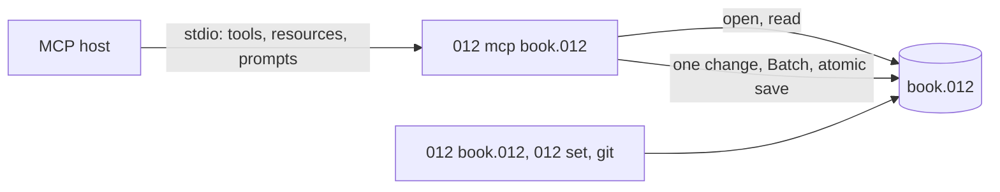

# MCP server

`012 mcp book.012` is a [Model Context Protocol](https://modelcontextprotocol.io)
server on one workbook, over standard input and output, so any MCP host
(Claude Code, Claude Desktop, editors) can read and change it. It is the
same code as [the commands](README.md#with-a-shell): reads are
`012 describe` and `012 get`, and every write is typed through the
checks `012 set` makes, as one undoable change, saved atomically at
once.



The file is opened afresh for every call, so what the screen, a script
or git saved meanwhile is what the next call sees. A file that doesn't
exist is an empty workbook, saved on the first change.

## Adding it to a host

Claude Code, for one workbook (`--scope project` writes `.mcp.json`
to commit with the project; the default keeps it to you):

```sh
claude mcp add budget -- 012 mcp /path/to/budget.012
claude mcp add --scope project budget -- 012 mcp budget.012
```

Claude Desktop, in `claude_desktop_config.json` (Settings > Developer >
Edit Config), with the full paths, since Desktop doesn't start in your
folder:

```json
{
  "mcpServers": {
    "budget": {
      "command": "/usr/local/bin/012",
      "args": ["mcp", "/Users/me/Documents/budget.012"]
    }
  }
}
```

Other hosts take the same command and arguments.

## Flags

| Flag | Does |
|---|---|
| `--read-only` | Offers only the tools that read |
| `--force` | Lets writes change [protected ranges](../sheets/notes-protection.md#protected-sheets-and-ranges), as `012 set --force` |
| `--notebooks` | Offers `run_notebook_cell`, which runs a [notebook](../nushell/notebooks.md) cell with nu, if the workbook was saved on this computer |
| `--trust` | With `--notebooks`, runs the cells of a workbook saved on another computer, and marks it trusted here |
| `--jev` | Answers [JEV functions](../formulas/jev.md) over the network, each question once a session |

Without them nothing runs a program or reaches the network: notebook
outputs are read as the file keeps them, and JEV functions show `#N/A`.
`shell = off` in the [configuration](../reference/config.md#shell) keeps
notebook cells from running even with `--notebooks`.

## Tools

References are written as in formulas (`B7`, `Q3!A1:C9`,
`'Q3 plan'!A:A`, a named range, a table, `Sales[Amount]`, a sheet's
name), and inputs as a person types them, in en-US form. Every write
takes `dry_run`, which returns the change without making it.

| Tool | Does |
|---|---|
| `describe` | The workbook's sheets, used ranges, guessed header rows and column names, tables, outputs, charts, pivots, notebook cells and names, as [`012 describe`](../reference/json.md#describe) |
| `read_range` | A range's values as rows, its formulas by cell, and with `text` each cell as shown |
| `evaluate` | A formula's value, computed in the workbook (at `at`, or below the data) without writing it: its text, why it's an error, an array's spill |
| `find` | Cells by what they show or, with `in_formulas`, their formulas' text, as Edit > Find |
| `list_errors` | The formulas showing errors after recalculating, as `012 recalc` lists them, without saving |
| `write_cells` | Entries typed into cells as one change, as `012 set` |
| `apply_operations` | Several operations as one change: `set`, `clear`, `insert_rows`, `delete_rows`, `insert_columns`, `delete_columns`, `add_sheet`, `rename_sheet`, `delete_sheet`, `define_name`, `sort` |
| `sort` | A range's rows sorted by columns, named by letter or header |
| `filter` | A filter on a range by conditions (`gt`, `contains` and the rest) or values to hide, or the sheet's filter removed |
| `create_chart` | A chart of a range, its type, title and place given or guessed as Insert > Chart guesses them |
| `create_pivot` | A pivot table on a new sheet: rows, columns and summarized values by header |
| `run_notebook_cell` | With `--notebooks`: one code cell run, its output kept and sent on to its sheet |

A write returns `saved`, `changes` (as [`012 diff`](../reference/json.md#diff)
lists them) and `warnings`; a refused one is an error naming the cell,
with nothing changed. Every result's schema is in
[JSON output](../reference/json.md#mcp-tools).

## Resources

Hosts that let people attach data to a conversation list these; the
scheme is `o12` since a URI's scheme starts with a letter, and a sheet's
name is percent-encoded:

| URI | Is |
|---|---|
| `o12://book/Sheet1!A1:D40` | A range, as `read_range` returns it; each sheet's used range is listed |
| `o12://book/table/Sales` | A table, header row included; each table is listed |
| `o12://book/notebook/Notes/2` | A notebook cell's source, and its output as NUON or why it failed; each code cell is listed |

The list follows the workbook: a change that adds a sheet or table
updates it, and hosts that listen are told.

## Prompts

| Prompt | Asks |
|---|---|
| `summarize_workbook` | What each sheet holds and what its numbers say, without changing anything |
| `fix_errors` | The formulas showing errors explained, fixes checked with `evaluate` and previewed before they're made |
| `add_column` | A column of formulas computing something beside a range (`range`, `column`) |
| `chart` | The chart that best answers a question about a range (`range`, `question`) |
