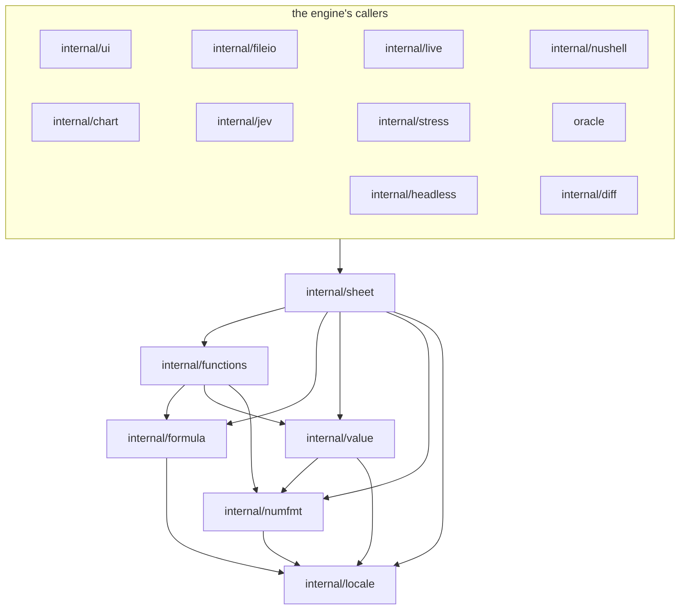
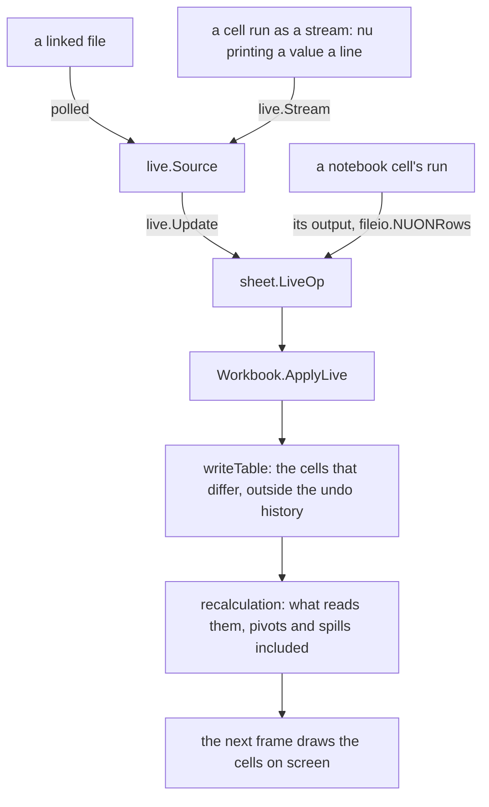
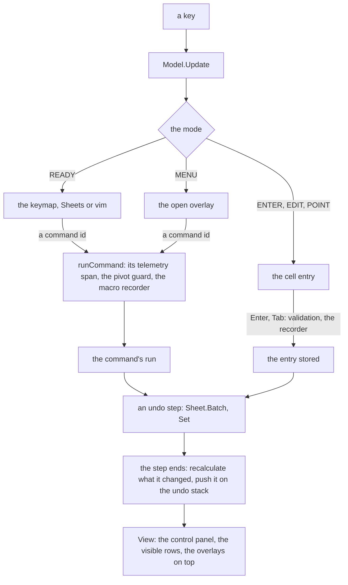
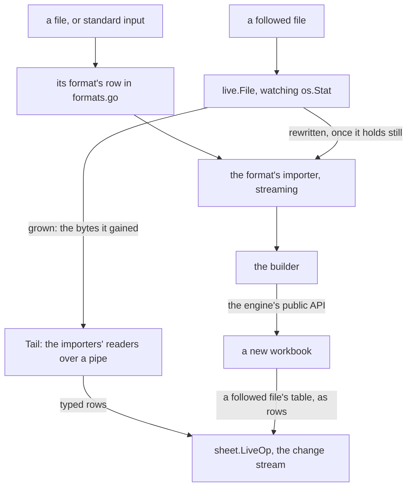
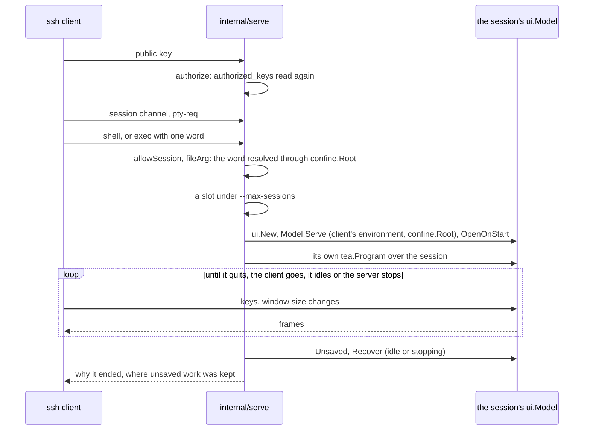

# Architecture

012 is a single pure-Go binary (`CGO_ENABLED=0`) built on Bubble Tea v2 and
Lip Gloss v2.

```
cmd/012          entry point: flags and config, 012 config, 012 serve, JEV setup, opening or importing a file, 012 - and --pipe on the terminal, the commands without the screen
internal/config  the config file and the registry of options
internal/sheet   the engine: cells, recalculation, undo, files, names, pivots
internal/functions the function library: the FuncDef table, evaluation, decimal arithmetic, JEV questions
internal/value   cell values, number formats, typed-entry parsing, the clock
internal/formula the formula language: references, lexer, parser, printer, rewriting
internal/numfmt  number formats, rounding, General, date serials
internal/locale  the locales: separators, date order, currency, formula separators
internal/fileio  import and export: CSV, TSV, XLSX, SQLite, Parquet, Lotus .wk1, JSON, NUON; tables on streams
internal/nuon    nushell's object notation: typed values, tables read a row at a time, written back
internal/live    the sources of linked regions: files followed as they grow or are rewritten
internal/headless workbook files without the screen: references, get, set, recalc, notebooks and JEV when asked, atomic saves
internal/diff    workbooks compared and merged cell by cell, from their files' fields
internal/chart   chart layout, text rendering and kitty image encoding
internal/jev     the API key's resolution, answer cache and TypeSafe client
internal/keyring the OS credential store the API key lives in
internal/macro   macros: the Starlark scripting API, recorded actions as scripts, step limits
internal/notebook a notebook's document: code and note cells, names, what each reads, run orders, stale outputs, save caps
internal/nushell a notebook cell's run: nu as a process, tables in as NUON files, NUON back
  module         012.nu, the nushell module with sheet, embedded for 012 nu --module and --install-module
internal/telemetry  opt-in JSON log and OTLP export of spans, events and frame stats
internal/serve   the SSH server: auth, host key, a Model per session (charm.land/wish/v2)
internal/confine resolving typed file names, confined to a directory when served
internal/stress  synthetic worst-case sheets for the -tags stress benchmarks
internal/ui      the Bubble Tea model: modes, menus, overlays, rendering
  theme          style roles, color schemes and the widgets drawn with them (frames, key chips)
  rowtext        laying out a row of cell text across the columns on screen
  formula        reading the formula being typed (F4, the word and call at the caret)
  overlay        the contract of what takes over input: Overlay, boxes, mouse events, lists
  lineedit       the one-line editor every text field shares, and the multi-line one of notebook cells
  picker         the searchable list behind the palette and every picker
  cmdline        the : command line and its completions
  nbview         a notebook tab as Jupyter's: its toolbar, cells, outputs, command and edit modes, mouse, the code editor and its language providers
  findbar        find and replace, a bar on the context line
  evalview       Data > Evaluate formula: a formula stepped through part by part
  themepicker    File > Settings > Theme, previewing as it moves
  rules          the conditional formatting and data validation panel
  sortbar        the sort bar: the columns and order to sort a range by
  filterpick     a filter column's values and condition
  choicebar      small questions on the context line answered with a key
  shortcuts      the keyboard shortcuts view
  suggest        formula suggestions and function signatures while typing
  tabstrip       the sheet tabs' layout and where each sheet was left
  transfer       imports running in the background and their progress
e2e/             end-to-end tests through libghostty (separate module, cgo)
oracle/          differential tests against excelize's calculation (separate module)
```

## The engine

`internal/sheet` knows nothing about terminals. It builds on the function
library, which knows nothing about sheets or storage, and on packages
that know nothing about cells. Dependencies point one way, down the
graph of imports below the engine; `internal/locale`, at the bottom,
holds the table of locales and depends on nothing:



- `internal/locale` is the conventions of each locale: decimal and
  thousands separators, date order and patterns, currency symbol and
  place, and the formula separators that follow from the decimal one.
  Cells, formulas and files keep en-US's form whatever the locale; the
  packages above translate at the edges, where entries are typed and
  shown: `value.Canonicalize` and `Localize` for typed values,
  `formula.Delocalize` and `Localize` for formulas (one byte for one,
  so positions carry over), `numfmt.FormatIn` and `Format.CodeIn` for
  display, and `sheet.CanonicalEntry` and `LocalEntry` for whole
  entries. The workbook's locale is a file setting beside decimal
  arithmetic ([Locale](../sheets/locale.md)).

- `internal/formula` is the language: `Addr` and `Rect`, A1 references
  with their `$` markers, sheet names in references and their quoting,
  the lexer and Pratt parser, the syntax tree, the printer and the
  reference rewriting for copies, moves and inserted or deleted rows and
  columns. The parser learns which functions exist through a small
  `Func` interface that the library's `FuncDef` implements.
- `internal/value` is what a cell computes to and how it is shown:
  `Value` with its kinds and error codes, the coercions and ordering
  every function shares (`ToNum`, `Compare`), `Format` and its kinds, and
  typed-entry recognition (`ParseValue`, which turns "$1,200" or "9/26"
  into a number and a format), with the clock it reads (`value.Now`,
  which TODAY and NOW read too; tests replace it).
- `internal/functions` is the function library; see
  [Functions](#functions) below.
- `internal/numfmt` renders numbers: number format patterns (as in TEXT
  and custom formats), Sheets' General form, rounding on 15 significant
  digits, and the calendar of serial day numbers.

`sheet` re-exports the types and helpers its callers need (`sheet.Addr`,
`sheet.Rect`, `sheet.Parse`, `sheet.Value`, `sheet.Format`,
`sheet.ParseValue`, `sheet.FuncDef`, `sheet.Funcs`, the remote types,
`sheet.FormatPattern`, the sheet-name helpers) as aliases and thin
wrappers, so the UI, importers and charts see one engine package.

A `Workbook` holds ordered `Sheet`s, the named ranges, the undo history,
the arithmetic setting, the JEV source and recalculation, as a Sheets
spreadsheet does. Each sheet keeps its cells, sparse, by address, with
its column widths, frozen panes, filter and charts; each cell keeps what
was typed, its parsed expression, its computed value, and its format and
style.

- **Cells.** Each sheet keeps its cells in a `cellStore` (`store.go`):
  get, set, delete, count, iterate all or a range, and narrower reads
  (a value, presence, formatting, the formula cells). Nothing else
  touches the representation beneath. Occupancy indexes (`occupancy.go`,
  bitmaps of 1024 rows per column) record which cells are stored and
  which have contents, so a range of the million-row grid is read at the
  cost of what it holds; the stored index's blocks hold the cells
  themselves, a 16-byte slot each in row order (`slot.go`). A plain cell
  (a number, boolean or text as typed, with a format and style) lives in
  its slot, with its text in a table of strings kept once each, its
  formatting in a table of looks, and its input only when that isn't
  the value's own text ("1.50" is kept as 1.5 printed with two
  decimals). What pivots and spills write is a slot too, marked as
  derived, holding the value and, in its look, a spill's inferred
  format; its entry is the value's text. Formulas and notes are whole
  `Cell`s in a side table, which recalculation updates in place. `get`
  hands out a plain cell as a `Cell` made for the caller, a copy whose
  changes reach nothing; `set` is the one way to change a cell. What
  each costs is in [Bounds of support](limits.md#sheet-size). Formats of
  whole columns and rows, and of the whole sheet, live on the lines
  (`lines.go`); a cell falls back on them.
  Copy, paste and move carry the formatting cells show (`clipfmt.go`):
  whole lines as line formats, blocks as the cells' own. A line's format
  changing recalculates the formulas reading any cell of it, found through
  the dependency indexes (`linereaders.go`), so they infer their format
  from blank cells too.
- **Layout.** A cell's style holds how its text wraps and the lines on
  its edges (`borders.go`), so both fall back on lines and travel with
  copies. Rows' heights set by hand are kept per sheet as column widths
  are, and merged ranges in the view state, replaced whole, so undo, the
  file and inserted lines follow them (`rowlayout.go`, `merge.go`, which
  finds a cell's merge through an interval index). Cells whose own style
  wraps or draws borders are indexed by row, so the grid measures the
  rows it shows at their cost, and a sheet with none of these (not
  `Shaped`) is drawn a line per row without asking.
- **Parsing.** `internal/formula`'s hand-written Pratt parser turns
  formulas into an AST, keeping absolute markers so references can be
  rewritten when cells move. Its printer turns ASTs back into text in
  Sheets' spelling. Decimal arithmetic marks the operators it computes
  with node types of the function library's own, so trees stay as
  parsed.
- **Recalculation.** Formulas record the cells and ranges they read on
  their own sheet; references that name a sheet (`Sheet2!A1`) are kept by
  name and resolved when evaluated, so renaming rewrites them and a deleted
  sheet's references wait, as `#REF!`, for a sheet of that name. Changing a
  cell marks it and everything that transitively depends on it, on any
  sheet, then evaluates the marked cells lazily in dependency order; a cell
  reached again while it is being evaluated is part of a cycle. Volatile
  functions (TODAY, RAND, the JEV functions) are recomputed on every
  recalculation (`recalc.go`). Formulas read other cells through each
  sheet's `reader`, the engine's side of the function library's `Book`
  (below): one cell, the cells a range holds in chunks, a range's bounds,
  and the running aggregates SUM-like functions share within a
  recalculation (`rangememo.go`). The formulas whose ranges contain a
  changed cell are found through interval trees per column
  (`rangeindex.go`).
- **Functions.** One table (`FuncDef`, in `internal/functions`) holds
  every function's name, signature, description and arity; it drives
  parsing, evaluation, autocomplete, in-app help and
  [Functions](../reference/functions.md). See [Functions](#functions).
- **Undo.** Every mutation goes through a small set of paths that snapshot
  the cells, widths, names, charts, view state and sheet list they change,
  on any sheet, so a step can be reversed exactly; multi-cell operations
  are one step. A step keeps each sheet's before-images as an image
  (`historyimage.go`) in the store's own form: plain cells as slots in
  columns of blocks, their text and formatting in the image's tables,
  and whole `Cell`s only for rich ones, so clearing a whole sheet holds
  about what the sheet does. A deleted or replaced sheet keeps its
  cells, so undo brings it back. The history keeps at most 100 steps and
  about 256 MB of before-images, counted as they're recorded, dropping
  the oldest steps first; a change whose step would pass 1 GB
  (`UndoCost`, `MaxStepBytes`) asks first, and runs `WithoutUndo` if told
  to go on.
- **Pivot tables.** A sheet may hold a pivot (`pivot.go`): a definition
  naming its source by sheet name, as formulas do, and a region of
  derived cells from A1 that the engine owns. When a recalculation marks
  a cell of a pivot's source range, or its definition changes, the pivot
  is recomputed after the formulas (`pivotcalc.go` groups the source
  rows into a tree of accumulators, `pivotlayout.go` lays out Sheets'
  table) and only the result cells that changed are rewritten, outside
  the undo history, then what reads them recalculates, pivots of pivots
  included (bounded, as a loop can't be defined). Undo restores the
  source and the definition, and the results follow. Derived cells are
  constants to formulas, values to copies and exports, refused by `Set`,
  and never saved: the file keeps the definition (`pivotfile.go`). A
  frequency table is a pivot with a preset definition.
- **Spills.** A formula computing an array (its anchor) shows the first
  value and spills the rest into the cells to its right and below
  (`spill.go`): spilled cells are derived cells as a pivot's results
  are, flagged `spilled`. Each evaluation pass notes the arrays anchors
  computed; after it, each is written (only the cells that changed, and
  nothing when the array and its cells are as they were), outside the
  undo history, then what reads the changed cells is recalculated, which
  may spill again (at most 64 passes). A sheet indexes its anchors by
  the cells they cover or would (an interval tree, as range users are),
  so a cell placed in a spill or in the way of a blocked one has its
  anchor recalculate, and a spilled cell placed (by undo, a move or a
  format) keeps only its formatting and note. A blocked anchor shows
  `#REF!` with the reason. `Set` refuses spilled cells; files keep only
  the anchor.
- **Regions.** A region (`region.go`) is a block of cells whose values
  come from outside the engine, of two kinds: a linked file
  (`linked.go`), a file the UI follows, and a notebook cell's output sent
  to a sheet (`Region.Output`), each its table at its anchor. Both are
  one list per sheet, the sheet's `regionState`, replaced whole on every
  change so undo steps keep the definitions; what isn't undone (the
  cells written, how the rows arrive) is kept beside it (`regionMeta`).
  Their cells have one write path, `writeTable` (`regionwrite.go`): a
  header and rows, written as spilled cells are, derived and outside the
  undo history, only those that differ, with the region's cells it no
  longer needs cleared; a table that would overwrite other contents
  isn't shown, its first cell saying where, and clearing that cell shows
  it. Rows arrive only as live operations, the change stream below, and
  are never part of the undo state, since undo can't bring back what a
  file held or a run printed: a region undo brings back or moves is
  emptied and marked stale, and the UI sends its rows again, the file
  read again or the cell's output as it is. Placing a cell in a region
  (a format, undo) keeps the region's value. Formulas name a region's
  table as `nu.name`, resolved when evaluated as named ranges are. The
  file keeps the definitions (`regionfile.go`), and converts the command
  regions of earlier files into notebook cells (`notebookfile.go`).
- **Notebooks.** A notebook tab is a sheet whose `regionState` holds
  cells (`notebook.go`), so adding, editing, moving and deleting cells
  are undo steps as any change is, and the tab is named, moved, hidden
  and deleted as a sheet is. The document itself, cells, names, what a
  cell reads, run orders and stale outputs, is `internal/notebook`,
  which knows nothing of sheets. Outputs aren't undone: the workbook
  keeps each cell's last `notebook.Output` by the cell's ID, its NUON as
  nu printed it, and the file keeps them up to the caps
  (`notebookfile.go`).
- **Rules.** A sheet's conditional formats and data validation
  (`rules.go`, `condfmt.go`, `validation.go`) are lists of rules on
  ranges, replaced whole on every change so undo steps keep them as they
  were; they follow inserted and deleted lines, and their formulas follow
  renamed sheets, as formulas do. How they draw a cell (`Look`, in
  `looks.go`) is worked out when the screen asks for it and kept until
  the next recalculation, which counts itself in `Workbook.gen`: a color
  scale reads its range's numbers once per recalculation, a custom
  formula is evaluated for the cells drawn, with its relative references
  moved as a copy's would be. `CheckEntry` tells the UI whether a cell
  takes an entry, evaluating a formula in place without storing it. The
  file keeps each rule as one line of JSON (`rulefile.go`).
- **JEV.** The engine never touches the network. JEV functions describe a
  question and ask the `Book` for the answer, which the engine looks up
  in the workbook's `RemoteSource`, set with `SetRemote`; `internal/jev`
  answers from a cache and queues new questions, and the UI sends them as
  background commands.

### The change stream

Rows reach a region as `sheet.LiveOp`s, each applied at once by
`Workbook.ApplyLive` through the regions' one write path, `writeTable`:
what follows a linked file sends them, the UI sends a notebook cell's
output to the region it was sent to whenever the cell runs, and a cell
run as a stream sends each batch of rows its pipeline prints.



| Field | Holds |
|---|---|
| `Region` | the region, by name, as the file keeps it |
| `At` | when the source changed |
| `Reset` | the rows replace every row under the header; otherwise they follow the last |
| `Header` | the first row, when it is new or changed |
| `Rows` | data rows: values with the formats they arrived in (`LiveCell`) |
| `Err`, `Note` | why the source can't be read, what it left out |

An op is applied outside the undo history, as a spill is written. A
window drops the oldest rows (read back from the region's cells and
written again one row up); inside an open step (a macro run) what reads
the cells recalculates when the step ends. An op carries whole
values and names nothing but its region, so applying the same ops in the
same order to the same workbook makes the same cells: it is what a
session following another's over `012 serve` would be sent, beside the
steps `Batch` records. `OnLive` times each op for telemetry.

### Functions

`internal/functions` holds the function library: the `FuncDef` table
(one file per category: `everyday.go`, `math.go`, `stats.go`,
`logic.go`, `text.go`, `regex.go`, `lookup.go`, `dynamic.go`,
`lambda.go`, `date.go`, `finance.go`, `link.go`, `jev.go`, which
[Functions](../reference/functions.md) is grouped by), the evaluation of formulas
(`eval.go`: operators and calls; arrays in `array.go`, functions mapped
over them in `lift.go`, the names LET and LAMBDA bind in `scope.go`), the helpers
functions share (arguments and blocks of cells in `args.go`, criteria
over aligned ranges in `masked.go`, searched lines in `seq.go`), format
inference for Automatic cells (`format.go`), the decimal twins and
`Decimalize` (`decimal.go`) and the questions JEV functions ask
(`remote.go`, `remotekey.go`). It imports `formula`, `value` and `numfmt`,
never the engine.

A formula reads cells through a `Reader` over a `Book`, the interface
the engine implements once per sheet (`reader` in `recalc.go`):

| `Book` method | What it is |
|---|---|
| `Cell(sheet, a)` | one cell's value, evaluated first if it's dirty |
| `Scan(sheet, r, from, addrs, vals)` | the next chunk of the cells a range holds, row by row: their addresses and, when asked, their values |
| `Bounds(sheet, r)` | the smallest range holding a range's cells, for the data area of blocks and lookups |
| `RangeAgg(sheet, r)` | the running aggregate SUM-like functions share within a recalculation |
| `Fold(sheet, r, agg)` | a range added to a SUM-like function's aggregate, as the engine reads it |
| `Ask(call)` | a JEV question's answer, `Pending` or `ErrNoRemote` |

Sheets are named as references write them, so resolving names, missing
sheets (`#REF!`), cycles and the depth limit stay the engine's. The
engine finds functions through the table (`LookupFunc`, which the parser
uses) and evaluates a cell's formula with `functions.EvalCell`, giving the
cell's address, so a range used where one value is wanted reads the cell
in the formula's row or column (implicit intersection; the `Reader`
keeps the address, and the one before it while formulas nest), and
getting back the array it computed, if any, to spill.

Arrays (`functions.Array`: rows and columns of values, of which only the
top-left block holding data is stored, the rest one fill value, so a
whole column read as an array costs what it holds) travel through the
evaluator as a `Value` of kind `value.Array` whose number indexes the
`Reader`'s arena, so a cell's `Value` stays as small as it is; the arena
is emptied when the outermost formula is done. Where an array goes
depends on what asked: an operator works value by value, a function
that takes ranges reads it whole (`arrayArg`, `matrixArg`, `each`), and
anywhere else one value is wanted it reads as its first. In an array
context (ARRAYFORMULA, or an argument taking ranges) a range reads whole
and a function of one value is called once with its arguments standing
in (`liftArg`): those it reads as one value are the ones mapped over, so
VLOOKUP maps over its keys and not its table without a list of which
argument is which. Each `FuncDef` says whether it takes one value, may
pass an array through (IF, IFERROR, INDEX) or takes arrays itself
(FILTER, LET). Ranges read whole are shared by the formulas of a
recalculation (`Reader.Forget` empties them as one starts and ends), as
running aggregates are.

The boundary costs no allocation on the hot paths, which an interface
usually would: a callback passed through an interface escapes to the
heap, so a `Book` that took one would allocate for every range a
formula reads. Every `Book` method takes and returns plain values
instead:

- SUM-like functions hand the engine their aggregate (`Agg`, a value) and
  it adds a range's cells as it reads them (`Fold`), or answers from the
  running aggregates (`RangeAgg`), calling `Agg.Add` directly.
- Other range walks (`Reader.cells`: AND, MEDIAN, TEXTJOIN, JEV lists)
  ask `Scan` for a chunk of cells into buffers the `Reader` keeps (they
  start at 8 cells and double up to 1024 as a range proves long; nested
  reads each have their own) and walk it with the function's callback,
  which stays on the stack. A chunk evaluates no cell past the first
  error, where every walk stops, so no cell is evaluated that reading
  one at a time wouldn't have.
- Lookups and criteria walk the cells' positions only (`Reader.walk`, a
  cursor, and `stored`), in chunks that start small at every search as a
  search stops at its match, and read the value of each cell they reach
  (`Cell`).

The engine fills a chunk from the occupancy index without a call per cell
(`colFill`, `rangeFill`), and keeps each sheet's reader between
recalculations, so the buffers are made once. See
[Bounds of support](limits.md#the-function-library) for its costs.

What stays in the engine is what needs cells or the workbook: the
running aggregates' storage and extension (`rangememo.go`), the links a
HYPERLINK cell opens (`link.go`), the questions a cell's JEV formulas ask
(`RemoteCalls`), explaining errors (`explain.go`), tracing precedents
and dependents through the dependency indexes (`trace.go`,
`tracedeps.go`), stepping through a formula (`steps.go`, where the
function library records each part's value where it stands,
`functions.EvalParts`) and the decimal setting (`SetDecimal`, which
marks formulas with `functions.Decimalize`).

### Where the engine can grow

The package boundaries leave the bounds in [Bounds of support](limits.md) room to
move without touching callers:

- **Storage.** `cellStore`'s methods are the whole contract, so what is
  kept whole or in a slot can change (spilled and pivot cells in slots)
  without touching callers.
- **Range reads.** Shared range results, prefix sums for running totals
  and column-block scans go behind the engine's `Scan` and `RangeAgg`,
  the places functions read ranges.
- **Files.** The `.012` reader and writer stream (`fileread.go`,
  `filescan.go`) and meet the store only through its methods, so another
  encoding would sit beside them; [Bounds of support](limits.md#the-012-file)
  says why there is one.
- **Depth limits.** `internal/formula`'s parser caps nesting at
  `formula.MaxDepth` (1024 levels), so a pathological formula fails to
  parse before anything evaluates it; evaluation puts off cells past
  65,536 levels of a chain rather than recursing further
  (`evaluate.go`).
- **Functions.** A new function is an entry in `internal/functions`
  that reads cells through its `Reader`; a new way of reading them (a
  column block, a cached result) is a `Book` method that takes and
  returns values, so the boundary stays free of allocations.

## The UI

`internal/ui` is a Bubble Tea program. Inside the grid it follows Google
Sheets; around it, the control panel keeps a 1-2-3 look. See
[UX and visual bar](ux.md) for the rules every change follows.

**Commands.** Every action is a registered command with a title and
description (`commands.go`), reached from key bindings, the menu bar,
context menus, the command palette, the help overlay and mouse gestures
that stand for one (double-clicking a tab renames it through
`sheet.rename`), so they can't disagree. `runCommand` is the one place a
command runs: telemetry times it there, and the macro recorder listens
there (see [Macros](#macros)). A command that writes cells declares the
range it writes (`edits`), and `runCommand` refuses it over a pivot
table's results, so a new editing command is guarded by saying what it
edits.

A keystroke's way from the terminal to the screen, as a command or as
an entry typed into a cell:



**Model and components.** `Model` (`model.go`) is the root: it holds the
file, the mode and the note on the context line, owns one component for
each thing that takes input or draws part of the screen, routes each
message to the component it's for, and composes the screen from what they
draw. The components:

| Component | Type | Owns |
|---|---|---|
| grid (embedded) | `grid` | the sheet shown, active cell, scroll, window size, selection; mapping rows and columns to the screen (rows as bands of lines, `bands.go`), frozen panes, moving and selecting (`grid.go`, `panes.go`, `selection.go`) |
| edit line | `lineedit.Line` | the one-line editor shared by cell entries, prompts and search fields (package `lineedit`) |
| cell entry | `entry`, `suggest.List` | typing into a cell, pointing at references, other sheets while pointing (`entry.go`, `assistsheets.go`); formula suggestions and signatures (package `suggest`, with `assist.go`) |
| prompt | `prompt` | a question on the context line, typed or pointed at (`prompt.go`) |
| overlays | `overlay.Overlay` | whatever has taken over input: menus (`menuoverlay.go`), the palette and pickers (package `picker`, with `palette.go`, `names.go`), the command line (package `cmdline`), the theme picker (package `themepicker`), the find bar (package `findbar`), the filter picker (package `filterpick`, with `filter.go`), the sort bar (package `sortbar`, with `sort.go`), choice bars (package `choicebar`, with `dialog.go`), the chart editor and selection (`charteditor.go`, `chartsel.go`), the pivot editor (`pivoteditor.go`, `pivotactions.go`), the rules panel (package `rules`, with `rules.go`), the shortcuts (package `shortcuts`, with `help.go`), Evaluate formula (package `evalview`, with `evaluate.go`) |
| sheet tabs | `tabstrip.Strip` | where each sheet was left, the tab strip's scroll and layout (package `tabstrip`); what clicks on it do (`tabstrip.go`) |
| mouse | `mouseState` | drags, hover, double clicks, the fill handle (`mouse.go`, `fill.go`) |
| import | `transfer.Transfer`, `pipeState` | the import in progress, its progress display and cancelling (package `transfer`); choosing and placing imports (`transfer.go`, `importplace.go`); standard input read as a sheet, and what a pipeline gets on quitting (`pipe.go`) |
| linked files | `followState` | a source (`live.Source`) for each linked region, polled one poll at a time on a command every `live.Interval` and reconciled with the workbook after every update, so undo, opening a file and unlinking need nothing of their own; trust in files outside a workbook's folder (`follow.go`); Data > Linked file and Import's Follow the file (`linked.go`) |
| notebooks | `nbview.View`, `nbState` | a view of each notebook tab, its selection, mode, scroll and editor (package `nbview`); the tab on the screen (`nbscreen.go`); the notebook's commands and keys (`notebook.go`); cells running one at a time in the background, their queue, stale outputs, trust (`nbrun.go`); what a run reads (`nbjob.go`); outputs sent to sheets (`nbsend.go`) |
| macros | `recorder`, `macroState` | a recording in progress (`macrorec.go`); a macro running, trust in the file's macros (`macrorun.go`); what scripts act on (`macrohost.go`, `macrohostnav.go`); Data > Macros and the manager (`macro.go`, `macromanage.go`) |
| others | `clipboard`, `trace`, `traceView`, `chartState`, `jevRunner`, `terminal`, `session` | what Ctrl+V pastes, a trace being stepped through and tracing that stays on (`traceview.go`), chart commands' target, JEV questions in flight, what the terminal supports and the chart images sent to it, what outlasts the file open (the `:` history, whether keys can be held: `keyboard.go`) |

Overlays implement `overlay.Overlay` (package `overlay`): an indicator for
the mode, `Key` and `Mouse` handlers, a `Layout` of boxes to draw, and
the status line while open; bars on the context line add `ContextLine`
(`overlay.Liner`), and those with a text field `Cursor` and `Changed`
(`overlay.Text`). The model routes to them without handing itself over:
each overlay is built with the host it acts on and keeps it. A new
overlay is a new type; `Model` needs no new fields, only a way to open it
(usually a command).

**Hosts.** A component names what it needs of the model in a small
interface, its host, and is tested against a fake of it. Components in
packages of their own declare an exported `Host`, which the model
implements through `host` (`hosts.go`), an adapter that keeps those
methods off `ui.Model`'s exported API:

| Package | Host | Methods |
|---|---|---|
| `picker` | `picker.Host` | theme, size, the edit line, close, record the answer to a command's question (5) |
| `choicebar` | `choicebar.Host` | theme, close, record the key chosen (3); the choices are closures over the model |
| `shortcuts` | `shortcuts.Host` | theme, size, close, the rows, built from the key bindings and the registry (4) |
| `evalview` | `evalview.Host` | theme, size, close, the locale (4); the formula's steps are the engine's `sheet.Steps` |
| `sortbar` | `sortbar.Host` | theme, size, the sheet, close, sort (recorded as the bar's command) (5) |
| `filterpick` | `filterpick.Host` | theme, size, the edit line, close, the locale (5); what applying and cancelling do are callbacks, as the sheet's filter and a pivot's differ |
| `cmdline` | `cmdline.Host` | theme, size, the edit line, close, the commands to complete, run a line, fail, the session's history (8) |
| `nbview` | `nbview.Host` | theme, locale, the cells, a cell's output, how its run stands, run a command, keep a cell's new source (7); the language's highlighter, completer and checker are `nbview.Providers`, small interfaces of their own |
| `suggest` | `suggest.Host` | theme, size, the edit line, whether an entry is being typed, the entry's sheet, the formula as parsed, where the formula bar's text starts (7) |
| `themepicker` | `themepicker.Host` | a picker's host, and the current theme, the themes directory, preview, keep, whether keys can be held (10) |
| `rules` | `rules.Host` | theme, size, the edit line, close, the sheet and selection, save a conditional format or a validation rule, follow a rule removed or moved (each recorded as the commands that do it), the terminal's palette colors (10) |
| `findbar` | `findbar.Host` | theme, size, the edit line, the workbook, the trace, the sheet and cell shown, show a cell, note, run a replacement (recorded as Find and replace), leave keeping the search, pass a click to the grid (11) |
| `tabstrip`, `transfer` | none | they're handed a view or messages and draw what they're given |

Components that stay in package `ui` declare an unexported host the model
implements itself:

| Host | For | Methods | Why it stays |
|---|---|---|---|
| `namesHost` | the named ranges picker | 6 | a few keys over a picker; what they do is the model's name prompts and selection, which open the picker again |
| `promptHost` | prompts | 8 | a prompt is one of the model's modes, not an overlay: ranges are pointed at with the grid's movement and drawn by the grid |
| `menuHost` | menus | 9 | their items are the command registry and the menu bar's definitions |
| `macrosHost` | the macro manager | 9 | a few keys over a picker; what they do is the macro machinery |
| `pivotHost` | the pivot editor and its field picker | 16 | it opens the model's pickers, filter values and range prompt and comes back from them |
| `chartHost` | the chart editor and a selected chart | 25 | besides the charts, the grid's geometry, the pointer shape, the chart menu, holding Space to zoom, and prompts, and passing keys and clicks on to the grid |

The cell entry has no host: typing into a cell is the model's ENTER,
EDIT and POINT modes, whose state is the model's edit line, active cell
and pointer, and committing goes through validation, the undo step and
the recorder, so an interface for it would be the model's own methods
over again. Its suggestions, which only read the entry, are package
`suggest`. Commands still run in one place: a host's way to run one
(`runFromOverlay`, `cmdline.Host.Run`, `chartHost.runCommand`) goes
through `runCommand`, so macros record them and pivots guard them.

**Drawing.** `View` (`panel.go`) stacks the control panel, the header,
the grid rows and the status line, then composites the floating layers
with Lip Gloss: charts over the grid, then the open overlay's boxes or the
formula suggestions, so the grid never shifts under them. Only the visible
cells are rendered; `rowtext` lays out each line of a row's text in one
pass over the cells that can reach the screen. A row is a band of lines
(`bands.go`): a rule line when a border lies along its top, then as many
lines as its height or the text it wraps takes (`rowtext.Shapes`, kept
until the sheet changes); navigation, the mouse and charts map rows to
lines through the bands. Borders, merged cells and the rule lines are
drawn over the laid-out text (`gridlines.go`), with what a frame has
drawn in each role kept for the rest of it. Styles come from `theme`, a small set
of roles with dark and light variants on the terminal's 16 ANSI colors,
so the user's palette applies; its widgets (framed boxes, key chips, key
hints) are what every overlay is drawn with.

**Packages.** `theme`, `rowtext`, `formula`, `overlay` and `lineedit`
depend on nothing in `ui`, so they can be tested and measured alone. The
components in `picker`, `cmdline`, `nbview`, `themepicker`, `findbar`, `rules`,
`sortbar`, `filterpick`, `choicebar`, `shortcuts`, `evalview`, `suggest`, `tabstrip`
and `transfer` build on them and reach the model only through their
hosts, with unit tests of their own against fake hosts. A component moves out of package
`ui` when its host stays small (about ten methods or fewer); one that
needs more keeps a narrow interface inside `ui` instead, since moving it
would mean exporting half of the model. New leaf packages are split off
the same way when a part needs only the sheet or the theme.

## Files

`internal/fileio` moves data between sheets and other formats. Each format
is one row of the table in `formats.go` (its name, extensions, the words
the UI shows for it, whether it holds several sheets or tables, and its
importer and exporter) plus a file of its own; `Import`, `Export`,
recognizing a file by its extension, the import picker and the Download
menu all come from the table. A file takes one of these ways into a
sheet, imported or followed:



The shared `builder` keeps text as text, falls back to a formula's
cached value when it can't be translated, and counts what didn't fit.
Importers stream: CSV and TSV are read record by record, NUON and JSON
a row at a time (`nuon.Reader`, which yields rows from a pipe as they
arrive), Parquet a batch of rows at a time, SQLite a row at a time, and
Parquet files and SQLite tables stop at the sheet's last row, taking the
number of rows left out from the file.

A `Tail` reads CSV, TSV, JSON and NUON as they arrive in pieces, for a
file followed as it grows: the importers' readers run on a goroutine of
its own over a pipe that waits for the next piece, so a record cut off
at the end of one waits for the rest, and rows come out typed as an
import types them (`tail.go`). A `live.Source` is anything that yields a
table's rows over time: a followed file (`live.File`), or a notebook
cell run as a stream (`live.Stream`), whose pipeline nu runs printing
each value as NUON on a line of its own (`nushell.Stream`), read by the
same `Tail` as it arrives.

XLSX is read by 012's own SpreadsheetML reader on `archive/zip` and
`encoding/xml`: the workbook, shared strings (kept end to end in one
buffer) and styles first, then each worksheet a token at a time, a row
at a time, expanding shared formulas only for the cells kept. The file
is untrusted, so the reader caps what it can be made to do
(`xlsxLimits`: uncompressed bytes per part and in all, compression
ratio, zip entries, XML nesting and token size, shared strings, styles,
sheets, and the text shared formulas expand to) and refuses unsafe part
names and references past Excel's edges; `FuzzReadXLSX` and
`FuzzReadXLSXParts` fuzz it. XLSX is written with the same packages, a
worksheet part streamed per sheet.

Exporters write a `Snapshot` taken on the UI goroutine, in the
background, through one atomic write-then-rename; CSV and TSV are
written a row at a time. One package suits formats that share this much
(the builder, number formats, serial dates and Excel formula
translation); a format that grew its own dependencies would move to a
subpackage behind the same table row.

`internal/headless` is the engine without the screen, for `012 get`,
`set`, `recalc` and `export` ([Scripts](../files/scripts.md)): it
resolves references, writes values through the same snapshots and
encoders as downloads, types entries through `Sheet.Set` in one
`Batch`, and saves with a write-then-rename. It sends the outputs a
file kept to their sheets as the screen does on opening, runs notebook
cells through `internal/nushell` and asks `internal/jev` only when its
caller says so; `cmd/012` decides, by the flags and the macro-origin
trust.

`internal/diff` reads a `.012` file as its JSON fields: the workbook's,
and each sheet's with its cells by address. Comparing and merging go
field by field, so a field added to the format is compared and merged
without teaching them about it, and the engine is used only to compute
values (`Compare`) and to check and write the merged workbook
(`Merge`), which it reads back as 012 would open it.

## Macros

Macros are Starlark scripts (`go.starlark.net`, pure Go) kept in the
workbook (`sheet.Macro`, saved in the file). `internal/macro` knows
neither the engine nor the terminal: it defines the functions scripts call
over a `Host` interface, turns a recording (a list of `Action`s, the
command log) into a script, and runs scripts with a step limit, a cancel
switch and errors placed at their line and column. Scripts have no
`load`, and Starlark itself has no file, network, clock or random access,
so the Host is the only way out.

The UI implements the Host on the model (`scriptHost`), through the same
paths keys take: entries go through `Sheet.Set`, the selection through
the grid, commands through `runCommand`, with a question answered as if
typed. A run's script executes on its own goroutine, and each call it
makes comes back to the UI goroutine as a message (`macroCallMsg`), is
run on the model, and releases the script; the UI keeps taking calls
within one update for a few milliseconds, so a 1000-action replay costs
about 2 ms, and gives the screen back when the script pauses, so Esc can
stop a runaway. A script whose program is gone (it quit, or its SSH
session dropped) stops after waiting 30 s for a call to be taken. The whole run is one undo step opened with
`Workbook.Begin`.

Recording (`macrorec.go`) listens where actions happen: `runCommand` for
commands (with the answer to a prompt or choice bar), the entry commit,
pastes, the fill handle, column borders and tab drags. A dialog records
itself when it acts (`recordDialog`), as its command answered with the
choices made, a JSON object the recording writes as a dict; the command's
`answer` hook makes the same choices and applies them when a script runs
it with that answer. Charts moved or resized record as Edit chart with
the fields changed (`chartmacro.go`), and the rules panel as the commands
that change rules from a line of the file (`rulemacro.go`). The selection is
recorded lazily, as absolute `select()` or relative `move()`/`extend()`,
just before something acts on it. Files record the computer their macros
were made or trusted on (an id from `cmd/012`); a macro from elsewhere
asks once before it runs. Only the local app lets scripts be edited in
the user's editor (`AllowEditor`), since that starts a program.

## Notebooks

`internal/nushell` runs a code cell: a `Job` holds the pipeline and the
NUON of what it reads, and the script `nu -c` runs binds each from a
file named by an environment variable
(`let files = (open --raw $env.NU012_TABLE_0 | from nuon)`) and ends in
`to nuon`, so no data is ever spliced into the pipeline; a range of a
sheet (`$sheet.A1:C9`) is renamed to a variable of its own first
(`notebook.Bind`). What nu prints is kept as it is, NUON, the cell's
output: a later cell reads it byte for byte as `$name`, `nbview` parses
it once to draw it, and `fileio.NUONRows` reads it as a region's rows to
send to a sheet:

```mermaid
sequenceDiagram
  participant UI as internal/ui
  participant R as nushell.Runner
  participant Nu as nu -c
  UI->>R: a Job: the pipeline, the NUON of what it reads
  R->>R: each to a file, named in NU012_TABLE_0, 1, ...
  R->>Nu: the script
  Nu->>Nu: let files = (open --raw $env.NU012_TABLE_0 | from nuon)
  Nu-->>R: the pipeline's value, to nuon
  R-->>UI: the NUON, up to 512 MB
  UI->>UI: the cell's output, not an undo step; sent on to its region
```

`Runner` is the seam: tests hand the UI a fake, the e2e
screens a stand-in `nu` script. The UI runs one cell at a time as a
`tea.Cmd` with a context Stop cancels and a timeout; the queue a run
makes comes from `notebook.Order` (each cell after those it reads) and
`notebook.Inputs` (what it reads that hasn't run), and a reactive
notebook adds `notebook.Dependents`. An output records the source it
ran and the `Seq` of each output it read, so `notebook.Stale` tells
which outputs may be out of date without running anything. Trust is
the macros': a file's cells run only once they were made or trusted on
this computer, or the user agrees.

`nbview` draws each cell as a block of lines, working out only how many
lines each takes and drawing those on screen, so an expanded output of
ten thousand rows costs the rows showing; a table's column widths are
fitted once, when its output is parsed. The code editor
(`lineedit.Area`) wraps at the cell's width, before pipes where it can;
highlighting, completion and diagnostics come from `nbview.Providers`,
asked in the background once typing pauses, with a tokenizer and the
notebook's names as the built-in answers.

## Charts

`internal/chart` draws a chart in two layers that share one layout: text
for any terminal (block elements for bars, braille for lines, half blocks
for pies, eighths filled column by column for areas) and, on terminals
with kitty or sixel graphics, an image of the plot area with the axes and
legend still terminal text. A kitty image is placed by placeholder
characters, which the renderer treats as text; a sixel image
(`chart.Sixel`) is pixels Bubble Tea's renderer doesn't know of, so
`internal/ui/sixel.go` keeps blank cells for it, draws it once the frame
has settled, and clears the screen when it moves. Each chart type is a layout in the `types` table,
returning a plan that draws it both ways, and the series its legend
lists; `Draw` places the legend and gives the layout the room left. The
type constants and their names, and the options of each chart
(`sheet.ChartOptions`: stacking, trend lines, the value axis, gridlines,
the legend), belong to `internal/sheet`, since charts are saved with
sheets. Stacked bars are piles of spans, and a cell where two meet draws
the lower as eighths over the upper as background. Work is bounded by the
chart's size, not its data: only the categories that fit are drawn, areas
are sampled once per column (per pixel column in images), pie slices are
found by binary search, and a pie image supersamples only pixels on a
slice edge or the rim.

## Serving over SSH

`internal/serve` wraps `charm.land/ssh` (wish's server) with only a
session channel, public-key auth against authorized_keys, and a shell
request or, with a PTY, a one-word exec request allowed. The exec
request is never run: its word is a file name. A session from login to
its end:



Each session runs its `tea.Program` over wish's emulated PTY; the
client's environment is what the model detects the terminal from, and
its `confine.Root` resolves every file name. Everything a model knows lives in the model, so sessions
share nothing but read-only tables (the command and function
registries), the process-wide telemetry and, with JEV on, the HTTP
client; each gets its own `jev.Cache`, whose queue belongs to that
session's program. See [Serving over SSH](../terminal/ssh.md).

**Unsaved work.** `Server.Shutdown` closes a channel every session
watches; a session quitting on it, or on its idle timeout, asks its
model `Unsaved` and `Recover`, which writes the workbook to
`.012-recovery/` (0700, files 0600, three kept per name) and returns
the name to tell the client. The directory is hidden, so `confine`
refuses it to names typed in a session; only `ui/recovery.go` reads and
writes it, and a model opening a file (or starting on a new sheet)
offers the newest recovery file kept for that name.

**File names.** The UI keeps names as typed and turns them into paths
only to read or write, through the model's `confine.Root`: the zero
root (the local app) uses them as they are, a served session's root
keeps them inside its directory. Every open, save, import, download and
file listing goes through `Model.path` or the root.

## Configuration and secrets

`internal/config` reads one Ghostty-style file (`key = value`, `#`
comments, `config-file` includes) from `$XDG_CONFIG_HOME/012` or the OS
config directory; the same directory holds `themes/` and 012 serve's host
key. Every option is one entry in `config.Options`: name, type, default,
environment variables, flag, whether Reload config applies it, and a
description. Parsing and validation, the flags `cmd/012` accepts, `012
config`'s listing and default file, and [Configuration](../reference/config.md)'s
reference (checked by a test) all come from that table. Values are layered defaults < file < environment < flags, each
remembering its source; problems are warnings, never fatal. The UI gets a
`ui.Settings` (the config, a reload function, the credential store, a JEV
connector) through `Model.Configure`, so tests hand it a temporary config
and a store in memory.

The JEV API key is never in the config. `jev.ResolveKey` takes it from
`TYPESAFE_API_KEY`, then the credential store, then
`jev-api-key-command` (split into words and run without a shell, with a
timeout, only when a sheet first asks JEV something). The base URL comes
from the config or environment only and must be https unless it's
loopback, so a file next to a sheet can't redirect the key. Settings >
JEV API key checks a new key with `jev.Check`: one fixed, trivial
question, its error worded for the context line and never holding the
key.

`internal/keyring` is the credential store, chosen for the least
dependency weight that is still correct on each OS, with `CGO_ENABLED=0`:

| OS | Store | How |
|---|---|---|
| macOS | Keychain | `/usr/bin/security`. Writing uses `security -i`, which reads its command from stdin, with the key hex-encoded (`-X`), so it's never in any process's arguments. |
| Linux, BSD | Secret Service (GNOME Keyring, KWallet, KeePassXC) | libsecret's `secret-tool`, which reads the secret to store from stdin. |
| Windows | Credential Manager | `CredReadW`, `CredWriteW`, `CredDeleteW` from advapi32 through `golang.org/x/sys/windows`, already in the module graph. |

The alternatives were a keyring module (zalando/go-keyring, which does
the same on macOS but brings godbus for Linux, or 99designs/keyring,
which brings several backends and needs cgo for the macOS Keychain) or
cgo bindings to Security.framework and libsecret, which would end the
pure-Go build. Two
small command-line programs and one system DLL cover the three OSes with
no new module. The stores share a `Store` interface; tests use a
recording runner or `keyring.Memory`, and the e2e binary is built with
`-tags fakekeyring`, whose store is a file under `XDG_CONFIG_HOME`, so no
test reaches a real keychain.

## Themes

`theme.Theme` is a set of style roles, each defined on the 16 ANSI colors
and the default background and foreground (`theme.New`). The terminal
theme sends them as ANSI numbers, so the terminal's palette applies. A
color scheme (`theme.Palette`: VHS's embedded catalog, or a Ghostty,
kitty or VHS JSON file in `themes/`) is drawn by `theme.FromPalette`,
which maps each ANSI color to the scheme's, adds full-width bands for the
bars and a screen background, and corrects contrast (see
[Themes](../terminal/themes.md)). Bands are applied by `theme.Fill`, one pass over
a rendered line's escape sequences that sets the band's colors at the
start and after each reset and pads to the width; `View` fills the bar
lines before overlays are composited and the whole screen after, so bars
reach the edge under menus too. Charts take their colors from the scheme
when there is one, and from the terminal's palette otherwise.

## Telemetry

`internal/telemetry` is off unless asked for. When on, spans, events and
per-second frame summaries go to a JSON log, an OTLP/HTTP collector, or
both (see [Observability](observability.md)). The OTLP exporter uses
only the standard library: bounded queues per signal, drained by one
goroutine in batches; when a queue is full new items are dropped and
counted, so the UI never waits on the network. Operation durations are
histograms keyed by span name, which are fixed in the code. Spans nest
through a `telemetry.Trace` per owner (each Model, each import) and
explicit `Parent` handles across goroutines; a workbook holds its
owner's trace, opaque to the engine, so recalculations nest in the
command that caused them.

## Testing

See [Testing](testing.md).
