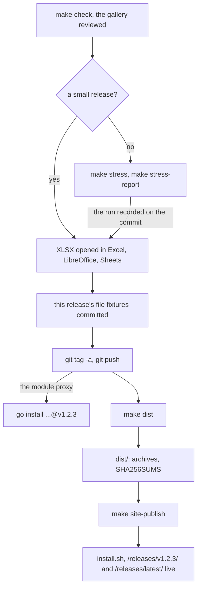

# Releasing

A release is an annotated version tag whose message is the release
notes, and archives of the binaries built from it on a maintainer's
machine, served with the docs site at
[012.dev.site](site.md#where-it-lives) along with the install scripts
that download them. The GitHub repository only
hosts the code: nothing builds or publishes there.

## Checklist

The steps in order, and what each leaves behind; a small release may
skip the stress run:



1. **`make check`** passes on the commit to be tagged (see
   [Testing](testing.md)), with the golden screens reviewed in the
   gallery.
2. **Stress** (optional for small releases): `make stress` on a quiet
   machine, then `make stress-report`, which compares the run with the
   last release's and exits non-zero on a regression past the threshold
   (see [Observability](observability.md#regressions-against-the-last-release)).
   Record the run on the release commit so the next release compares
   against it.
3. **XLSX in spreadsheet apps.** Export a workbook that uses what the
   release touches (formats, notes, frozen panes, filters, validation,
   conditional formats, charts' data) with File > Download, and open it in
   Excel, LibreOffice Calc and Google Sheets: it opens without a repair
   prompt, and values, formulas and formats read as they did in 012. The
   automated checks read XLSX with excelize and 012's own reader only.
4. **File fixtures**: the workbooks this release saves, committed (see
   [File fixtures](#file-fixtures)).
5. **Tag** with the release notes as the message, what changed since the
   previous tag for a user, with the install line last:

   ```sh
   git tag -a v1.2.3        # the editor opens for the notes
   git push origin v1.2.3
   ```

   The Go module proxy picks the tag up, so `go install
   github.com/FelineStateMachine/012/cmd/012@v1.2.3` works from then on.
6. **Binaries**: `make dist VERSION=v1.2.3` on the tagged commit.
7. **Publish** the site with the release
   ([Publishing](#publishing)):

   ```sh
   make site-publish VERSION=v1.2.3
   ```

   then check the live copy: `SHA256SUMS` at
   `https://012.dev.site/releases/v1.2.3/` matches `dist/SHA256SUMS`, and
   `curl -fsSL https://012.dev.site/install.sh | PREFIX=$(mktemp -d) sh`
   installs a `012` whose `012 version` prints v1.2.3.

## File fixtures

`internal/sheet/testdata/fixtures` holds workbooks as each release saved
them, a folder per release (`v0.2.0/`), and
`TestFixturesOpenAndSaveUnchanged` opens every one and saves it again,
failing unless the bytes come back the same. A later build that can't
open a release's file, or saves it differently, fails `make check`
([The .012 format](../files/format.md#versions) says what that
promises).

The workbooks a release saves are the ones in `fixtures/new`, written by
hand to use everything the format stores: formats, entries that read
against their format, column and row formats, widths, heights, merges,
borders, freeze, filters, names, notes, protection, rules and
validation, charts, pivot tables, a notebook tab's cells and outputs,
outputs sent to a sheet, linked files, macros, the locale and decimal
arithmetic. A release that adds to the format adds what it adds there.
Then, on the commit to be tagged:

```sh
go test ./internal/sheet -run TestFixtures -fixtures v1.2.3
```

saves them with that build into `fixtures/v1.2.3`, to commit with the
release. The test refuses a folder that exists. A released folder is
never edited or replaced: when a later build saves one differently, the
build is what changes. The folder of a release not yet tagged may be
deleted and saved again.

## make dist

`make dist VERSION=v1.2.3` (`scripts/dist.sh`) cross-compiles 012 with
`CGO_ENABLED=0` and `-trimpath` for macOS, Linux and Windows on amd64
and arm64, stamping the version with `-ldflags -X main.version=...`, so
`012 version` prints it. Each platform gets an archive in `dist/`
(gitignored) holding the binary, `LICENSE`, `NOTICE` and `README.md`:

```
dist/012_1.2.3_darwin_arm64.tar.gz
dist/012_1.2.3_linux_amd64.tar.gz
dist/012_1.2.3_windows_amd64.zip
...
dist/SHA256SUMS
```

`PLATFORMS="darwin/arm64 linux/amd64"` narrows the list. The script
refuses a version that isn't `vMAJOR.MINOR.PATCH` (with an optional
`-suffix`) or that is tagged at another commit than the one checked
out, and warns when the tree has uncommitted changes. The archives and
`SHA256SUMS` are what a release publishes.

## Publishing

`make site-release` (`scripts/site-release.sh`) builds the docs site as
`make site` does and adds the release to `website/build`:

```
website/build/install.sh
website/build/install.ps1
website/build/releases/v1.2.3/   archives, SHA256SUMS, an index page
website/build/releases/latest/   the same files
```

`VERSION` defaults to the newest version tag. The archives are `dist/`'s
when its `SHA256SUMS` names that version; otherwise the script checks
the tag out in a temporary git worktree, runs `make dist` there and
keeps the result in `dist/`, so the site can be published from a commit
after the tag. It checks the archives against `SHA256SUMS` before
copying them. `SITE_URL` also goes into the copied install scripts, so a
site built for another address serves scripts that download from it.

The site serves one release, `VERSION`, under both addresses; earlier
releases stay installable with `go install ...@v1.2.3`.
`make site-publish` deploys the result
([The docs site](site.md#where-it-lives)). Every deploy replaces the
whole site, so the docs are always published with the release: a
deploy of a plain `make site` build leaves the install script without
its archives.

The install scripts live in `scripts/install/`. `install.sh` is POSIX
sh (it runs under dash as well as sh) and needs curl or wget, tar, and
sha256sum, shasum or openssl. `install_test.go`, in `make test`, runs
it as a file and piped to the shell against a local server holding a
fake release: the latest into `~/.local/bin`, a version under `PREFIX`,
and a refusal of an archive whose checksum doesn't match. `install.ps1`
has no automated test, as no PowerShell is assumed on a maintainer's
machine; try it on Windows when it changes.
