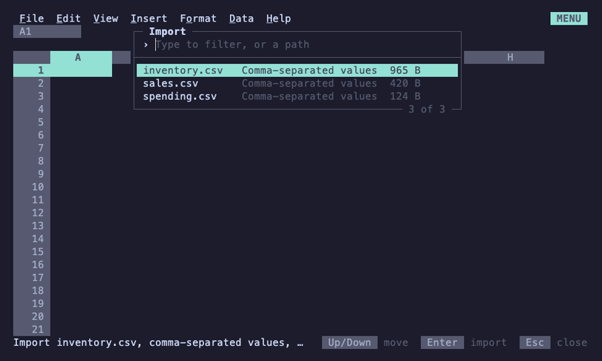

# Files

Spreadsheets save as `.012` files: JSON with one line per cell, every
sheet in one file. Other formats come in through File > Import, File >
Open or the command line (`012 sales.xlsx`), and go out through File >
Download.



## Import and download

Imports run in the background with a progress bar; Esc cancels. Saving
an imported sheet asks whether to save it as a `.012` file or download
it back in its format.

| Format | Import | Download |
|---|---|---|
| CSV, TSV | Delimiter (`,` `;` tab `\|`), UTF-8 BOM, UTF-16 and Windows-1252 detected; entries become numbers, dates, currency and percentages as if typed; formulas stay text | Values as shown, of the sheet shown, as Sheets' Download does; a selection of whole columns or rows downloads their data, not a million blank lines |
| Excel `.xlsx` | Every sheet, with formulas, formats and most of what a sheet holds: see [Excel files](#excel-files) | The same |
| SQLite | Pick a table or view, or type a query; a header row names the columns | The sheet shown or the selection as a table, first row as column names; a table of that name is replaced |
| Parquet | Every column, with dates and timestamps; lists joined with commas | |
| Lotus 1-2-3 `.wk1`, `.wks` | Numbers, labels with their alignment, formats, column widths, formulas translated (references, operators, `@SUM`, `@AVG`, `@IF`, `@ROUND`, `@PMT` and 60 more) or kept as values | |

Formats other than XLSX import as one sheet named after the file (or the
SQLite table).

File > Import asks where the data goes, as Sheets' Import location does
(a new, empty spreadsheet is simply replaced):

| Location | Does |
|---|---|
| Insert new sheet(s) | Adds the file's sheets after the sheet shown. A name already taken gets a number (`Sales 2`) and the file's formulas follow it; named ranges come along unless their name is taken. One undo step, and the spreadsheet stays the file you're editing |
| Replace current sheet | Puts the data in place of the sheet shown, keeping its name and position, so formulas and named ranges that read it read the new data. One undo step. Not offered for `.xlsx`, which holds several sheets |
| Replace spreadsheet | Opens the file instead, as File > Open and the command line do, asking first when there are unsaved changes |

Replacing the current sheet keeps the charts that fit the new data. A
chart that drew a whole table is re-pointed to the table the file has at
the same corner when it has as many columns (rows for a chart by row),
so last month's chart draws this month's rows; a chart of part of a
table, or of whole columns or rows, keeps its range. A chart whose table
now has other columns, or whose range is empty, is removed. The context
line lists the removed charts first, then which were re-pointed and
which kept their range, and undo brings the removed ones back.

**Size.** A sheet is 1,048,576 rows by 16,384 columns (A to XFD), as in
Excel. Imports keep at most `max-cells` cells ([config.md](config.md#max-cells),
two million by default, about 600 MB): whole rows, as many as fit, and
the context line says how many rows were left out, e.g. `only the first
166,666 rows fit in max-cells (2,000,000 cells); 12,000 rows left out`.
Data past the grid's edges is left out the same way. WK1 files keep their
own 8,192 by 256. See [limits.md](limits.md#imports) for speeds.

## Excel files

**Read:** every sheet, opening on the one Excel showed; values, formulas
(references between sheets too, shared formulas), workbook named ranges,
number formats, bold, italic, underline, strikethrough, alignment,
column widths, column and row styles, frozen panes, [filters](#filters-in-excel),
notes (Excel's notes, its legacy comments; threaded comments aren't
read), [conditional formatting and data validation](#rules-in-excel),
[array formulas](#arrays-in-excel),
dates in the 1904 system, and hidden sheets (unless it's the one Excel
showed).

**Written:** the same, with formulas in Excel's syntax and their results
cached, column and row formats as column and row styles, frozen rows and
columns as frozen panes, a filter as Excel's with the rows it hides
hidden, notes as Excel's notes (which Sheets reads as notes), and
formulas that spill as Excel 365's [dynamic array formulas](#arrays-in-excel).

What changes on the way:

| | |
|---|---|
| Formulas 012 can't read (unknown functions) | Keep their values |
| Excel pivot tables | Come in as the values they showed; 012's go out as their results, not a pivot |
| Excel's sheet protection | Comes in unprotected, with a note saying so: Excel's protection locks cells where 012's only warns. Protected ranges aren't written |
| Array formulas (Excel 365's dynamic arrays and older `{=...}` ones) | Come in as formulas that spill again, without the values Excel kept in the cells they spill into |
| Functions only Sheets has (`SORTN`, `FLATTEN`, `SPLIT`, `REGEXMATCH`, `REGEXEXTRACT`) | Go out as values, counted with the others below |
| JEV functions, `#AND#`, formulas naming a sheet that doesn't exist | Go out as values (their `#REF!`, for a missing sheet: Excel would refuse the reference). The download's result counts the formulas saved as values, with an example |
| A sheet name Excel can't take as is (spaces at its ends, or the same as another's but for them and case) | Written as one it can: without the spaces, with a number when two would clash (`Plan (2)`); formulas and named ranges naming it name that |
| Files past the reader's limits (a zip bomb, 1 GB in one part, 2 GB in all, cells past XFD1048576) | Refused, with a message saying which |

### Filters in Excel

A sheet's filter goes out as Excel's AutoFilter over the same range, and
an AutoFilter comes in as a filter:

| 012 | Excel |
|---|---|
| Filter by values: the values unchecked | The list of values shown (Excel keeps those checked), with blanks when they're shown. Values are compared as displayed, ignoring case |
| Is empty | Blanks only |
| Is not empty | Custom filter: does not equal a space |
| Text contains, does not contain, starts with, ends with, is exactly | Custom filter: equals or does not equal `*text*`, `text*`, `*text`, `text`, with Excel's wildcards in the text escaped (`~*`) |
| Greater than, less than, is equal to, is not equal to (and or equal to) | Custom filter with that operator; numbers typed as `$1,200` or `12%` go out as the number |

The rows the filter hides are written hidden, since Excel shows a file's
rows as saved rather than filtering again. A column with both unchecked
values and a condition goes out as the list of values both let through,
and comes back as that list. What 012's filters can't do is left out,
with a note saying how many criteria and which: two conditions in one
column (`and`, `or`), wildcards other than at the ends of the text (`a?c`,
`a*c`), top 10, dynamic filters (above average, this month), dates
grouped by year or month, and filtering by color or icon. The filter
itself still comes in over its range. Filters of Excel tables (as
opposed to the sheet's AutoFilter) aren't read.

### Arrays in Excel

A formula whose array spills (see [formulas.md](formulas.md#arrays-and-spills))
is written as Excel writes a dynamic array formula: an array formula over
the cells it spills into (`<f t="array" ref="C1:C9">`) on a cell whose
metadata marks it dynamic (`cm="1"`, defined in `xl/metadata.xml`), with
the values in the cells below and right of it, so Excel spills it the
same and older Excels show the values. Formulas calling array functions
(`FILTER`, `SORT`, `UNIQUE`, `SEQUENCE`, `LET`, `LAMBDA` and the like) or
holding an array literal are written that way even when they compute one
value, so Excel doesn't put its implicit intersection (`@`) in front of
them. Excel gets its own names for the functions newer than Excel 2007
(`_xlfn._xlws.FILTER`, `_xlfn.SEQUENCE`), `_xlpm.` before the names LET
and LAMBDA bind, and the formula inside an `ARRAYFORMULA` around a whole
formula, which a dynamic array formula computes over arrays anyway.
What Excel can't hold goes out as the value it showed, counted in the
download's note: functions only Sheets has (`SORTN`, `FLATTEN`, `SPLIT`,
`REGEXMATCH`, and `REGEXEXTRACT`, whose Excel namesake returns the whole
match where Sheets' returns the capture group), array literals holding
references (Excel's hold only constants) and `ARRAYFORMULA` inside a
formula.

### Rules in Excel

[Conditional formats](data.md#conditional-formatting) go out as Excel's
conditional formatting, and [data validation](data.md#data-validation)
as its data validation, and both come back:

| Conditional format | Excel |
|---|---|
| Is empty, is not empty | `containsBlanks`, `notContainsBlanks` |
| Text contains, does not contain, starts with, ends with | `containsText`, `notContainsText`, `beginsWith`, `endsWith` |
| Text is exactly | `cellIs` equal to the text |
| Date is today, tomorrow, yesterday | `timePeriod` |
| Date is, is before, is after a date | an expression, `INT(A1)<DATE(2026,9,30)` |
| Greater than ... is not between | `cellIs` with the operator; dates as Excel's serial numbers |
| Custom formula is | `expression`, in Excel's syntax |
| Color scale | `colorScale` with its points (`min`, `max`, `num`, `percent`, `percentile`) |
| A rule's style | a differential style (dxf): bold, italic, underline, strikethrough, the text color and a solid fill |

| Data validation | Excel |
|---|---|
| Dropdown, from a range | `list` of the items in quotes, or of the range (`Lists!$A$1:$A$20`) |
| Checkbox | `list` of `TRUE,FALSE`, which comes back as a checkbox |
| Number, date, text length | `decimal`, `date`, `textLength` with the operator; any date as a date greater than 0 |
| Custom formula is | `custom` |
| Reject the input, show a warning | error style `stop`, `warning`; help text as the prompt |

Each single-color rule stops the ones after it (`stopIfTrue`) and its
priority is its place, so Excel applies the first that matches, as 012
does. Named colors go out in the colors of Sheets' palette, and Excel's
colors (ARGB, theme and indexed) come in as the nearest named color by
hue, grays as none; a color scale's gray or white point takes the nearest
scale color. Validation in Excel 2010's extension (lists from other
sheets) is read too; whole-number rules come in as number rules.

Left out, with a note saying how many and which: conditional formats 012
has no rule for (data bars, icon sets, top or bottom values, above or
below average, duplicate or unique values, errors, date periods other
than today, tomorrow and yesterday, and what Excel 2010's extension
holds), rules whose style has only a number format or borders, time
validation and lists from named ranges or formulas. Going out, a
formula with no Excel equivalent (`#AND#`) leaves its rule out, and so
do list items with commas or quotes, or longer than Excel's 255
characters.

## Saving

Saves are atomic: 012 writes a temporary file and renames it. Saving over
the open file when something else wrote it since it was opened or last
saved (another program, or another session of [012 serve](ssh.md)) asks
first: Enter overwrites, S saves under another name, Esc cancels. Save
as (and `:w name`, `:wq name` with vim keys) onto another file that
exists asks the same way: Enter replaces it, Esc cancels, and cancelling
`:wq`'s question cancels its quit too.

Under `012 serve`, a session that idles out or is ended by the server
stopping keeps its unsaved changes in `.012-recovery/` in the served
directory, and the next session opening that file offers them back: see
[ssh.md](ssh.md#unsaved-work).

## The .012 format

`.012` files are JSON with one line per cell, keyed by address, so diffs
read naturally and files merge reasonably in version control. A cell
without formatting is just what was typed; a formatted cell is a small
object:

```json
{
  "version": 2,
  "widths": {"A": 14},
  "cells": {
    "A1": "Rent",
    "B1": {"input":"1450","format":"currency","decimals":2},
    "B2": {"input":"95","note":"Due on the 1st"},
    "B3": "=SUM(B1:B2)"
  }
}
```

A formatted cell has its `input` and the formatting that isn't the
default: `format` (as `number_format` in [macros](macros.md#cells) names
it: `currency`, `percent`, `date`, ...), `decimals`, `pattern` for a
custom format, `bold`, `italic`, `underline`, `strikethrough` and
`align` (`left`, `center`, `right`).

### Versions

012 writes the lowest version that holds the workbook, so older builds
open what they can, and refuses a version newer than it knows rather
than lose sheets or pivots. Version 1 files (cells as plain strings)
still load.

| Version | Written when | Adds |
|---|---|---|
| 2 | One sheet, using none of the below | `cells`, `widths` |
| 3 | A sheet has named ranges, frozen panes or a filter | `names` (each name's range, `#REF!` once its cells were deleted), `freeze` (`rows`, `cols`), `filter` (its `range`, and `columns` by letter, each with `hidden` values or a `condition` and its `value`) |
| 4 | Several sheets, or a formula naming a sheet | `sheets`, a list; see [Several sheets](#several-sheets) |
| 5 | A pivot table | a sheet's `pivot`; see [Pivot tables](#pivot-tables) |

### Fields that need no version

Builds that don't know these fields ignore them (and drop them if they
save), so they raise no version:

| Field | On | Holds |
|---|---|---|
| `note` | a cell | Its [note](data.md#notes) |
| `own` | a cell | `true` when its formatting is its own, not its column's or row's (Automatic in a currency column) |
| `lines` | a sheet | [Column and row formats](#column-and-row-formats) |
| `name`, `hidden` | a sheet | Its name when renamed; `true` when hidden (a file whose sheets are all hidden opens with the first one shown) |
| `charts` | a sheet | One chart per line: `type` (`column`, `bar`, `line`, `pie`, `area`, `scatter`), `data`, `at`, `width`, `height`, `byRow`, `header`, `labels`, `title`, and options left out at their defaults: `stack` (`stacked`, `percent`), `trend`, `min`, `max`, `log`, `gridlines` (only when off), `legend` (`right`, `none`). A build that charts but lacks a chart's type refuses the file |
| `protected` | a sheet | [Protected ranges](data.md#protected-sheets-and-ranges): `{"range":"B2:C9","description":"Totals"}`, or `{"sheet":true}` |
| `conditionalFormats`, `validations` | a sheet | [Rules](#conditional-formats-and-data-validation), one per line |
| `arithmetic` | the workbook | `decimal` for [decimal arithmetic](formulas.md#decimal-arithmetic) |
| `macros`, `macroOrigin` | the workbook | Macros as Starlark scripts, and the computer they were made or trusted on: see [macros.md](macros.md#in-the-file). Opening a file never runs them |

### Column and row formats

[Formats of whole columns and rows](data.md#rows-and-columns) are kept
in a `lines` field after the widths, runs of lines with the same
formatting together; `A:XFD` is the whole sheet's format:

```json
  "lines": {"A:XFD": {"italic":true}, "B:D": {"format":"currency","decimals":2}, "1:1": {"bold":true}},
```

### Several sheets

In version 4 the sheets are a list, each with its name and the fields a
version 3 file has at the top, and named ranges say their sheet. The
workbook's settings (named ranges, decimal arithmetic, the sheet shown
when saved as `active`) stay at the top:

```json
{
  "version": 4,
  "names": {"Rent": "Budget!B1"},
  "active": 1,
  "sheets": [
    {
      "name": "Budget",
      "cells": {
        "A1": "Rent",
        "B1": "1450"
      }
    },
    {
      "name": "Q3 plan",
      "hidden": true,
      "cells": {
        "A1": "=Budget!B1*3"
      }
    }
  ]
}
```

### Pivot tables

A pivot's sheet has a `pivot` field, on one line after its cells,
holding the definition. The results are never saved; they are computed
again when the file opens, so the file stays small and can't disagree
with its data.
Arrays that formulas spill are kept the same way: the file keeps the formula,
and the cells it spills into only for their formatting and notes.

```json
{
  "name": "Pivot Table 1",
  "cells": {},
  "pivot": {"source":"Sales!A1:D200","rows":[{"column":"B"},{"column":"A","order":"desc","sortBy":1}],"columns":[{"column":"C"}],"values":[{"column":"D","summarize":"sum"},{"column":"D","summarize":"counta","showAs":"percent_of_total","name":"Share"}],"filters":[{"column":"A","hidden":["North"]}],"rowTotals":true,"columnTotals":false}
}
```

- `source` is the data, with its sheet; `Sales!#REF!` once the range was
  deleted. The sheet is by name, as in formulas, and follows renames.
- `rows` and `columns` are fields by column letter on the source sheet,
  with `order` `desc` for Z to A and `sortBy` the value, counting from 1,
  whose totals order the groups.
- `values` summarize a column: `sum`, `counta`, `count`, `countunique`,
  `average`, `max`, `min`, or `rows` (every row, blank or not, which
  frequency tables use); `showAs` is `percent_of_row`,
  `percent_of_column` or `percent_of_total`; `name` replaces the header.
- `filters` take a filter column's criteria: `hidden` values and a
  `condition` with its `value`.
- `rowTotals` and `columnTotals` are the grand total row and column.

### Conditional formats and data validation

A sheet's rules are two lists after its cells and charts, one rule per
line:

```json
  "conditionalFormats": [
    {"ranges":"A2:A6","condition":"formula","values":["=$D2"],"text":"green","strikethrough":true},
    {"ranges":"C2:C6","scale":[{"type":"min","color":"green"},{"type":"percentile","value":"50","color":"yellow"},{"type":"max","color":"red"}]}
  ],
  "validations": [
    {"ranges":"B2:B6","criteria":"list","items":["Ann","Bo","Cy"],"help":"Pick who does it"},
    {"ranges":"D2:D6","criteria":"checkbox"},
    {"ranges":"C2:C6","criteria":"number","condition":"between","values":["0","80"],"reject":true}
  ]
```

- `ranges` are the rule's ranges, `A2:A9,C2:C9`.
- A single-color rule has a `condition` (`empty`, `not_empty`, `contains`,
  `not_contains`, `starts_with`, `ends_with`, `exactly`, `date_is`,
  `date_before`, `date_after`, `gt`, `ge`, `lt`, `le`, `eq`, `ne`,
  `between`, `not_between`, `formula`), its `values` as typed, and its
  style: `text` and `fill` colors (`red`, `yellow`, `green`, `cyan`,
  `blue`, `magenta`) and `bold`, `italic`, `underline`, `strikethrough`.
- A color scale has `scale`: two or three points, each a `type` (`min`,
  `max`, `num`, `percent`, `percentile`), a `value` where it takes one,
  and a `color`.
- A validation rule has `criteria` (`list`, `range`, `checkbox`,
  `number`, `date`, `length`, `formula`) with its `items`, `source`
  (`Lists!A1:A20`), or `condition` (`between`, `not_between`, `eq`, `ne`,
  `gt`, `ge`, `lt`, `le`; none for any date) and `values`; `reject` refuses
  invalid entries, and `help` replaces the rule's own help text.

A line of either list is also what Add conditional format rule and Add
data validation rule take (in the palette, and as `run(...,
answer=...)` in macros), which is how a macro records a rule added from
the panel.
