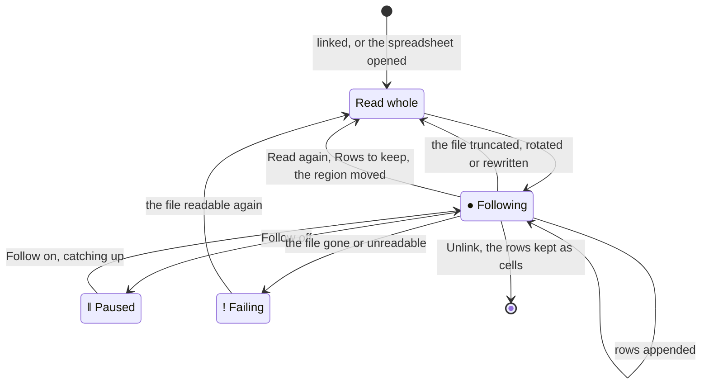

# Following files

A file can be linked rather than imported: its table shows in a linked
region of a sheet that follows the file, as `tail -f` follows a log. Rows
appended to a CSV, TSV, JSON lines or NUON file come in as they're
written; any file 012 imports (XLSX, SQLite, Parquet too) is read again
when it's rewritten. Formulas, charts, pivot tables and rules over the
region recalculate as rows arrive.

## Linking a file

- **Data > Linked file > Link a table** links a file at the active cell,
  which must be empty. The picker lists the files around, as File >
  Import's does, or takes a path.
- **File > Import**, then **Follow the file** among the import locations,
  follows the file in a new sheet after the one shown, named after the
  file. On a new, empty spreadsheet File > Import opens the file instead,
  as it always does; link it with Data > Linked file there.

For a SQLite database with several tables, a picker asks which one. Then
a question on the context line asks how many rows to keep:

| Key | Keeps |
|---|---|
| Enter | Every row, up to `max-cells` ([Configuration](../reference/config.md#max-cells)); past it, the rows that don't fit are left out and the context line says so |
| L | The last rows, as many as typed (1,000 to start with): older rows drop as new ones arrive. The first row, the file's header, stays |

## The region

The first row of the region is the file's first row (a NUON or JSON
file's column names, as an import names them); the rows under it are the
file's rows, typed as an import types them. The region is the file's:

- its cells are read-only; typing into one, pasting over it or clearing
  it says so. Formatting them (bold, number formats, colors) is fine and
  stays on the cell as rows go by;
- its values show in italics, as an array's spilled values do, and
  copying them copies values;
- it grows to the right and down as the file does. Where it would write
  over a cell holding something, its rows aren't shown, and its first
  cell (`#REF!`) and the context line say which cell is in the way;
  clearing that cell reads the file again;
- inserting or deleting rows or columns before it moves it, and it reads
  the file again there; deleting its first cell's row or column unlinks
  it.

A linked file is a region, as a [notebook](../nushell/notebooks.md)
cell's output sent to a sheet is, named after the file (`app` for
`app.csv`, `app_2` for a second link to it): formulas on any sheet read
its table as `nu.app`, and notebook cells as `$app`, its rows as they
are when the cell runs ([Names and
$name](../nushell/notebooks.md#names-and-name)).

The sheet's tab carries a mark, and the context line says what the
region under the pointer is doing:

| Mark | Context line |
|---|---|
| `●` | `● Following app.csv  1,204 rows, updated 09:14:17`; with a window, `(the last 1,000)` and how many older rows dropped |
| `‖` | `‖ Paused app.csv ...`: Data > Linked file > Follow is off |
| `!` | `! app.csv: the file isn't there`, or why the file can't be read or its rows written. A region with nothing to show has `#REF!` in its first cell |

## How a file is followed

012 checks each linked file four times a second with the operating
system's file information alone (size, modification time, identity), so
a file that doesn't change costs one check.

- **Text tables that grow** (CSV, TSV, `.json`, `.ndjson`, `.jsonl`,
  NUON): the bytes appended since the last check are read and their rows
  added. A line still being written (or a NUON value, or a quoted CSV
  field spanning lines) waits until it's whole. A file shorter than what
  was read (truncated), another file at the same path (rotated, as
  `logrotate` does), or one whose last bytes read differ (rewritten in
  place) is read again from its start. A large file comes in a megabyte at a time, the screen
  staying live between.
- **Files that are rewritten** (XLSX, SQLite, Parquet, and `.wk1`): the
  file is read again whole when its size or modification time changes,
  once they've held still for 0.3 s, so a file being written isn't read
  half done. An XLSX file's sheet shown when it was saved is the one read.

Rows arrive outside the undo history, as an array's spilled values do:
undo takes back edits, not the file's rows, and rows arriving don't mark
the spreadsheet modified.

## Pause, read again, unlink

A linked region follows its file, is paused, or shows why it can't read
it, and is read again whole whenever its cells may no longer be the
file's:

Data > Linked file acts on the region under the pointer, or the sheet's
only one:

| Command | Does |
|---|---|
| Follow | Pauses following (the region keeps its rows) or follows again, catching up |
| Read again | Reads the file again, whole |
| Rows to keep | Asks again how many rows to keep; the file is read again |
| Unlink | Keeps the rows as ordinary cells, values with their formats, and stops following; undo links the file again |

## Saving and opening

A spreadsheet keeps what each region reads, never its rows (see
[The .012 format](format.md#regions)): the file's path relative to
the spreadsheet's folder (absolute when the file is elsewhere and was
linked by an absolute path), its format, the SQLite table or query, and
how many rows to keep. Saving in another folder keeps the paths naming
the same files. Opening the spreadsheet reads the files again and follows
them; a file that isn't there shows in its region, and is read once it
is.

Under `012 serve`, linked files resolve inside the served folder, as
every file name a session types does ([Serving over SSH](../terminal/ssh.md));
a spreadsheet linking a file outside it shows why in the region.

## Files from elsewhere

Following reads files, so a spreadsheet made on another computer asks
once before following files outside its own folder (an absolute path,
or one through `..`): the context line names them, Enter follows them
and records this computer as trusted in the spreadsheet, Esc leaves
their regions empty. Files in the spreadsheet's folder or below never
ask. The trust is the spreadsheet's one trust (`macroOrigin`, saved with
it), which its macros and shell commands need too
([Macros](../sheets/macros.md#macros-from-other-computers)): a
spreadsheet made or trusted on this computer follows its files, runs its
macros and its commands without asking.

What following costs, measured, is in
[Bounds of support](../contributing/limits.md#following-files).
