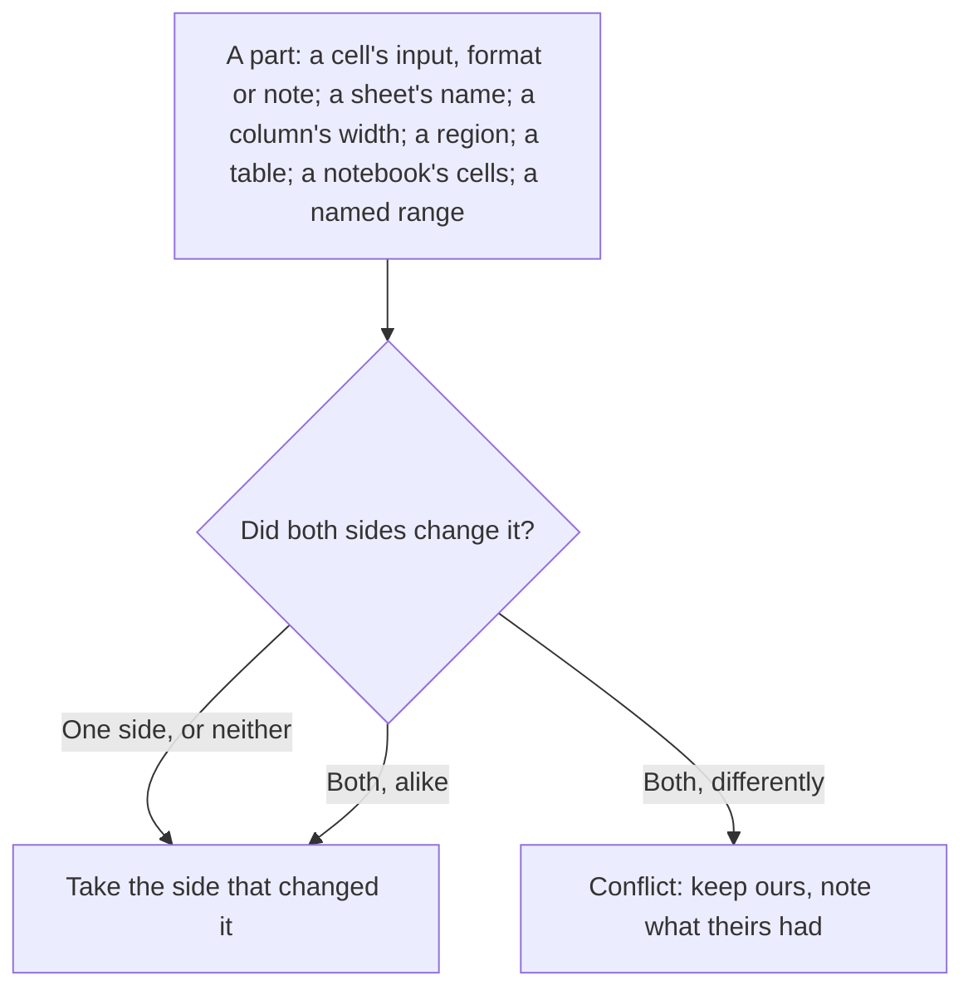

# Diff and merge in git

`012 diff` compares two workbooks cell by cell, and `012 merge-driver`
merges them, so sheets kept in git are reviewed and merged like code.

## 012 diff

```sh
012 diff budget.012 budget-v2.012
```

```
sheet Q4  renamed from Q3
sheet Notes  added
Q4!B7  input  =SUM(A1:A5) → =SUM(A1:A6)
Q4!B7  value  15 → 21
Q4!C2  value  15 → 21
Q4!D9  input  - 42
Q4!A12  input  + Total
Q4!B3  format  currency, decimals 2 → currency, bold, decimals 2
Q4!B3  note  check → checked
Q4 widths  C  10 → 14
Notebook cell 2  source  ls → ls -a
name Sales  range  Q3!B2:B20 → Q4!B2:B21
```

A line says where, what about it changed, and `old → new`, `+ new` for
something added or `- old` for something removed. On a terminal (and in
git's pager) the old side is red and the new green; `--color never` or
`NO_COLOR` turns that off, `--color always` on.

What it compares:

| Change | Lines |
|---|---|
| Sheets | `added`, `removed`, `renamed from`, `moved from 3 to 1`. A sheet under a new name that holds at least half the cells of one gone is that sheet renamed |
| Cells | `input` (what was typed: a formula or an entry), `value` (what a formula computes, or an array spilled), `format` (the cell's formatting, by its fields in the file), `note` |
| Notebooks | Each [notebook](../nushell/notebooks.md) cell, lined up by its source: `added`, `removed`, or which field changed (`source`, `output`, `error`) |
| Regions | Each [linked file](following.md) or notebook output sent to a sheet, by name: added, removed, or which field changed |
| Tables | Each [table](../sheets/tables.md), by name, the same way: `Q3 table Sales  range  A1:C9 → A1:C10` |
| Layout | Every other field of a sheet, by its name in [the file](format.md): `widths`, `heights` and `lines` key by key, the rest (`charts`, `conditionalFormats`, `freeze`) whole |
| Workbook | Named ranges, macros, the locale and decimal arithmetic |

A value is shown only for formulas and cells an array filled, since a
typed entry's value is its input. Values that change on every
recalculation (`NOW()`, `RAND()` and what reads them, on any sheet)
aren't compared, and neither is anything that needs a notebook cell or
JEV run: `012 diff` only reads the two files, whose notebook outputs are
compared as they were saved. The sheet shown, the
file's version, the notebook prompt's history and which computer
trusted its commands aren't changes either.

`--format json` and `--format nuon` write the changes as a table with
the columns `kind`, `sheet`, `item`, `field`, `old` and `new`, values
with their types:

```nu
012 diff a.012 b.012 --format nuon | from nuon | where kind == cell and field == value
```

The exit status is diff(1)'s: 0 when the workbooks are the same, 1 when
they differ, 2 on trouble (a file that can't be read).

## Git

Tell git which files are workbooks, in `.gitattributes` at the top of
the repository (committed, so everyone's clone knows):

```
*.012 diff=012 merge=012
```

and what `012` means for them, in each clone or in your global git
config (git doesn't take commands from a repository):

```sh
git config diff.012.command '012 diff'
git config diff.012.textconv '012 diff --textconv'
git config merge.012.name '012 cell by cell'
git config merge.012.driver '012 merge-driver %O %A %B %P'
```

- **`diff.012.command`** makes `git diff`, `git show` and `git log -p`
  show 012's diff for each workbook, under a `diff --012 a/budget.012
  b/budget.012` header. Git calls it with its own seven arguments, which
  `012 diff` recognizes; it exits 0 then, as git expects.
- **`diff.012.textconv`** is for what doesn't use the external diff:
  `git diff --no-ext-diff`, `git log -p --no-ext-diff`, `git blame`,
  `git grep` and hosting sites that honor textconv. `012 diff --textconv
  file` writes the workbook as one line per cell and field, each naming
  its sheet (`Q3!B7  =SUM(A1:A6)  = 21  [currency, decimals 2]`), and git
  diffs those lines. Either can be set alone.
- **`merge.012.driver`** merges workbooks cell by cell, below.

## Merging

`012 merge-driver base ours theirs [path]` merges theirs into ours from
their common base and writes the result over ours, which is what git
asks of a merge driver (`%O %A %B %P`). Each part of a workbook merges
on its own:



So two people editing different cells of one sheet, or one formatting a
cell while the other retypes it, merge without conflicts. Sheets are
matched by name, or by their cells when renamed (as `012 diff` matches
them): a sheet renamed on one side and edited on the other merges both.
A sheet removed on one side goes, unless the other side changed it,
which is a conflict: ours stays (kept when ours changed it, gone when
ours removed it). Sheets added on both sides under one name merge cell
by cell. A notebook's cells are one part, their sources compared: the
side that changed them brings its cells and their outputs, and a
notebook run on both sides with the same cells keeps ours' outputs.

On conflicts the merge keeps ours for each, adds to the cell's note what
theirs had (`Merge conflict, kept ours; theirs had input 11`), so the
cells show the note's mark in the grid, lists them on standard error and
exits 1:

```
012 merge-driver: 1 conflict in budget.012, where ours is kept; a cell's note says what theirs had:
  Sheet1!B2 input: ours 12, theirs 11, base 10
```

Git then reports the file as conflicted. Open it in 012, fix the cells
and delete the notes, then `git add` it; or take one side whole with
`git checkout --ours` or `--theirs`. A merge that can't be made at all
(a side that isn't a workbook, or a result the engine refuses, such as a
named range left on a sheet the other side removed) leaves ours as it
was and exits 2, which git also takes as a conflict.

Two limits:

- Inserting or deleting rows or columns moves every cell below or to
  the right, which a merge by address can't tell from edits to those
  cells. Merge such a change in 012 instead: open both versions and copy
  across.
- Trust in a file's commands follows [macros' rule](../sheets/macros.md#macros-from-other-computers):
  the merged file keeps ours' trust only when its macros, notebook cells
  and linked files are ours', or theirs were trusted on the same
  computer. Otherwise the next time the file runs one, 012 asks first.
