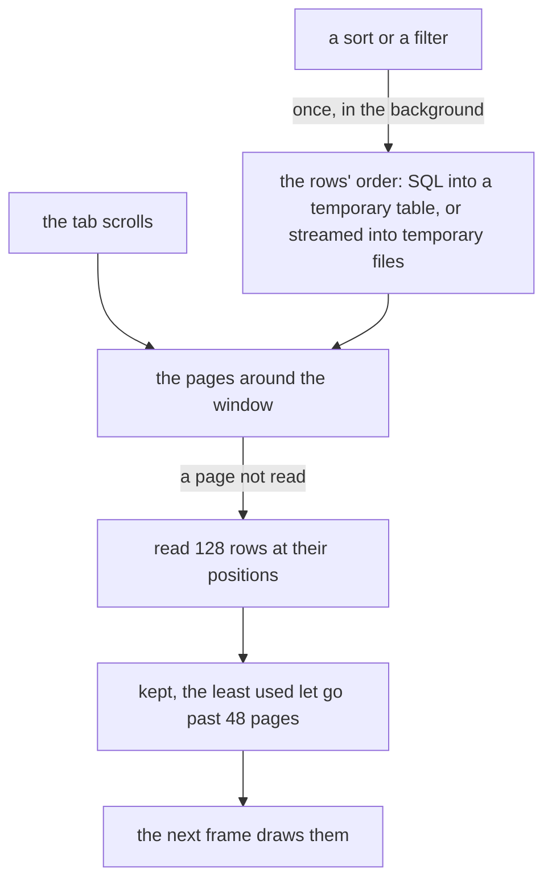

# Linked sources

A Parquet file, or a SQLite table or query, too big for any grid links
as a source: a read-only table on a tab of its own, read in place
rather than imported. The tab shows a window of the rows as it
scrolls, with the row numbers and the scrollbar over every row, and
formulas and pivot tables read the whole source by streaming it. A
source of ten million rows opens at once and takes a few MB.

## Linking a source

**Data > Linked file > Link a source** lists the Parquet files and
SQLite databases in the folder, or takes a path. For a database a
second list asks which table or view to read, or **A query…** to read
what a `SELECT` returns.

The source gets a tab after the one shown, named after the file
(`sales` for `sales.parquet`), with `▦` before its name. The source is
a [table](../sheets/tables.md) of that name, which formulas on any sheet
read as a table's:

| Formula | Reads |
|---|---|
| `=SUM(sales[amount])` | a column's values, every row |
| `=ROWS(sales)` | the rows under the header |
| `=COUNTA(nu.sales)` | the whole table, header row included |
| `=sales!C5` | one cell: row 1 is the header, so row 5 is the source's fourth row |

Renaming the tab keeps the table's name. Undo takes the link back. A
source's rows may run past the grid's last row, 1,048,576: its table's
name reaches them all, where a reference typed as `C5` stops at the
grid's edge.

## The tab

Row 1 is the header, the columns' names, and stays put as the rows
scroll under it. The rows are numbered as the tab's rows, so the
source's first row is row 2, and `sales!C2` is its first amount. The
scrollbar at the right edge is as long as the share of the rows shown,
and as far down as they are.

| Key or mouse | Does |
|---|---|
| Arrows, Tab | Move the active cell |
| Page Up, Page Down, the wheel | Scroll |
| Home, End | The first or last column |
| Ctrl+Up, Ctrl+Down | The first or last row |
| Ctrl+Home, Ctrl+End | The first cell, the last |
| A click on the scrollbar, or dragging its thumb | Jumps there |
| Ctrl+G, F5 | Goes to a row, or a cell such as `C5000000` |
| Ctrl+C | Copies the active cell |

The rows come from the file a page (128 rows) at a time, in the
background, the pages either side of the window read ahead, so
scrolling finds them there. A row on its way shows `…`. The name box
shows the active cell as the tab names it, and the formula bar its
value; the context line says what the source is:
`▦ sales.parquet  10,000,000 rows, 4 columns`. The mode is `SOURCE`,
and typing, pasting or formatting there says the tab is read-only.

## Sorting and filtering

The tab's rows sort and filter as a sheet's do, without changing the
file:

- **Data > Sort sheet A to Z** (or **Z to A**) sorts by the active
  column; blanks go last either way.
- **Data > Create a filter** or **Filter by column** asks for a
  condition on the active column: the conditions of a sheet's
  [filter](../sheets/sort-filter.md#filter). There is no list of values
  to tick: a source's are too many to list. Each column's condition
  applies at once.
- **Data > Remove filter** drops the conditions, and **Data > Linked
  file > Original order** shows the source's own rows in its own order.

Each is an undo step and is saved with the workbook. Formulas read the
source in its own order, every row, as formulas read the rows a sheet's
filter hides.

Ordering reads the whole source once, in the background, while the
context line says `sorting and filtering…`; the tab then shows the
first of the rows. SQLite does the work: the sort and the conditions
become SQL, the rows' order is kept in a temporary database beside the
system's temporary files, and the database itself is never written. A
Parquet file is streamed: a filter is one pass over the columns it
tests, and a sort writes sorted runs to temporary files and merges
them, so memory stays a few MB and up to about 100 MB while sorting,
whatever the size. Either way a page anywhere in the ordered rows
costs what one at the top does:

In SQLite a text condition compares the text as SQLite writes it, so a
number reads as `1e+20` where the sheet shows `1E+20`, a date held as
text (`2026-09-26`) sorts and compares as that text, and letters beyond
ASCII are compared by case.

## Formulas over a source

A function given a source's range is worked out in the background, by
reading the source; its cell shows `Loading…` until then. The answer
is kept until the file changes, so another formula asking the same, or
the same formula recalculating, costs nothing.

These read a source of any size in one pass, holding only what they
compute:

| Kind | Functions |
|---|---|
| Aggregates | SUM, AVERAGE, COUNT, COUNTA, MIN, MAX, PRODUCT |
| Criteria | COUNTIF, COUNTIFS, SUMIF, SUMIFS, AVERAGEIF, AVERAGEIFS, COUNTBLANK, SUMPRODUCT |
| Lookups | MATCH, XLOOKUP, VLOOKUP, HLOOKUP, INDEX, ROWS, COLUMNS |

Any other function (MEDIAN, SORT, FILTER, UNIQUE, TEXTJOIN) holds what
it reads, and is given a source's range as long as that holds no more
than `max-cells` cells ([Configuration](../reference/config.md#max-cells));
past it the formula shows `#VALUE!`, and the context line says what it
would have read. So does an operator over a source's range
(`=SUM(sales[amount]*2)`) and a function whose other arguments are
ranges of a sheet or arrays: `SUMPRODUCT((sales[cat]="north")*sales[amount])`
computes an array as long as the source, where
`SUMIFS(sales[amount],sales[cat],"north")` streams.

## Pivot tables

**Data > Pivot table** on a source's tab makes a
[pivot table](../sheets/pivots.md) over the whole source, and **Data >
Frequency table (column stats)** one of the active column. The source's rows are
grouped in the background, `Loading…` showing in the pivot table's
first cell until they are, and again whenever the file changes. A
filter of a pivot table over a source takes a condition, not values
ticked.

## When the file changes

012 looks at each source's file four times a second, with the
operating system's file information alone. Once the file has changed
and held still for 0.3 s, the source is read again: the tab, and every
formula and pivot table reading it. **Data > Linked file > Read the
source again** does the same at once. A file that isn't there shows
`!` after the tab's name and the reason on the context line, and the
formulas reading it show `#REF!` with it.

## Saving and sharing

The workbook keeps the link, never the rows: the file's path relative
to the workbook's folder, the table or query, and the tab's order
([The .012 format](format.md#linked-sources)). Opening the workbook
reads the sources again. A workbook from another computer asks before
reading files outside its own folder, as for
[linked files](following.md#files-from-elsewhere).

`012 get`, `recalc` and `export` ([Scripts](scripts.md)) read the
sources in the workbook's folder or below, to the end, before they
answer. Under `012 serve` sources are read in the served folder, and in
a [shared workbook](../terminal/ssh.md#sharing-a-workbook) the room reads them, as it follows linked
files, while each participant scrolls a tab of their own.

What sources cost, measured on ten million rows, is in
[Bounds of support](../contributing/limits.md#linked-sources).
