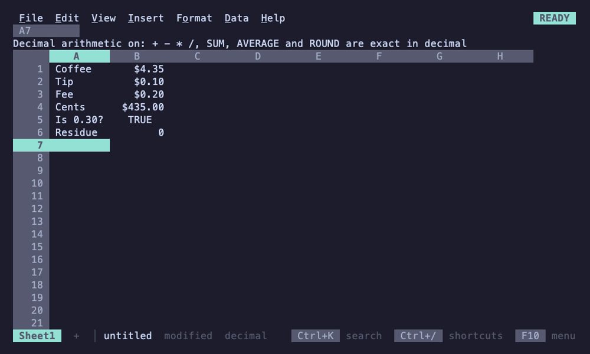

# Entries and formulas

## What you type

Typing replaces the active cell, as in Google Sheets. 012 decides what the
entry is the way Sheets does:

| You type | You get |
|---|---|
| `Rent`, `Q3 total` | text |
| `42`, `-3.5`, `1,234`, `1e3` | a number |
| `$1,200`, `12%` | a number with currency or percent format |
| `9/26/2026`, `2026-09-26`, `Sep 26, 2026`, `14:30`, `2pm` | a date or time (a serial number with a date or time format) |
| `TRUE`, `false` | a boolean |
| `=A1*2`, `+A1*2` | a formula |
| `'42` | text, even though it looks like a number |

A formula that doesn't parse isn't accepted: 012 stays in EDIT mode with the
caret on the problem and says what's wrong on the context line, e.g.
`Expected , or ) in SUM`.

## References

- Cells: `A1`, ranges: `A1:B3` (1-2-3's `A1..B3` also works), whole
  columns `A:C` and whole rows `2:5` (`$A:$A`, `$2:$2` absolute). Whole
  columns and rows stay whole when copied, filled or when lines are
  inserted and deleted; `A1:A1048576` reads back as `A:A`.
- Absolute parts: `$A$1`, `A$1`, `$A1`. F4 while typing cycles the reference
  at the caret through them. Copying, filling, sorting and inserting or
  deleting rows and columns adjust the relative parts, as in Sheets;
  references to deleted cells become `#REF!`.
- Named ranges: `=SUM(Sales)`. Define them from Data > Named ranges or Data >
  Define named range. Names are case-insensitive, follow the selection when
  rows move, and renaming one rewrites the formulas that use it.
- Other sheets: `=Sheet2!A1`, `=SUM('Q3 plan'!B2:B9)`; names with spaces or
  punctuation, or that look like a cell, go in single quotes. While typing a
  formula, Ctrl+PgDn or clicking a tab points into another sheet and inserts
  the reference. Renaming a sheet rewrites the formulas that use it;
  deleting one leaves them as written, showing `#REF!` ("Unresolved sheet
  name") until a sheet of that name exists again, as in Sheets. Inserting
  and deleting rows moves references into that sheet from every sheet, and
  leaves references to other sheets alone. Named ranges belong to the whole
  file and may point into any sheet.
- Each sheet is 16,384 columns (A to XFD) by 1,048,576 rows, Excel's size;
  a reference past them (`XFE1`, `A1048577`) reads as a name. Formulas cost
  what their ranges hold, not their size: `SUM(A:A)` over ten numbers reads
  ten cells, and `ROWS(A:A)` is still 1,048,576. See [limits.md](limits.md)
  for what that means in practice.

## Building formulas

- After an operator or `(`, arrow keys (or a click) pick a cell and insert
  its reference; Shift+arrows (or a drag) pick a range. Keep typing to go on.
- While you type a name, suggestions drop down: named ranges first, then
  the other sheets, then functions with their arguments. Tab or Enter
  inserts `NAME(`, or a sheet with its `!`, quoted when it needs to be
  (`=Su` offers `Summary!`; `=Q3` or `='Q3` offers `'Q3 plan'!`). An arrow
  after it points into that sheet, as clicking its tab does. Hidden
  sheets aren't offered, though formulas still read them.
- Inside a function's parentheses the context line shows its signature with
  the current argument marked, e.g. `SUMIF(range, criterion, [sum_range])`.
- Alt+, and Alt+. trace precedents and dependents: the cells a formula reads
  and the formulas that read a cell. Press again to step through them.
  Cells on hidden sheets are skipped; when that leaves nothing, the
  context line names the hidden sheets ("Reads only Data, a hidden sheet;
  View > Hidden sheets shows it").
- A formula left Automatic shows the format of what it reads: `=B5*2` of
  a currency cell shows currency, and so does `=SUM(B2:B9)`. A blank cell
  counts with its column's, row's or sheet's format, and changing those
  formats changes what the formulas show at once.

## Operators

`+ - * / ^` for arithmetic, `&` to join text, `= <> < > <= >=` to compare
(giving TRUE or FALSE), `%` after a number divides by 100. Unary minus binds
tighter than `^` as in Sheets and Excel, so `=-2^2` is 4. 1-2-3's `#AND#`,
`#OR#` and `#NOT#` still work; `AND()`, `OR()` and `NOT()` are the Sheets way.

## A range where one value is wanted

A range used where a formula wants one value (with an operator, or as
an argument that takes a number or text) reads as one of its cells, as
in Sheets and Excel (implicit intersection):

- a single column gives the cell in the formula's own row, so with the
  named range Rent = B2:B4, `=Rent*2` in F4 is B4*2 and `=B:B+1` in G5 is
  B5+1;
- a single row gives the cell in the formula's own column: `=B6:D6+1` in
  C8 is C6+1;
- a single cell is itself;
- anything else is `#VALUE!`: a formula outside the range's rows (or
  columns), and a range of several rows and columns.

Ranges on other sheets work the same, by the formula's row or column:
`='Q3 plan'!C2:C9*10` in A3 reads `'Q3 plan'!C3`. A range that is a
cell's whole formula, `=B2:B4` or `=Rent`, is an array and spills, as in
Sheets (see [Arrays and spills](#arrays-and-spills)). Functions that
take ranges (`SUM`, `COUNTIF`, `MATCH`, `VLOOKUP`, `SUMPRODUCT` and the
like) read the whole range, and an expression given to them is computed
over arrays: `SUM(B2:B4*2)` doubles each cell and adds them.

## Arrays and spills

An array is a block of values: a range read whole, an array literal
such as `{1,2;3,4}` (`,` between values in a row, `;` between rows; its
values may be ranges, so `{A1:A3,C1:C3}` puts two columns side by
side), or what an array function computes. A formula whose result is an
array shows its first value and spills the rest into the cells to its
right and below, as in Sheets:

- `=SEQUENCE(3, 2)` fills three rows of two; `=SORT(A2:A99)`,
  `=FILTER(A2:C99, C2:C99>100)` and `=UNIQUE(B:B)` spill as tall as
  their results, and grow or shrink as the data changes. Blank cells past
  a range's data aren't spilled, so `=SORT(A:A)` fills as many rows as
  column A holds.
- Operators work value by value: `={1,2,3}*10` is 10, 20, 30. A row and a
  column combine into a block (`={1;2}+{10,20}` is two rows of two), and
  arrays of different sizes line up with `#N/A` past the smaller one.
- `ARRAYFORMULA(...)` computes its formula over arrays: ranges read whole
  and functions of one value are applied to each value, so
  `=ARRAYFORMULA(IF(C2:C99>100, "big", "small"))` spills one word per row
  and `=ARRAYFORMULA(VLOOKUP(A2:A9, Prices, 2, FALSE))` looks each key up.
  The arguments of functions that take ranges are computed the same way,
  so `=SUM(LEN(A2:A9))` counts every character and
  `=SUMPRODUCT((B2:B99="north")*C2:C99)` sums a column by a condition.
- Elsewhere an array reads as its first value, as Sheets does:
  `=LEN(SEQUENCE(3)*100)` is 3. `IF`, `IFERROR`, `IFNA`, `IFS`, `SWITCH`,
  `CHOOSE` and `INDEX` pass an array through, so
  `=IFERROR(FILTER(A2:A99, B2:B99="x"), "none")` spills or says none, and
  `=INDEX(A2:C9, 0, 2)` spills the second column.

The context line says where a spilled cell's value comes from
("Spilled from B2"), and on the formula's own cell where it spills
("Spills into B2:C9"); spilled values are drawn in a color of their own,
and the formula bar shows a spilled cell's formula dimmed. A spilled cell
can't be typed into, cleared, pasted over or filled: the context line
names the formula to edit instead. Selecting the formula with its spill
and pressing Del clears it, formatting spilled cells keeps the
formatting, and inserting or deleting rows and columns through a spill
spills it again. Copying spilled cells pastes their values. Conditional
formats color spilled cells by their values, and data validation marks
spilled values it doesn't accept, but never stops an array from
spilling: rules judge what's typed, and a spilled value isn't.

When a cell in the way of an array isn't empty, the formula shows
`#REF!` and says why, as Sheets does: "Array result was not expanded
because it would overwrite data in C3". Clearing that cell lets the
array spill. The same goes for an array that would pass the sheet's
edge, or write more cells than `max-cells` allows.

Formulas reading spilled cells recalculate when the array changes, on
any sheet, and undo brings back what an array spilled with the formula.
Files keep only the formula: its array is computed again when the file
opens.

## Names in a formula: LET and LAMBDA

`=LET(total, SUM(B2:B99), count, COUNT(B2:B99), total/count)` names
values for use in the rest of the formula. A name bound to a range reads
as the range would where the name is used. Names that LET and LAMBDA
bind are the formula's own: a named range of the same name isn't used
inside them.

`LAMBDA(x, y, x*y)` is a function of its names, called with values right
after it, `=LAMBDA(x, x*2)(21)`, or through a name LET gave it,
`=LET(double, LAMBDA(v, v*2), double(21))`. `MAP`, `REDUCE`, `SCAN`,
`BYROW`, `BYCOL` and `MAKEARRAY` call one for each value, row or column:
`=BYROW(B2:D9, LAMBDA(row, SUM(row)))` spills each row's total. A LAMBDA
that isn't called is `#VALUE!`, and one called with the wrong number of
values `#N/A`, as in Sheets.

## Regular expressions

`REGEXMATCH`, `REGEXEXTRACT` and `REGEXREPLACE` use Go's regular
expressions, which are RE2, as Sheets' are: the same patterns mean the
same thing. They take text only: a number is `#VALUE!`, as in Sheets
(`A1&""` makes one text). `REGEXEXTRACT` returns the first
capture group, or the whole match without one, and spills several
groups across; `REGEXREPLACE` writes a group in the replacement as `$1`.
`SPLIT` spills the pieces of a text across, reading those that look like
numbers as numbers.

## Values and errors

Text in arithmetic is `#VALUE!` unless it reads as a number (`="3"*2` is 6);
blanks count as 0 or empty text. Aggregates such as `SUM` over a range skip
text. Errors use Sheets' codes:

| Error | Meaning |
|---|---|
| `#DIV/0!` | division by zero |
| `#VALUE!` | the wrong kind of value, e.g. text in arithmetic |
| `#NAME?` | an unknown name |
| `#REF!` | a reference to deleted cells, or a circular reference |
| `#N/A` | not available, e.g. a lookup found nothing |
| `#NUM!` | a number out of range, e.g. `SQRT(-1)` |

Error cells are red with a curly underline, and the context line explains the
active cell's error and where it came from, e.g.
`#DIV/0!  From B3: division by zero in B5/0`, or names the chain of a
circular reference.

## Decimal arithmetic

Like Sheets and Excel, 012 computes in binary floating point, so
`=0.1+0.2=0.3` is FALSE and `=INT($4.35*100)` is 434. File > Settings >
Decimal arithmetic (or search the palette for "decimal") switches the whole
file, every sheet of it, to decimal math for money. The status line then says
`decimal`, the menu shows a check mark, and the setting is saved with the
file and can be undone.

| Computed in decimal | Stays binary |
|---|---|
| `+ - * /` and postfix `%`; `SUM`, `AVERAGE`, `PRODUCT`, `SUMIF`, `SUMIFS`, `SUMPRODUCT`; `ROUND`, `ROUNDUP`, `ROUNDDOWN`, `TRUNC` | `^`, `SQRT`, statistics, finance, dates and everything else |

Values are still stored as doubles. Each decimal step reads its inputs as the
shortest decimal that round-trips (what the cell shows), computes exactly
(division to 34 significant digits) with
[apd](https://github.com/cockroachdb/apd), and keeps the double nearest the
result, so comparisons, lookups and formats see `0.3` rather than
`0.30000000000000004`. Division still rounds: `=1/3*3` is 0.9999999999999999,
as in any decimal system. Displayed numbers are already rounded to 15
significant digits, so the setting matters for comparisons, `INT`/`MOD`-style
truncation and residues such as `=1.1-1-0.1`. Older builds ignore the setting
and compute in binary.

## Functions

See [functions.md](functions.md) for all of them, generated from the engine.
