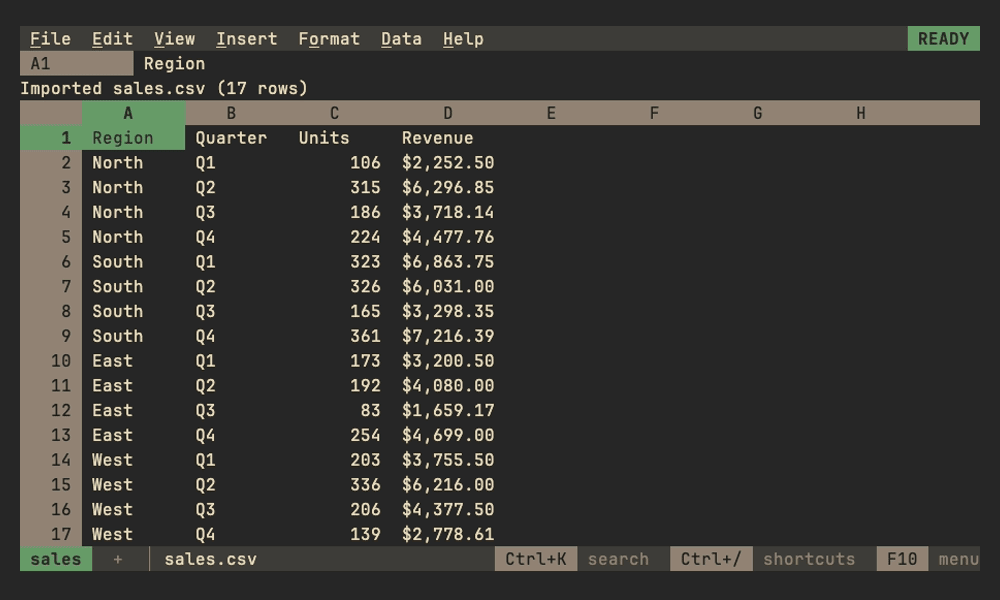

# Arrays and spills

An array is a block of values: a range read whole, an array literal
such as `{1,2;3,4}` (`,` between values in a row, `;` between rows; its
values may be ranges, so `{A1:A3,C1:C3}` puts two columns side by
side), or what an array function computes. A formula whose result is an
array shows its first value and spills the rest into the cells to its
right and below, as in Sheets:

- `=SEQUENCE(3, 2)` fills three rows of two; `=SORT(A2:A99)`,
  `=FILTER(A2:C99, C2:C99>100)` and `=UNIQUE(B:B)` spill as tall as
  their results, and grow or shrink as the data changes. Blank cells past
  a range's data aren't spilled, so `=SORT(A:A)` fills as many rows as
  column A holds.
- Operators work value by value: `={1,2,3}*10` is 10, 20, 30. A row and a
  column combine into a block (`={1;2}+{10,20}` is two rows of two), and
  arrays of different sizes line up with `#N/A` past the smaller one.
- `ARRAYFORMULA(...)` computes its formula over arrays: ranges read whole
  and functions of one value are applied to each value, so
  `=ARRAYFORMULA(IF(C2:C99>100, "big", "small"))` spills one word per row
  and `=ARRAYFORMULA(VLOOKUP(A2:A9, Prices, 2, FALSE))` looks each key up.
  The arguments of functions that take ranges are computed the same way,
  so `=SUM(LEN(A2:A9))` counts every character and
  `=SUMPRODUCT((B2:B99="north")*C2:C99)` sums a column by a condition.
  This follows Excel 365 on purpose: Sheets computes `=SUM(C2:C4*2)` only
  inside `ARRAYFORMULA`, and is `#VALUE!` without it.
- Elsewhere an array reads as its first value, as Sheets does:
  `=LEN(SEQUENCE(3)*100)` is 3. `IF`, `IFERROR`, `IFNA`, `IFS`, `SWITCH`,
  `CHOOSE` and `INDEX` pass an array through, so
  `=IFERROR(FILTER(A2:A99, B2:B99="x"), "none")` spills or says none, and
  `=INDEX(A2:C9, 0, 2)` spills the second column.

## Spilled cells

Spilled values are drawn in a color of their own. The context line says
where a spilled cell's value comes from ("Spilled from B2"), and on the
formula's own cell where it spills ("Spills into B2:C9"); the formula
bar shows a spilled cell's formula dimmed.

| Doing this to spilled cells | Does |
|---|---|
| Typing, clearing, pasting over or filling one | Nothing: the context line names the formula to edit instead |
| Del on the formula with its spill selected | Clears the formula |
| Formatting them | Keeps the formatting, which the file saves |
| Inserting or deleting rows or columns through the spill | Spills it again |
| Copying them | Pastes their values |
| Conditional formats and data validation on them | Color them by their values, and mark values a rule doesn't accept; a rule never stops an array from spilling |

Formulas reading spilled cells recalculate when the array changes, on
any sheet, and undo brings back what an array spilled with the formula.
The file keeps only the formula ([format](../files/format.md)).

## When an array can't spill

When a cell in the way of an array isn't empty, the formula shows
`#REF!` and says why, as Sheets does: "Array result was not expanded
because it would overwrite data in C3". Clearing that cell lets the
array spill. The same goes for an array that would pass the sheet's
edge, or write more cells than `max-cells` allows. When two arrays need
the same cells, blank ones of theirs included, the one whose formula
comes first, row by row, spills and the other shows `#REF!`, whichever
was typed first, so a sheet looks the same when opened again. An array that would
spill into cells its formula reads, `=SORT(B8:D9)` in A9, is a circular
dependency and shows `#REF!` too, as are arrays that would spill into
each other's inputs, even when one of them, blocked and read as
`#REF!`, would come out smaller and free the other, or is blocked by a
value only at the size the other's spill gives it. So is an array that
would spill over a notebook output or linked file whose cells it reads:
the output would give way, and its `#REF!` free the array again.

## Names in a formula: LET and LAMBDA

`=LET(total, SUM(B2:B99), count, COUNT(B2:B99), total/count)` names
values for use in the rest of the formula. A name bound to a range reads
as the range would where the name is used. Names that LET and LAMBDA
bind are the formula's own: a named range of the same name isn't used
inside them.

`LAMBDA(x, y, x*y)` is a function of its names, called with values right
after it, `=LAMBDA(x, x*2)(21)`, or through a name LET gave it,
`=LET(double, LAMBDA(v, v*2), double(21))`. `MAP`, `REDUCE`, `SCAN`,
`BYROW`, `BYCOL` and `MAKEARRAY` call one for each value, row or column:
`=BYROW(B2:D9, LAMBDA(row, SUM(row)))` spills each row's total. A LAMBDA
that isn't called is `#VALUE!`, and one called with the wrong number of
values `#N/A`, as in Sheets.
