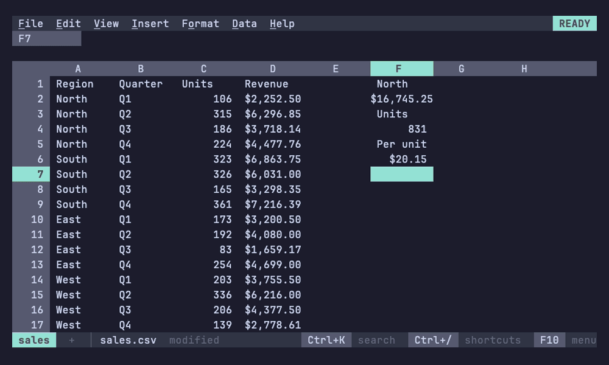

# Tracing formulas

When a number looks wrong, trace it: the cells its formula reads (its
precedents), the formulas that read it (its dependents), and what each
part of the formula computes.



## Showing precedents and dependents

Data > Formula tracing > Show precedents and dependents (Alt+;) marks them in the grid as
the pointer moves: the cells the active cell's formula reads in green,
the formulas that read the active cell in magenta and bold. Without
color both are in reverse video, dependents bold as well. The context
line lists them all, those off screen with an arrow toward them and
those on other sheets with their sheet:

```
C7 reads B3, Rate, Data!B2:B9; read by D7, A40↓, Summary!B2 +3 more
```

Alt+; again stops. What counts as a link:

| The active cell | Its precedents | Its dependents |
|---|---|---|
| A formula | the cells and ranges it reads, on any sheet; a named range, a region (`nu.sales`) or a [table's](../sheets/tables.md) cells (`Sales[Amount]`) by its name | the formulas that read it through a reference, a range, a named range, a table or a region's name, on any sheet |
| A formula whose array spills | as any formula | the cells it spills into, and the formulas reading any of them |
| A value an array spilled | the formula that spilled it | the formulas reading it |
| A cell of a linked file or of a notebook output sent to the sheet ([regions](../nushell/notebooks.md)) | the file, or the notebook cell | the formulas reading it, `nu.name` included |

Only direct links show; go to one and tracing shows its own, a level
further. Excel draws arrows between cells; 012 marks the cells and lists
the rest, which reads the same for a range on another sheet or far off
screen.

## Going to one

Data > Formula tracing > Go to a precedent or dependent (Alt+') lists
the active cell's precedents, then its dependents, with what each is
(`precedent, named range B2:B9`, `dependent, on Summary`). Type to narrow the
list; Enter goes to one, selecting a range, showing another sheet, or a
notebook's cell. A cell read by more than a thousand formulas lists the
first thousand.

## Stepping through them

Alt+, and Alt+. step through the precedents and the dependents, as
Excel's Ctrl+[ and Ctrl+], which terminals send as Esc: the first press
marks them all and jumps to the first, each press after to the next,
and Esc goes back to the cell traced. Cells on hidden sheets are
skipped; when that leaves nothing, the context line names the hidden
sheets ("Reads only Data, a hidden sheet; View > Hidden sheets shows
it").

## Evaluating a formula step by step

Data > Formula tracing > Evaluate formula (Alt+=), after Excel's
Evaluate Formula, opens a box over the grid with the active cell's
formula. The part computed next is underlined, and the line under it
says what it computes:

```
┌─ Evaluate D1 ────────────────────────────────────────┐
│ =IF(TRUE,SUM(A2:A3)*2,A3)                            │
├──────────────────────────────────────────────────────┤
│ Next  SUM(A2:A3) = 5                                 │
└───────────────────────────────────────────── 2 of 5 ─┘
```

- Enter puts the value in its place, in italic, and underlines the next
  part, until the formula's value is all that's left; Enter then starts
  over.
- → steps into the underlined part when it's a reference to another
  formula: the box shows that formula, and its title the way in
  (`Evaluate D1 › B1`). ← or Esc steps back out, the reference's value
  in its place. Esc at the first formula closes the box.

The values are what the formula computes where each part stands: an
array where the part is read as one (`SUM(A1:A9*2)` shows the doubled
column, `{2;4;…}`), names bound inside `LET`, and nothing for the branch
`IF`, `IFERROR` or `CHOOSE` didn't take, which stays as written. A blank
cell reads as 0. The formula is written in the
[locale's](../sheets/locale.md) syntax, spaced as 012 stores it.
