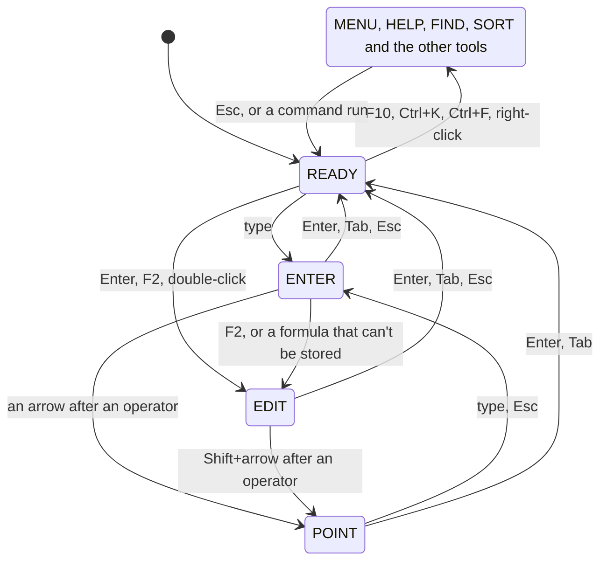

# The screen

Three lines above the grid and one below it, as 1-2-3's control panel,
say what's going on.

| Line | Shows |
|---|---|
| Menu bar (top) | The menus, and the mode indicator on the right (`REC` beside it while a macro records) |
| Formula bar | The name box, then the cell's contents or the entry being typed |
| Context line | Prompts, key hints, formula errors and explanations, and bars such as find and the chart editor |
| Status line (bottom) | The sheet tabs (the one shown highlighted), the file name, whether it's modified, and Sum, Avg and Count for a selection |

## The mode indicator

| Indicator | 012 is |
|---|---|
| READY | Waiting for a key in the grid |
| ENTER | Taking a new entry, which replaces the cell |
| EDIT | Editing a cell's contents, or a text prompt, with a movable caret |
| POINT | Pointing at a cell or range for a formula or a prompt |
| MENU | Showing a menu, the palette or a picker |
| HELP | Showing the keyboard shortcuts |
| FIND, FILTER, SORT, CHART, PIVOT, RULES | In the find bar, a filter picker, the sort bar, the chart editor, the pivot editor or the rules panel |
| WAIT | Importing in the background (Esc cancels) |
| CMD | Running a macro (Esc stops it) |
| NORMAL, VISUAL, COMMAND | In the [vim keymap](../reference/keys.md#vim-keys), in place of READY, while selecting, and on the `:` line |

Whatever the mode, the context line shows the keys that apply, and Esc
backs out one level. Typing into a cell moves between READY, ENTER, EDIT
and POINT; menus and the other tools open over READY and close back to
it:

