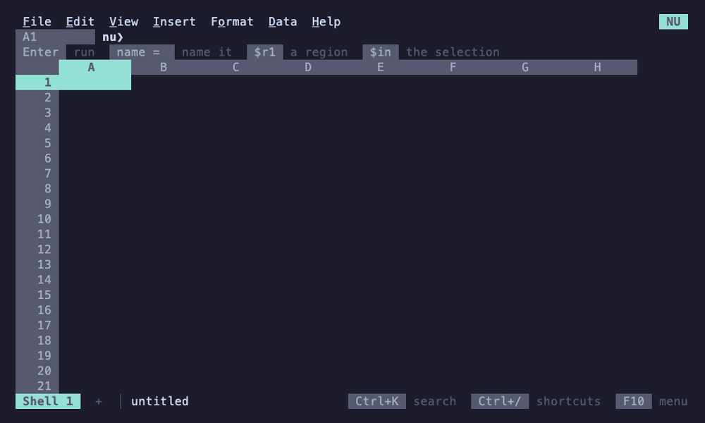
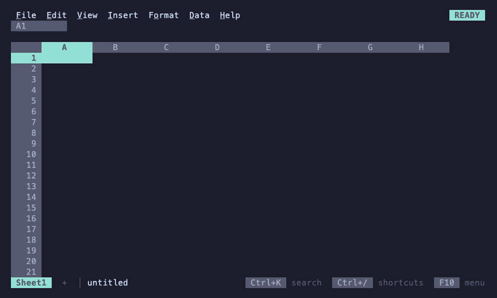

# Cookbook

Short worked examples. Pipelines that end in `sheet` or `sheet view`
run in a nushell session, with 012's module installed ([Install the
`sheet` command](README.md#install-the-sheet-command)); lines that start
with a name and `=` are code cells of a [notebook](notebooks.md)
(`sheet nu`, or **Data > Notebook > Open notebook** in any workbook), one
cell a line, each run with Shift+Enter. Nushell's own
[cookbook](https://www.nushell.sh/cookbook/) has more pipelines to start
from.

## A CSV cleaned, then summarized

Money written as text (`"$2,252.50"`) becomes numbers in nushell, and a
second cell totals it by region, sent to a sheet with a chart that
follows it.



```nu
sales = open sales.csv | update Revenue { str replace -ar '[$,]' '' | into float }
totals = $sales | group-by Region --to-table | update items { get Revenue | math sum } | rename Region Revenue
```

To chart it, `G` on `totals` sends its output to a new sheet; there,
**Insert > Chart** charts the table around the pointer. Edit `sales` to
read another file and run it: `totals` shows `stale` until it runs too
(at once in a [reactive notebook](notebooks.md#stale-outputs-and-reactive-notebooks)),
and then the sheet and the chart follow.

To pivot rather than total, send `sales` to a sheet and **Data > Pivot
table** there ([Pivot tables](../sheets/pivots.md)): Region in rows,
Quarter in columns, Revenue in values.

Nushell:
[`update`](https://www.nushell.sh/commands/docs/update.html),
[`str replace`](https://www.nushell.sh/commands/docs/str_replace.html),
[`into float`](https://www.nushell.sh/commands/docs/into_float.html),
[`group-by`](https://www.nushell.sh/commands/docs/group-by.html),
[`math sum`](https://www.nushell.sh/commands/docs/math_sum.html).

## A log file followed live

A JSON lines log (`app.jsonl`) linked with **Data > Linked file > Link a
table** takes in rows as they're written ([Following
files](../files/following.md)). A notebook's cells read it as `$app`:



```nu
errors = $app | where status >= 500 | select time path status ms
by_path = $errors | group-by path --to-table | update items { length } | rename path errors
```

The linked region grows by itself; running `errors` again (Ctrl+Enter)
reads the rows the log has now, and a reactive notebook runs `by_path`
after it. A log in CSV or TSV works the same; a plain text log needs a
line of nushell to become a table, such as
[`parse`](https://www.nushell.sh/commands/docs/parse.html) in a cell:

```nu
lines = open --raw app.log | lines | parse "{time} {level} {message}"
```

## Disk usage with a chart

```nu
usage = du * | select path physical | update path { path basename } | sort-by physical --reverse
```

Sizes arrive in the Size format ([Types](types.md)), so once `G` sends
the output to a sheet, a chart's axis and `=SUM(nu.usage)` read them as
bytes: **Insert > Chart** there for a column chart. Ctrl+Enter on the
cell runs `du` again, and the sheet follows.

Nushell: [`du`](https://www.nushell.sh/commands/docs/du.html).

## An API response as a table

```nu
http get https://api.github.com/repos/nushell/nushell/issues | select number title user.login comments created_at | update created_at { into datetime } | sheet view
```

Sort by comments, filter by author, or make a pivot table of issues by
author, in the sheet. In a notebook, the same pipeline without
`| sheet view` is a cell that fetches the list again each time it runs;
Enter on its output opens it full-screen to sort and filter, and
`nu-timeout` stops a request that hangs.

Nushell: [`http get`](https://www.nushell.sh/commands/docs/http_get.html),
[`into datetime`](https://www.nushell.sh/commands/docs/into_datetime.html),
and the cookbook's [HTTP](https://www.nushell.sh/cookbook/http.html)
page.

## Processes, sorted, filtered and sent back

```nu
ps | where cpu > 1 | sort-by cpu --reverse | select pid name cpu mem | sheet | get pid | each {|pid| kill $pid }
```

In 012, sort the list and filter it down to the processes to stop
(**Data > Create a filter**); Ctrl+Q, Enter sends the rows the filter
shows, and nushell stops those and no others. D sends nothing, and the
pipeline stops there ([The exit status](pipelines.md#the-exit-status)).

Nushell: [`ps`](https://www.nushell.sh/commands/docs/ps.html),
[`kill`](https://www.nushell.sh/commands/docs/kill.html).

## Git history as a sheet

```nu
commits = git log --pretty=%h»¦«%an»¦«%s»¦«%aI -n 500 | lines | split column "»¦«" commit author subject date | update date { into datetime }
authors = $commits | group-by author --to-table | update items { length } | rename author commits | sort-by commits --reverse
```

`date` is a datetime, so a filter by date or a pivot table by month
works on it in the sheet. The pattern is the one nushell's cookbook
explains in [Parsing git
log](https://www.nushell.sh/cookbook/parsing_git_log.html).
