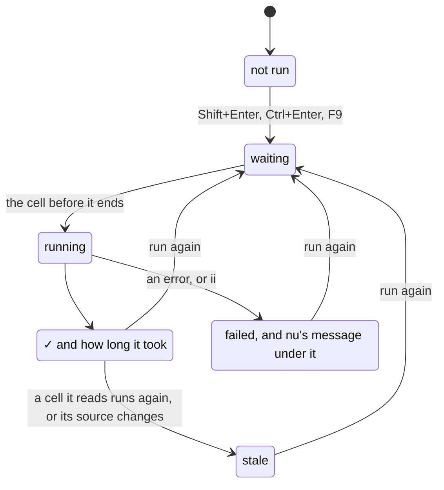
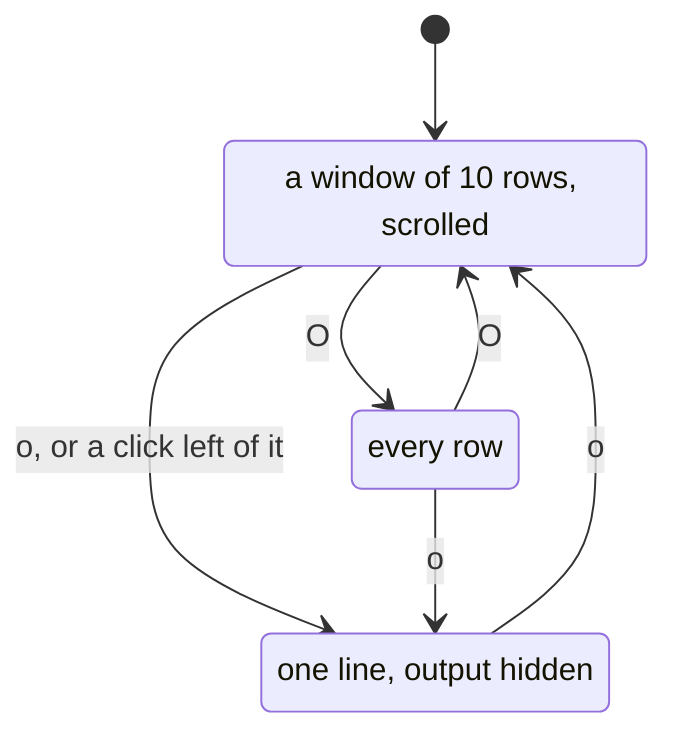
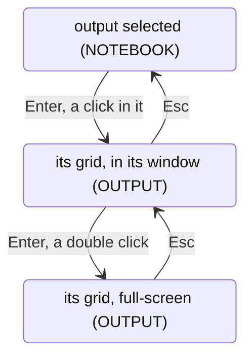
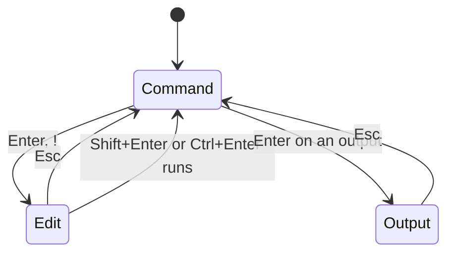
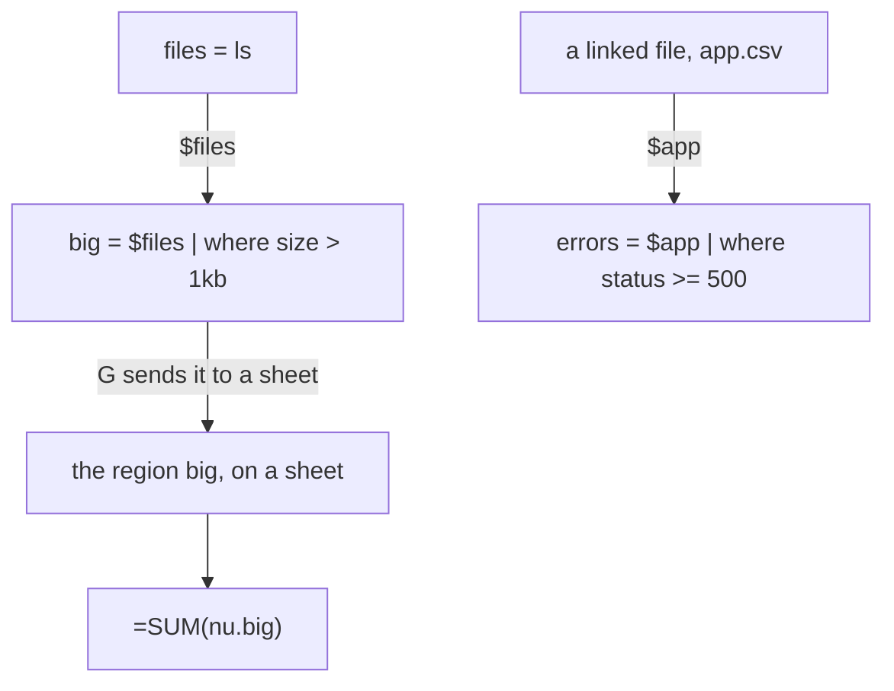
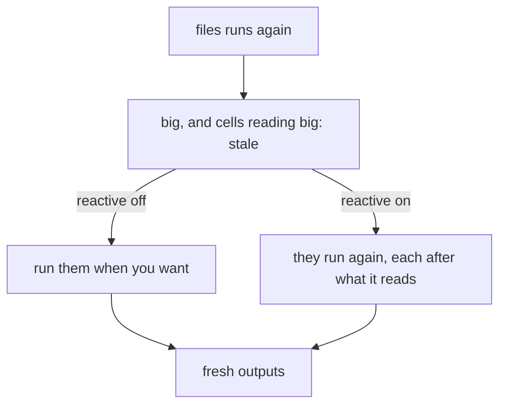
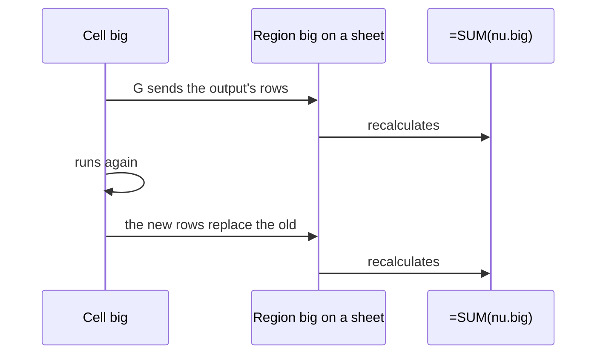
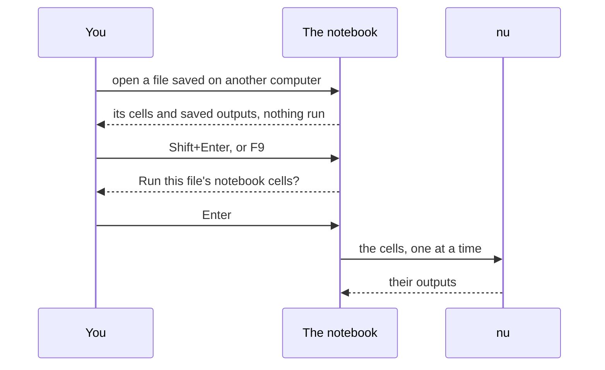

# Notebooks

A notebook is a tab of the workbook, beside its sheets, that holds cells
rather than a grid: code cells of nushell, each with its output under it,
and note cells of Markdown. You run the cells you choose, in the order
you choose, as in Jupyter; any output can go to a sheet, where formulas,
charts and pivots read it and it follows the cell's next run.

```nu
files = ls | where type == file
$files | where size > 1kb | sort-by size --reverse
```


Open one from a shell with `012 nu`, or from nushell with `sheet nu`
(`sheet` comes from 012's nushell module: [Install the `sheet`
command](README.md#install-the-sheet-command)):

```sh
012 nu              # a new notebook, its first cell ready to type in
012 nu work.012     # the workbook's notebook, made if it has none
```

In any workbook, **Data > Shell > Open notebook** (or the palette)
shows the workbook's notebook, or adds one after the sheet shown. A
notebook's tab is marked `❯`. Cells run `nu` as a separate process, so
[nushell](https://www.nushell.sh/book/installation.html) must be
installed; without it, a cell's output says so and the rest of 012
works as before.

## Cells

The tab looks and works like Jupyter's: a toolbar over the cells, a
code cell's pipeline in a box with its prompt at the left and a `▶` that
runs it at the right, its output under it, and note cells drawn as text.


### Reading a cell

Every state shows in words or marks as well as in color, so a notebook
reads the same on a terminal without it:

| Where | Shows |
|---|---|
| The tab | `❯` before the notebook's name |
| Left of the cells | A bar at the active cell, blue in command mode and green in edit mode, and a thinner one at the others selected ([Keys](#keys)) |
| The box | Light lines, and heavy ones around the cell being edited |
| The prompt | How many runs came before this one: `[2]:`, `[*]:` while it runs, `[ ]:` before it has; `Out[2]:` marks the output of that run |
| The box's top border | The cell's name at the left, and at the right how its run stands (below): `waiting`, `running`, `● live` and the rows printed for a cell run as a [stream](#streams), ✓ and how long it took, `failed`, `stale`, or `saved` for an output read from the file |
| Right of the box | `▶` runs the cell, `■` stops it while it runs |
| The output | What it is ([below](#outputs)): a table or a record as a grid, its column names where a sheet has letters; `×` before an error; `output hidden`; which rows show in its window. Worked in, `OUTPUT` in the mode indicator, the bar left of it green, and its pointer and selection in reverse video, as on a sheet ([Outputs as grids](#outputs-as-grids)) |
| The context line | What the cell reads and how others read it (`big: reads $files; read as $big, nu.big in formulas`), the keys that apply, and what nu says about the cell being written, underlined curly in the cell ([Writing a cell](#writing-a-cell)) |

A cell's run goes through these states:



A source is shown whole: a line too long for the screen wraps before a
pipe where it can, its next rows indented.

### Outputs

Outputs are drawn by what they are, with values formatted as cells
([Types](types.md)):

| Output | Shows |
|---|---|
| A table (a list of records) | 012's grid ([Outputs as grids](#outputs-as-grids)): its columns headed by their names and fitted to their values, its rows numbered from 1 |
| A record | The same grid of two columns, `field` and `value`, a field a row |
| A list | Its items, numbered from 0, as nushell numbers them |
| Text | Its lines, wrapped |
| A value | As a cell shows it: `4.2 kB`, `9/27/2026 11:27:31` |
| An error | `×` and nushell's message, then its help line, without an `Out` prompt |

A long output scrolls in a window of its own, 10 rows high, so the cells
under it stay where they are: with the output selected, Up and Down
scroll it before they move on, the wheel scrolls the window under the
mouse, and its last line says which rows show (`rows 11 to 20 of 45`).
`O` shows every row instead, and again the window; `o` hides the output
to one line, and again shows it, as does a click left of it. **Data >
Shell > Clear output** clears the selected cells' outputs, **Clear
outputs** every one.



**Enter** on any other output, or a double click, opens it full-screen,
its lines scrolled with the arrows; Esc (or `◀ Back`) goes back.

### Outputs as grids

A table or a record is drawn as 012's own grid, the one a sheet has:
the values are the cells [sending it to a sheet](#send-to-a-sheet)
makes, each in the format of its type (sizes as `4.2 kB`, durations,
dates), right-aligned numbers, fitted columns and the grid's row
numbers, with the table's column names where a sheet has letters.

**Enter** on the output, or a click in it, works in it (the mode
indicator says `OUTPUT`, and the bar left of it turns green, as for a
cell edited): an active cell moves with the arrows, and the grid's keys,
menus and mouse work on it as on a sheet, in its window:


- Shift+arrows, Ctrl+A or a drag select a range, and the status line
  shows its Sum, Avg and Count; Ctrl+C copies it, as TSV to the system
  clipboard and with its formats for Ctrl+V on a sheet.
- **Data > Sort sheet** (or the column's right-click menu) sorts by the
  active column, **Data > Create a filter** puts `▾` on each column's
  name, and Alt+Down (or a click on `▾`) opens the column's filter;
  Ctrl+F finds.
- Drag the right edge of a column's name, or **Format > Column width**,
  to resize it; Shift+wheel scrolls a wide table sideways; the names
  stay on top as the rows scroll.
- Ctrl+Z undoes a sort, a filter or a width; typing, Del, paste and
  formats are refused, as they'd change the output: `G` sends it to a
  sheet, where its copy can change.
- **Enter** shows the grid full-screen, where it all works the same;
  **Esc** deselects, then goes back from full-screen, then back to the
  notebook.



Sorting and filtering act on the grid's copy: the output, what later
cells read as `$name`, doesn't change, and running the cell again
draws its new output afresh.

**Insert > Chart**, **Data > Pivot table** and the frequency table
(Alt+Shift+F) on the grid make them where charts and pivot tables live,
on a sheet: the output is [sent to a sheet](#send-to-a-sheet) first (a new
one named after the cell, unless it's on one already), and the command
runs there on the columns selected in the grid, every row under the
header. A chart drawn under the output would have to squeeze into the
notebook's column and scroll with the cells; on the sheet it has room,
its editor, images where the terminal draws them, and it follows the
cell's next run, as the region it charts does.

### Note cells

Note cells are Markdown: headings, **bold**, *italic*, `code`, links (the
terminal opens them), lists and quotes. They're drawn as text, without a
box or a prompt, and show their Markdown in a box only while edited.

## Keys

Like Jupyter, a notebook has two modes. In command mode (the mode
indicator says `NOTEBOOK`) keys act on cells; in edit mode (`EDIT`) they
type into the selected cell.



The bar left of the active cell and the box's lines say which mode
you're in ([Reading a cell](#reading-a-cell)). Shift+Up and Shift+Down
(or `K` and `J`, or Shift+click) select the cells passed over as well,
and the commands below that act on "the cells" act on all of them: run,
delete, copy, cut, move, make notes or code, hide or clear outputs.

| Key | In command mode |
|---|---|
| Up, Down, `j`, `k` | Move between cells, stopping at each output; on an output, scroll its window first |
| Shift+Up, Shift+Down, `K`, `J` | Select the cells passed over too |
| Home, End, PgUp, PgDn | The first cell, the last, a screen up or down |
| Enter | Edit the cell; on a table or record output, work in its grid; on another, open it full-screen |
| Shift+Enter | Run the cells and select the next, adding one at the end |
| Ctrl+Enter, `r` | Run the cells, staying on them |
| Alt+Enter | Run the cells and add a code cell under them |
| F9 | Run every cell |
| `a`, `b` | Add a code cell above, below |
| `!` | Add a code cell below and edit it |
| `dd` | Delete the cells |
| `z` | Undo, bringing back deleted cells (as Ctrl+Z) |
| Alt+Up, Alt+Down (or Ctrl+Shift+Up, Ctrl+Shift+Down) | Move the cells up or down |
| `m`, `y` | Make the cells notes (Markdown), or code |
| `c`, `x`, `v`, `V` | Copy, cut the cells; paste below, above |
| `n` | Name the cell |
| `o`, `O` | Hide the output, or show it again; show every row, or the window again |
| `G` | Send the output to a sheet |
| Ctrl+G | Go to a cell by its number, name, code or heading |
| `f` | Run the cell as a stream, until it's stopped ([Streams](#streams)) |
| `ii` | Stop: kill the cell running, forget those waiting, and stop every stream |
| `00` | Restart: stop, clear every output, count runs from 1 |

| Key | In edit mode |
|---|---|
| Esc | Keep what's typed and go back to command mode |
| Shift+Enter, Ctrl+Enter, Alt+Enter | Run, as in command mode |
| Enter | A new line, as indented as the one before |
| Up, Down, Home, End | Move by the lines on screen, wrapped lines too |
| Ctrl+A, Ctrl+E | The start, the end of the line |
| Tab | Complete the word at the caret: a cell's `$name`, `$selection`, a linked file, then what nu completes there (commands, flags, paths); one completion goes in at once ([Writing a cell](#writing-a-cell)) |

A terminal without the kitty keyboard protocol sends Shift+Enter and
Ctrl+Enter as Enter ([Keys the terminal has to tell
apart](../reference/keys.md#keys-the-terminal-has-to-tell-apart)): there
Esc then `r` runs the cell, and Alt+Enter runs it and adds one under it.

Every action is a command, in **Data > Shell**, the palette and the
shortcuts (Ctrl+/), and File, Edit and the sheet tabs work as anywhere;
commands for a sheet's cells are off on a notebook's tab. Changes to
cells are undo steps, as any edit is.

### Toolbar and mouse

The toolbar runs the commands Jupyter's does: `▶ Run` (the cells, then
the next), `■ Stop`, `↻ Restart`, `▶▶ Run all`, `+ Add`, `✂ Cut`, `⧉ Copy`,
`⎘ Paste`, and `Code ▾` or `Markdown ▾`, which makes the cells either. Each
shows its key where the width allows. At the right, `nu ○ idle`, `nu ●
busy` with how many cells wait, or `nu ⊘ off` where cells don't run,
stands for Jupyter's kernel; `reactive` beside it says the notebook is.
While every cell runs, the view follows the cell running until you
scroll.

The mouse works as in JupyterLab: a click selects a cell and a click in
a code cell's box edits it with the caret where you clicked; `▶` runs the
cell and `■` stops it while it runs; a double click edits a note or opens
an output full-screen; the wheel scrolls an output's window, then the
notebook; right-click opens the cell menu. All of them are listed in
[Keys and mouse](../reference/keys.md#mouse).

### Moving around

**Ctrl+G** (Go to cell) lists every cell by its number, name and first
line, and the notes' headings, to jump to by typing any of them. **View
> Table of contents** lists the headings alone, indented by level, as
Jupyter's table of contents.

## Writing a cell

The cell being written is read by nu itself, as nushell's own prompt
reads what you type: once typing pauses, 012 asks `nu --ide-ast` what
each word is and colors it (commands, strings, variables, numbers,
keywords, operators; flags stay plain), and `nu --ide-check` what's
wrong. A problem is underlined with a curly line, and with the caret on
it the context line says what nu said:


Tab asks `nu --ide-complete` too, after the notebook's own names, so it
completes flags, subcommands and paths as well as cells and commands.
nu doesn't know the variables a notebook binds, so it's asked about the
cell with `$name` for each name the cells assign and each linked file,
`$selection` and `$sheet` declared before it; a `$sheet.A1:C9` range
reads as one variable, and the cell's `name =`s ([Names and
$name](#names-and-name)) aren't part of what nu reads, so what nu says
is where it points in the cell.

Questions to nu run in the background and never on each key: one
process for each question after a pause, at most two at a time, each
stopped once the text changes and after a second and a half. Until nu
answers, the cell shows 012's own highlighting, and what's unchanged
keeps nu's colors, so nothing flickers or moves. 012 falls back to its
own highlighting and names, without saying so, when:

- nu isn't installed, or is older than 0.100;
- nu timed out three times in a row (asked again in the next session);
- the cells couldn't run without asking: a file from another computer
  not yet trusted ([Saving and trust](#saving-and-trust)), `shell =
  off`, or [012 serve](../terminal/ssh.md#notebooks) without
  `serve-shell`.

nu reads the cell without your `config.nu` or its standard library, so
your own commands aren't known to it; they still run when the cell does
with `nu-config`.

## Running

Cells run in the background, one at a time, so the screen stays live:
the one running shows `[*]` and those after it `waiting`. **Data >
Shell** runs one cell, every cell (F9), the cells above the selected
one or it and those below; each runs after the cells it reads. A cell
that fails stops the rest.

Each cell runs as `nu --no-config-file -c`, so your aliases and custom
commands aren't there unless `nu-config` is on
([nushell's configuration](https://www.nushell.sh/book/configuration.html)).
A cell stops after `nu-timeout` (30 seconds unless set); `ii` stops it
sooner.

### Streams

A pipeline that never ends, such as following a log or `watch`ing a
folder, runs as a stream: `f` (**Data > Shell > Run as stream**) runs
the selected cell until you stop it, and every value it yields reaches
the cell's output as soon as nu prints it, and the sheet the output was
[sent to](#send-to-a-sheet) as rows under its header:

```nu
log = tail -f app.log | lines | parse '{time} {level} {msg}'
changes = watch . --glob=*.csv --quiet
```

While it runs, the cell's box says `● live` with how many rows it has
printed, and the toolbar how many cells stream; streams run beside the
cells run once, each on its own, without `nu-timeout`. `ii` (or `■`)
stops them all, keeping what they printed; running the cell once (`r`)
stops its stream first. A stream that ends on its own keeps its output
as a run does, and one that fails says why. A cell of several statements
streams its last one's values; the names its earlier lines assign stay
its own, as a stream hands later cells only its output.

The output keeps a stream's last 10,000 values; a sheet it was sent to
keeps every row, up to `max-cells`. The rows arrive as the change
stream does for a [followed file](../files/following.md), outside the
undo history.

A table's grid takes the rows as they arrive, under those it shows, so
what you've done in it stays: the pointer, the selection, a filter
(which covers the new rows) and the rows as sorted, the new ones under
them. Its columns widen to fit longer rows, never narrowing, and wait
while you're in the grid so nothing shifts under the pointer; a column
you resized keeps its width. Past 20,000 rows the grid starts again
from the rows the output keeps.

## Names and $name

A cell holds one statement or several, a line each (or apart by `;`),
as a nushell script does; a line starting with `|` goes on with the
pipeline above it. `name =` before a pipeline, on any line, assigns `name` as
nushell's `let` does, and the cell's later lines read
it as `$name`. `#` starts a comment to the end of the line, outside a
string, as in nushell: a commented-out line assigns and reads nothing.

As in nushell and Jupyter, the cell's output is its last statement's
value, and the names work across cells by one rule:

- **The cell's name is its output's.** When the last statement is
  an assignment (`name =`), the cell is named `name`; otherwise it has no
  name until `n` names it, which puts `name =` before its last
  statement. Other cells read the output as `$name`, and formulas on
  any sheet as `nu.name`, or a column of it as `name[column]`, once
  it's [sent to a sheet](#send-to-a-sheet).
- **Every name assigned goes to later cells.** `$files` in another
  cell reads the `files` a cell's earlier line assigned, as it was at
  the end of that cell's run. A cell's name comes first: `$sales` reads
  the cell named `sales`, and only when no cell is named so, the first
  cell assigning `sales`.
- **A cell's own names come first in it.** `$files` after the line
  assigning `files` reads the cell's own, not another cell's, and isn't
  a cell it reads.

```nu
files = ls | where type == file
$files | where size > 1kb | sort-by size --reverse
```

This cell has no name (its last line assigns none) and reads no cell;
its output is the big files, and later cells read `$files` too. Split
over cells, each named after its output:

```nu
files = ls
big = $files | where size > 1kb
$big | get name | str join ", "
```

The context line says what a cell reads, the names it sets for later
cells and its own name (`reads $files; sets $big`). A file keeps each
cell's output, not the other names it assigned: after opening one, a
cell reading such a name runs the cell assigning it first, as it does
a cell that hasn't run.

A name is letters, digits and `_`, not starting with a digit or `__`;
`in`, `env`, `nu`, `it`, `selection` and `sheet` are taken. Two cells
can't share a name: the second says so and doesn't run until it's
renamed.

What a cell reads decides the order cells run in: each after the cells
it reads, and a cell that hasn't run first when one reading it runs. A
cell reading itself, directly or through others, doesn't run.



A cell reads the sheets two ways, each a table:

| In a cell | Is |
|---|---|
| `$selection` | The range selected on the sheet shown last before the notebook, with its first row as the header |
| `$sheet.A1:C9`, `$sheet.Sales!A1:C9`, `$sheet.'Q1 data'!B2:B40` | That range, of the sheet shown last or the sheet named |
| `$app` | A [linked file](../files/following.md) named `app`, its rows as they are when the cell runs |

They reach nu as NUON in a file it reads, never as text spliced into
the pipeline, so types survive ([Types](types.md)): sizes stay sizes,
dates stay dates, and currency and percentages, numbers in nu, take
their columns' formats again when the output is sent to a sheet
([Currency and percentages](types.md#currency-and-percentages)).

### Stale outputs and reactive notebooks

Running a cell again makes the outputs of the cells that read it,
directly or through others, `stale`: they were made from what it printed
before. So is a cell's own output once its source is changed.



**Data > Shell > Reactive notebook** (off unless turned on, saved
with the notebook) runs them again whenever a cell they read runs.

## Send to a sheet

`G` sends the selected cell's output to a sheet: a new sheet named after
the cell, or a cell of a sheet you pick. There it's a region named after
the cell, italic as a linked file's rows are, that formulas read as
`nu.name`, header row included (`=SUM(nu.big)`, `=VLOOKUP("go.mod",
nu.files, 3, FALSE)`), and charts and pivot tables use. It's also a
[table](../sheets/tables.md#notebook-outputs-and-linked-files) by the
cell's name, read by column: `=SUM(big[size])`, `=COUNTIF(app[status],
500)`, with `big` alone its rows under the header. A cell without a
name is given one first. On the region's cells the context line says
whose output they are (`Output of big`).



Like an [array's spill](../formulas/arrays.md#spilled-cells), its cells
can't be typed over: **Data > Shell > Freeze output** turns them into
plain values, and **Remove output** takes them off the sheet. Undo takes
back sending it, and the rows come back from the cell's output whenever
undo brings the region back.

## Saving and trust

The file keeps the cells and their outputs as NUON
([format](../files/format.md#notebooks)), so opening it shows every
output without running anything; the heads say `saved`. An output larger
than `nu-save-cell-kb` (1 MB), or past `nu-save-notebook-kb` (8 MB) for
all of them, is left out: the cell shows `not saved; run to see`, and
saving says which.

Opening a file never runs its cells. Like
[macros](../sheets/macros.md#macros-from-other-computers), a file's cells
run as you, with your files, so a notebook saved on another computer
asks once before its cells run:



Cells you write in a notebook made here run without asking. The options,
in [Configuration](../reference/config.md#nushell-notebooks):

| Option | Default | Does |
|---|---|---|
| `shell` | `ask` | `ask` as above; `on` never asks; `off` runs no cells |
| `nu-timeout` | `30s` | Stops a cell that runs longer; `0` lets it run until `ii` |
| `nu-config` | `false` | Runs cells with your `config.nu` and `env.nu` |
| `nu-save-cell-kb`, `nu-save-notebook-kb` | `1024`, `8192` | How much of the outputs a file keeps |

[012 serve](../terminal/ssh.md#notebooks) shows notebooks and their
saved outputs, but runs no cells unless the server's `serve-shell` is on.

### Notebook sheets

A file with the notebook sheets of earlier versions of 012, whose
pipelines were typed at a prompt on the formula bar, opens with each of
those pipelines as a code cell of the workbook's notebook, named as the
region was. Their tables stay where they were on the sheet, as the
cells' outputs sent there, so formulas reading `nu.r1` keep working once
the cells run; a note on opening says which sheets were converted.
