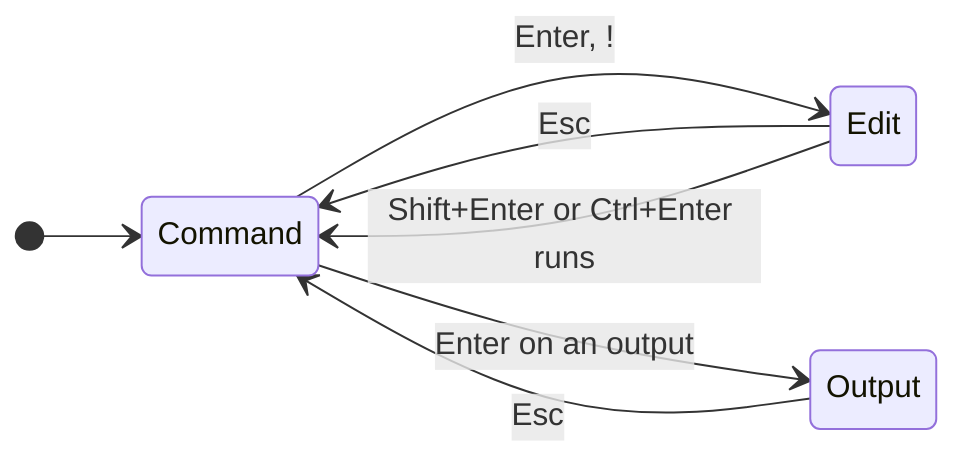
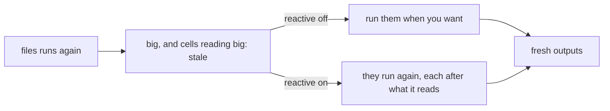
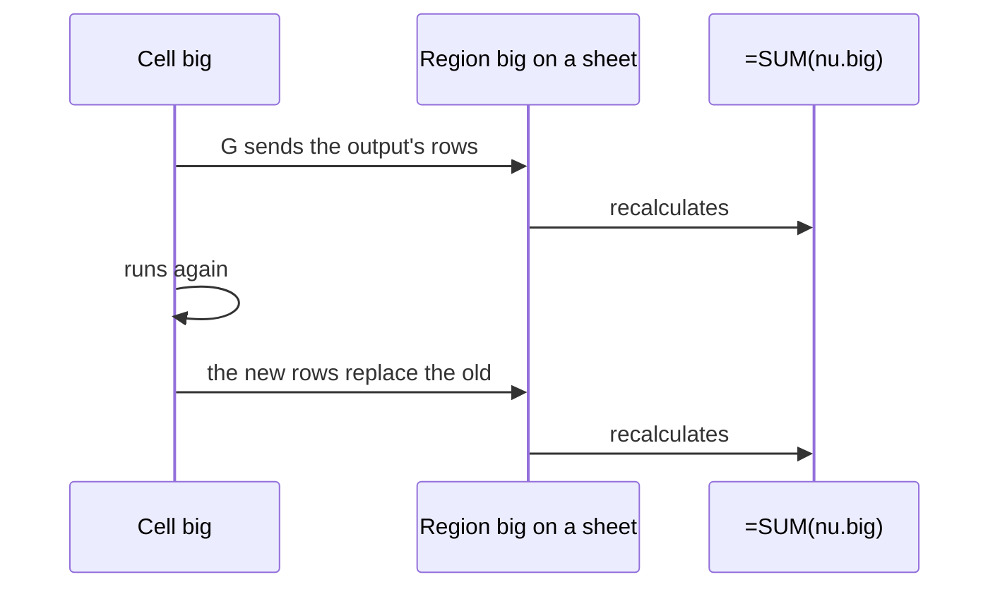

# Notebooks

A notebook is a tab of the workbook, beside its sheets, that holds cells
rather than a grid: code cells of nushell, each with its output under it,
and note cells of Markdown. You run the cells you choose, in the order
you choose, as in Jupyter; any output can go to a sheet, where formulas,
charts and pivots read it and it follows the cell's next run.

```nu
files = ls | where type == file
$files | where size > 1kb | sort-by size --reverse
```


Open one from a shell with `012 nu`, or from nushell with `sheet nu`
(`sheet` comes from 012's nushell module: [Install the `sheet`
command](README.md#install-the-sheet-command)):

```sh
012 nu              # a new notebook, its first cell ready to type in
012 nu work.012     # the workbook's notebook, made if it has none
```

In any workbook, **Data > Notebook > Open notebook** (or the palette)
shows the workbook's notebook, or adds one after the sheet shown. A
notebook's tab is marked `❯`. Cells run `nu` as a separate process, so
[nushell](https://www.nushell.sh/book/installation.html) must be
installed; without it, a cell's output says so and the rest of 012
works as before.

## Cells

A cell is its head, its source and, for a code cell, its output:

```
  [2] big                                                  ✓ <1s
│ big = $files | where size > 1kb
│   | sort-by size --reverse
  name       size
  README.md  9.8 kB
  012        4.2 kB
```

The head says how many runs came before this one (`[2]`, `[*]` while it
runs, `[ ]` before it has), the cell's name, and at the right how its run
stands: `running`, `waiting` for the cell before it, `✓` or `failed` with
how long it took, `stale`, `not run`, or `saved` for an output read from
the file. A source is shown whole: a line too long for the screen wraps
before a pipe where it can, its next rows indented.

Outputs are drawn by what they are, with values formatted as cells
([Types](types.md)):

| Output | Shows |
|---|---|
| A table (a list of records) | Its columns fitted to their values, numbers right-aligned, its first 10 rows and how many more there are |
| A record | Its fields, one a line: `key  value` |
| A list | Its items, numbered from 0, as nushell numbers them |
| Text | Its lines, wrapped |
| A value | As a cell shows it: `4.2 kB`, `9/27/2026 11:27:31` |
| An error | `×` and nushell's message, then its help line |

`o` shows a long output whole, and again its first rows. **Enter** on an
output opens it full-screen: arrows (or `h` `j` `k` `l`) move, `s` sorts
by the pointer's column and `S` in descending order (again for the
output's own order), `/` keeps the rows holding what's typed, and Esc
goes back. The output itself doesn't change.

Note cells are Markdown: headings, **bold**, *italic*, `code`, links (the
terminal opens them), lists and quotes.

## Keys

Like Jupyter, a notebook has two modes. In command mode (the mode
indicator says `NOTEBOOK`) keys act on cells; in edit mode (`EDIT`) they
type into the selected cell.



| Key | In command mode |
|---|---|
| Up, Down, `j`, `k` | Move between cells, stopping at each output |
| Home, End, PgUp, PgDn | The first cell, the last, a screen up or down |
| Enter | Edit the cell; on an output, open it full-screen |
| Shift+Enter | Run the cell and select the next, adding one at the end |
| Ctrl+Enter | Run the cell, staying on it |
| Alt+Enter | Run the cell and add a code cell under it |
| F9 | Run every cell |
| `a`, `b` | Add a code cell above, below |
| `!` | Add a code cell below and edit it |
| `dd` | Delete the cell |
| `z` | Undo, bringing back a deleted cell (as Ctrl+Z) |
| `m`, `y` | Make the cell a note (Markdown), or code |
| `c`, `x`, `v` | Copy, cut, paste a cell below |
| `n` | Name the cell |
| `o` | Show the output whole, or its first rows |
| `G` | Send the output to a sheet |
| `ii` | Stop: kill the cell running, and forget those waiting |
| `00` | Restart: stop, clear every output, count runs from 1 |

| Key | In edit mode |
|---|---|
| Esc | Keep what's typed and go back to command mode |
| Shift+Enter, Ctrl+Enter, Alt+Enter | Run, as in command mode |
| Enter | A new line, as indented as the one before |
| Up, Down, Home, End | Move by the lines on screen, wrapped lines too |
| Ctrl+A, Ctrl+E | The start, the end of the line |
| Tab | Complete the word at the caret: a cell's `$name`, `$selection`, a linked file, or one of nu's commands |

Every action is a command, in **Data > Notebook**, the palette and the
shortcuts (Ctrl+/), and File, Edit and the sheet tabs work as anywhere;
commands for a sheet's cells are off on a notebook's tab. Changes to
cells are undo steps, as any edit is.

## Running

Cells run in the background, one at a time, so the screen stays live:
the one running shows `[*]` and those after it `waiting`. **Data >
Notebook** runs one cell, every cell (F9), the cells above the selected
one or it and those below; each runs after the cells it reads. A cell
that fails stops the rest.

Each cell runs as `nu --no-config-file -c`, so your aliases and custom
commands aren't there unless `nu-config` is on
([nushell's configuration](https://www.nushell.sh/book/configuration.html)).
A cell stops after `nu-timeout` (30 seconds unless set); `ii` stops it
sooner.

## Names and $name

A cell that starts `name =` gives its output that name; `n` names a
cell for you. Later cells read the output as `$name`, a nushell
variable holding the value, and formulas on any sheet as `nu.name` once
it's [sent to a sheet](#send-to-a-sheet):

```nu
files = ls
big = $files | where size > 1kb
$big | get name | str join ", "
```

A name is letters, digits and `_`, not starting with a digit or `__`;
`in`, `env`, `nu`, `it`, `selection` and `sheet` are taken. Two cells
can't share a name: the second says so and doesn't run until it's
renamed.

A cell reads the sheets two ways, each a table:

| In a cell | Is |
|---|---|
| `$selection` | The range selected on the sheet shown last before the notebook, with its first row as the header |
| `$sheet.A1:C9`, `$sheet.Sales!A1:C9`, `$sheet.'Q1 data'!B2:B40` | That range, of the sheet shown last or the sheet named |
| `$app` | A [linked file](../files/following.md) named `app`, its rows as they are when the cell runs |

They reach nu as NUON in a file it reads, never as text spliced into
the pipeline, so types survive ([Types](types.md)): sizes stay sizes,
dates stay dates.

### Stale outputs and reactive notebooks

Running a cell again makes the outputs of the cells that read it,
directly or through others, `stale`: they were made from what it printed
before. So is a cell's own output once its source is changed.



**Data > Notebook > Reactive notebook** (off unless turned on, saved
with the notebook) runs them again whenever a cell they read runs.

## Send to a sheet

`G` sends the selected cell's output to a sheet: a new sheet named after
the cell, or a cell of a sheet you pick. There it's a region named after
the cell, italic as a linked file's rows are, that formulas read as
`nu.name`, header row included (`=SUM(nu.big)`, `=VLOOKUP("go.mod",
nu.files, 3, FALSE)`), and charts and pivot tables use. A cell without a
name is given one first.



Like an [array's spill](../formulas/arrays.md#spilled-cells), its cells
can't be typed over: **Data > Notebook > Freeze output** turns them into
plain values, and **Remove output** takes them off the sheet. Undo takes
back sending it, and the rows come back from the cell's output whenever
undo brings the region back.

## Saving and trust

The file keeps the cells and their outputs as NUON
([format](../files/format.md#notebooks)), so opening it shows every
output without running anything; the heads say `saved`. An output larger
than `nu-save-cell-kb` (1 MB), or past `nu-save-notebook-kb` (8 MB) for
all of them, is left out: the cell shows `not saved; run to see`, and
saving says which.

Opening a file never runs its cells. Like
[macros](../sheets/macros.md#macros-from-other-computers), a file's cells
run as you, with your files, so a notebook saved on another computer
asks once before its cells run:

```
Run this file's notebook cells?   Enter Run   Esc Cancel
```

Cells you write in a notebook made here run without asking. The options,
in [Configuration](../reference/config.md#nushell-notebooks):

| Option | Default | Does |
|---|---|---|
| `shell` | `ask` | `ask` as above; `on` never asks; `off` runs no cells |
| `nu-timeout` | `30s` | Stops a cell that runs longer; `0` lets it run until `ii` |
| `nu-config` | `false` | Runs cells with your `config.nu` and `env.nu` |
| `nu-save-cell-kb`, `nu-save-notebook-kb` | `1024`, `8192` | How much of the outputs a file keeps |

[012 serve](../terminal/ssh.md#notebooks) shows notebooks and their
saved outputs, but runs no cells unless the server's `serve-shell` is on.

### Notebook sheets

A file with the notebook sheets of earlier versions of 012, whose
pipelines were typed at a prompt on the formula bar, opens with each of
those pipelines as a code cell of the workbook's notebook, named as the
region was. Their tables stay where they were on the sheet, as the
cells' outputs sent there, so formulas reading `nu.r1` keep working once
the cells run; a note on opening says which sheets were converted.
