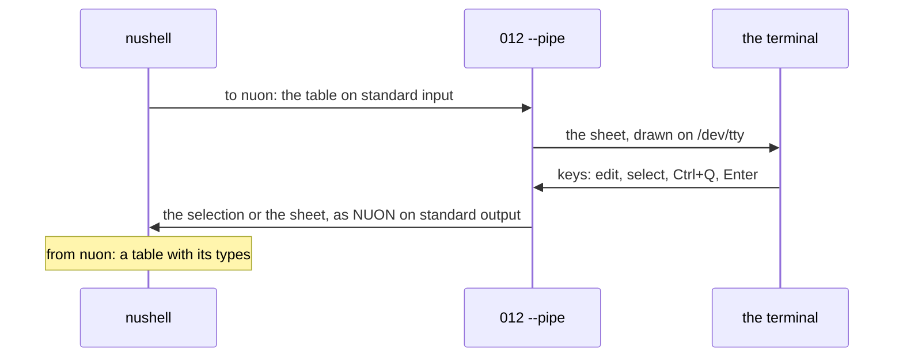

# Pipelines

012 can be a stage in a pipeline: a table comes in on standard input,
you look at it or edit it in the terminal, and with `--pipe` the result
goes out on standard output for the next command.

```nu
ls | select name size | to nuon | ^012 --pipe | from nuon | where size > 1kb
```


[`to nuon`](https://www.nushell.sh/commands/docs/to_nuon.html) writes
the table in NUON, nushell's own notation, so file sizes, durations and
dates arrive as themselves, and
[`from nuon`](https://www.nushell.sh/commands/docs/from_nuon.html) reads
what 012 sends back with the same types ([Types](types.md)). With the
[`sheet` command](#the-sheet-command) installed, the same stage is
`ls | select name size | sheet | where size > 1kb`.

The screen is the terminal's own (`/dev/tty`, or the console on
Windows), not standard input or output, so the pipeline's data never
mixes with what 012 draws, and nothing but the table reaches standard
output.



| Command | Reads | Writes |
|---|---|---|
| `012 -` | A table from standard input, into a new sheet | Nothing; the table stays in 012 until you save or download it |
| `012 --pipe` | A table from standard input, or a file named after it | The sheet or the selection, to standard output, when you quit (asking which, unless `--send` says) |
| `sheet`, `sheet view` | As `012 --pipe` and `012 -`, from nushell values | A nushell table, or nothing |

## Reading a table: `012 -`

`012 -` reads a table from standard input into a new sheet named
`stdin`, and tells its format from the text:

| Text starts with | Read as |
|---|---|
| `[` or `{`, and is all JSON | JSON: a list of records, a record, or records one after another (NDJSON) |
| `[` or `{` otherwise | NUON: a table (`[[name, size]; [a, 1kb]]`), a list of records, a record |
| anything else | delimited text: TSV when tabs separate the fields, otherwise CSV, as [imports](../files/README.md#import-and-download) read them |

The first row holds the column names; a record that brings a new key
adds a column. The sheet has no file and counts as unsaved, so quitting
asks first, as with any unsaved sheet. `max-cells` applies as it does to
imports: whole rows while they fit, and the context line says how many
were left out. While a long input is still coming in, the status line
counts its rows and Esc stops reading.

## Sending it on: `012 --pipe`

`012 --pipe` reads standard input as `012 -` does (or a file named on
the command line, `012 --pipe sales.csv`), and quitting sends a table to
standard output:

- The status line says what Ctrl+Q sends and in which format
  (`Ctrl+Q  send the sheet as NUON`, or `send B2:D9 as NUON` while a
  range is selected).
- Quit (Ctrl+Q, File > Quit, `:q`) asks: Enter sends the selection when
  one is made, or else the sheet; S sends the whole sheet instead; D
  quits without sending; Esc goes back to the sheet.
- File > Quit and send selection and File > Quit and send sheet send
  without asking, and File > Quit without sending (or `:q!`) sends
  nothing. They're in the menus and the palette only with `--pipe`.

`--send` makes Quit send without asking, for a pipeline that always
wants the same thing back:

| `--send` | Quit sends |
|---|---|
| `ask` (the default) | What you choose at the question above |
| `selection` | The selection; with only the active cell selected, the sheet, as Enter at the question does |
| `sheet` | The sheet, whatever is selected |

```nu
open orders.csv | to nuon | ^012 --pipe --send sheet | from nuon | save -f orders.nuon
```

The status line still names what Ctrl+Q will send, and File > Quit
without sending stays in the menu. The active cell on its own isn't a
selection to send, as at the question: `--send selection` sends the
sheet until a range is selected.

The sheet is its used range from A1. A selection is sent as selected,
and its first row names the columns. Either way, rows a filter hides
stay behind, as Sheets copies a filtered range.

The table goes out in the format it came in (NUON, JSON, CSV or TSV);
from a file of another kind, such as `.xlsx` or `.012`, as NUON.
`--to nuon`, `--to json`, `--to csv` or `--to tsv` picks the format
instead:

```nu
open budget.xlsx | to nuon | ^012 --pipe --to csv | save budget.csv
```

## The `sheet` command

The nushell module that comes with 012 ([Install the `sheet`
command](README.md#install-the-sheet-command)) wraps both commands, so a
pipeline needs neither `^012` nor NUON on either side:

```nu
ls | select name size | sheet | where size > 1kb
ps | sheet view
sheet budget.xlsx | save -f budget.csv
```


`sheet` is `to nuon | ^012 --pipe --to nuon | from nuon`: it opens the
table piped in, or the file it names, and returns what you send back
with its types. `sheet --send sheet` and `sheet --send selection` pass
`--send` on, so quitting sends without asking:

```nu
ls | sheet --send sheet | where size > 1kb
```
 Text piped in, such as `open --raw data.csv`, goes to
012 as it is, to be read as `012 -` reads it. `sheet view` is
`to nuon | ^012 -`, and returns nothing. Quitting without sending makes
`sheet` fail with 012's reason:

```nu
try { ls | sheet | save -f picked.nuon } catch {|e| print $e.msg }
# quit without sending anything to the pipeline
```

## The exit status

Quitting without sending (D at the question, File > Quit without
sending, `:q!`) writes nothing and exits
with status 1, so the pipeline stops rather than carrying on with
nothing. Nushell treats that
as a failed external command and stops the pipeline with an error
([Failing external commands](https://www.nushell.sh/book/pipelines.html#failing-external-commands-in-a-pipeline));
[`try`](https://www.nushell.sh/commands/docs/try.html) catches it:

```nu
try { ls | to nuon | ^012 --pipe | from nuon | save -f picked.nuon } catch { print "nothing sent" }
```

## Recipes

Each of these reads a table into 012 with `sheet view`; `sheet`
instead carries on with what you send back. Without the module, each
`sheet view` is `to nuon | ^012 -`.

```nu
# Files, largest first: sizes in the Size format, dates as dates
ls | sort-by size --reverse | sheet view

# Processes: CPU as numbers, memory as file sizes
ps | select pid name cpu mem | sheet view

# Every CSV here, one table, with the file each row came from
glob *.csv | each {|f| open $f | insert file ($f | path basename) } | flatten | sheet view

# An API's JSON, its dates made datetimes on the way
http get https://api.github.com/repos/nushell/nushell/releases | select name published_at | update published_at { into datetime } | sheet view

# This computer: sys host is a record, which comes in as one row
sys host | sheet view
sys disks | select mount total free | sheet | sort-by free
```

The commands are nushell's:
[`ls`](https://www.nushell.sh/commands/docs/ls.html),
[`ps`](https://www.nushell.sh/commands/docs/ps.html),
[`open`](https://www.nushell.sh/commands/docs/open.html),
[`http get`](https://www.nushell.sh/commands/docs/http_get.html),
[`sys host`](https://www.nushell.sh/commands/docs/sys_host.html).
The [Cookbook](cookbook.md) has longer examples.

## Other shells

Any command that writes CSV, TSV or JSON can feed 012, and the exit
status works as usual:

```sh
ps -eo pid,comm,%cpu | awk '{$1=$1}1' OFS='\t' | 012 --pipe | sort -t$'\t' -k3 -rn
curl -s https://api.example.com/items | 012 --pipe --to csv > items.csv
sqlite3 -csv -header app.db 'select * from users' | 012 --pipe > users.csv || echo "not sent"
```

`.nuon` and `.json` files also open, import and download like any other
[file](../files/README.md).
