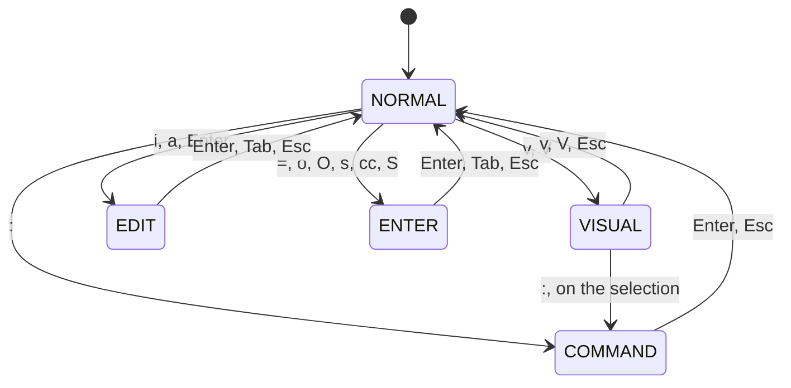
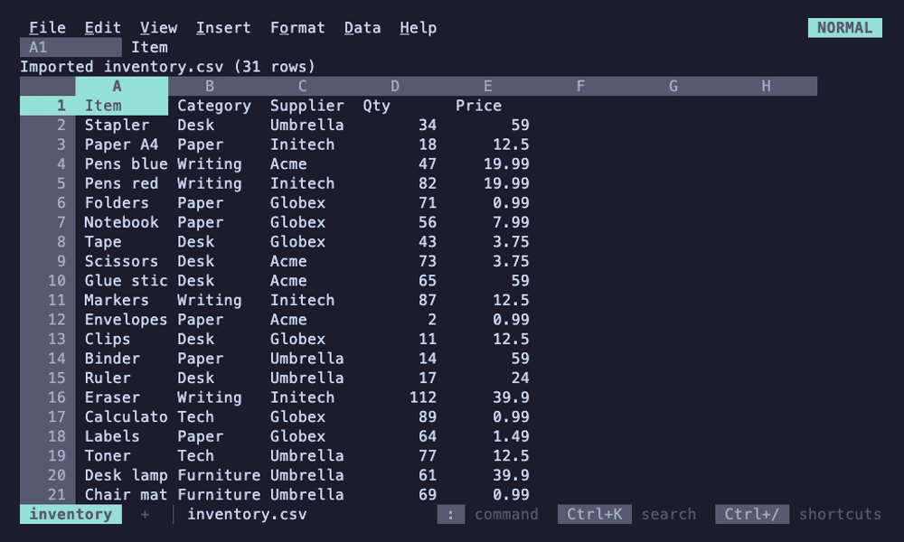

# Keys and mouse

Inside the grid, 012 behaves like Google Sheets: if you know a Sheets
shortcut, try it. Every command is also in the menus (F10 or Alt+letter)
and the command palette (Ctrl+K), which show each command's key. F1 or
Ctrl+/ lists every binding, generated from the table the app uses, so it
never drifts from what the keys do. This page is the same list with the
mouse and the vim keymap added.

## Moving around

| Key | Action |
|---|---|
| Arrows | Move one cell |
| Ctrl+arrows, End | Jump to the edge of the data (End: rightwards) |
| Tab, Shift+Tab | Right, left |
| PgUp, PgDn | A screen up, down |
| Alt+PgUp, Alt+PgDn | A screen left, right |
| Home, Ctrl+Home, Ctrl+End | Column A, cell A1, the last used cell |
| Ctrl+G, F5 | Go to a cell, a range, a named range or a region's table (`nu.r1`), on any sheet (`Sheet2!B3`) |

## Entering data

| Key | Action |
|---|---|
| Type | Replace the cell: `=` starts a formula, `'` forces text, and `$1,200`, `12%`, `9/26/2026` or `14:30` are numbers that keep their format ([Formulas](../formulas/README.md#what-you-type)) |
| Enter, Tab | Accept and move down or right; Enter goes back to the column a run of Tabs began in |
| Enter, F2, double-click | Edit the cell |
| Esc | Cancel the entry |
| Ctrl+Enter | Enter the same entry in every selected cell |
| Arrows, Shift+arrows | While typing a formula, after an operator: point at a cell, or a range |
| F4 | While typing a formula: cycle the reference at the caret through `A1`, `$A$1`, `A$1`, `$A1` |
| Up, Down; Tab, Enter | While suggestions for a function, range or sheet name show: pick one; insert it (a sheet as `Summary!`, then arrows point into it). Esc hides them |

## Selecting

| Key | Action |
|---|---|
| Shift+arrows, Ctrl+Shift+arrows | Extend the selection, a cell at a time or to the edge of the data; the status line shows Sum, Avg and Count |
| Ctrl+Space, Shift+Space | Whole columns, whole rows |
| Ctrl+A | The data around the active cell, then everything |
| Esc | Deselect |

## Changing the sheet

| Key | Action |
|---|---|
| Del, Backspace | Clear the selection; formatting stays |
| Ctrl+Z; Ctrl+Y, Ctrl+Shift+Z | Undo; redo |
| Ctrl+C, Ctrl+X, Ctrl+V | Copy, cut, paste; references adjust as in Sheets, and copies also go to the system clipboard |
| Ctrl+Shift+V | Paste values only |
| Paste in the terminal | Tab-separated or multi-line text fills a block of cells |
| Ctrl+D, Ctrl+R | Fill down, fill right; a series started in the top rows (1, 2 over blanks) continues |
| Ctrl+Alt+=, Ctrl+Alt+- | Insert rows above, delete the selected rows (columns when whole columns are selected) |

[Editing](../sheets/editing.md#copy-paste-and-fill) says how formats travel with
copies and which series the fill handle continues.

## Formatting

| Key | Action |
|---|---|
| Ctrl+Shift+1 | Number |
| Ctrl+Shift+2 | Time |
| Ctrl+Shift+3 | Date |
| Ctrl+Shift+4 | Currency |
| Ctrl+Shift+5 | Percent |
| Ctrl+Shift+6 | Scientific |
| Ctrl+B, Ctrl+I, Ctrl+U, Alt+Shift+5 | Bold, italic, underline, strikethrough |
| Ctrl+Shift+L, Ctrl+Shift+E, Ctrl+Shift+R | Align left, center, right |
| Alt+Shift+1, Alt+Shift+2, Alt+Shift+3, Alt+Shift+4 | Top, right, bottom, left border |
| Alt+Shift+7, Alt+Shift+6 | Outer borders, clear borders |
| Ctrl+\ | Clear formatting |

The rest of the formats are in the Format menu.

## Sheets

| Key | Action |
|---|---|
| Ctrl+PgDn, Ctrl+PgUp, Alt+Right, Alt+Left | Next, previous sheet; while typing a formula, point into it to insert `Sheet2!A1` |
| Shift+F11 | New sheet |
| Alt+Shift+K | Go to a sheet by name |

## Data tools

| Key | Action | More |
|---|---|---|
| Ctrl+F, Ctrl+H | Find; find and replace | [Find and replace](../sheets/find-replace.md) |
| Alt+Down | Open the active cell's dropdown (type to search, Enter picks); elsewhere, with a filter on (Data > Create a filter), the column's filter (Space checks values, type to search, or pick a condition) | [validation](../sheets/rules.md#data-validation), [filter](../sheets/sort-filter.md#filter) |
| Space | Check or uncheck the selected checkboxes (Insert > Checkbox); elsewhere Space starts an entry | [Conditional formatting and data validation](../sheets/rules.md#data-validation) |
| Alt+, Alt+. | Trace precedents, dependents: highlight the cells a formula reads, or the formulas that read the cell, and jump to the first; again for the next, Esc to go back (Excel's Ctrl+[ and Ctrl+], which terminals send as Esc) | [Building formulas](../formulas/building.md) |
| Alt+Shift+F | Frequency table of the active column on a new sheet, as VisiData's Shift+F | [Pivot tables](../sheets/pivots.md#frequency-tables) |
| Shift+F2 | Add or edit the active cell's note; Alt+Enter or Shift+Enter starts a new line | [Notes and protection](../sheets/notes-protection.md#notes) |

Tools with no key of their own have their keys on screen while they're
open, and in their docs: sorting by several columns
([Freeze, sort and filter](../sheets/sort-filter.md#sort)), conditional formatting and data validation
([rules panel](../sheets/rules.md#conditional-formatting)), pivot tables
([pivot editor](../sheets/pivots.md)), protected ranges
([Notes and protection](../sheets/notes-protection.md#protected-sheets-and-ranges)), charts
([Charts](../sheets/charts.md)) and linked files (Data > Linked file, where
Enter keeps every row and L the last ones:
[Following files](../files/following.md)). In Data > Named ranges, Enter goes to a
range, F2 renames or repoints it and Ctrl+D deletes it.

## Files, menus and help

| Key | Action |
|---|---|
| Ctrl+S, Ctrl+O, Ctrl+Q | Save, open (and import other formats), quit; with `012 --pipe`, quitting asks what to send, or sends what `--send` chose ([Pipelines](../nushell/pipelines.md#sending-it-on-012---pipe)) |
| F10, Alt+F, Alt+E, Alt+V, Alt+I, Alt+O, Alt+D, Alt+H | Open a menu; arrows move, Enter runs, Esc closes |
| Ctrl+K, Alt+/, Ctrl+Shift+P | Search the menus: find and run any command |
| Shift+F10, right-click | The cell, column or row menu |
| F1, Ctrl+/ | Keyboard shortcuts |

## Macros

| Key | Action |
|---|---|
| Ctrl+Alt+Shift+0 to 9 | Run the macro with that shortcut ([Macros](../sheets/macros.md#running)) |
| Esc | Stop a macro while it runs (the mode indicator says CMD) |

## Notebooks

On a [notebook's](../nushell/notebooks.md#keys) tab, as in Jupyter:
command mode (`NOTEBOOK`) acts on cells, edit mode (`EDIT`) types into
one. **Data > Shell > Open notebook** opens the workbook's notebook;
on a sheet, `!` starts an entry as any character does.

| Key | In command mode |
|---|---|
| Up, Down, `j`, `k`, Home, End, PgUp, PgDn | Move between cells and their outputs |
| Enter | Edit the cell; on an output, open it full-screen |
| Shift+Enter, Ctrl+Enter, `r`, Alt+Enter | Run the cell and select the next; run it in place (`r` too); run it and add a cell under it |
| F9 | Run every cell |
| `a`, `b`, `!` | Add a code cell above, below; add one below and edit it |
| `dd`, `z` | Delete the cell; undo |
| `m`, `y` | Make the cell a note, or code |
| `c`, `x`, `v` | Copy, cut, paste a cell |
| `n`, `o`, `G` | Name the cell; show all of its output or its first rows; send the output to a sheet |
| `ii`, `00` | Stop what's running; restart, clearing every output |

| Key | In edit mode |
|---|---|
| Esc | Back to command mode, keeping what was typed |
| Shift+Enter, Ctrl+Enter, Alt+Enter | Run, as in command mode |
| Enter, Tab | A new line; complete the word at the caret, with what nu completes there ([Writing a cell](../nushell/notebooks.md#writing-a-cell)) |
| Up, Down, Home, End, Ctrl+A, Ctrl+E | Move by the lines on screen; the start, the end of the line |

| Key | On an output full-screen |
|---|---|
| Arrows, `h`, `j`, `k`, `l`, PgUp, PgDn, `g`, `G` | Move |
| `s`, `S` | Sort by the pointer's column, A to Z or Z to A; again for the output's order |
| `/` | Keep the rows holding what's typed; Esc clears it |
| Esc, `q` | Back to the notebook |

## Keys the terminal has to tell apart

Terminals send some keys as they send others: Shift+Enter as Enter,
Ctrl+I as Tab, Ctrl+M as Enter, and Alt and a letter as Esc typed just
before the letter. A terminal with the kitty keyboard protocol
([Terminal features](../terminal/README.md#terminal-features-012-uses))
tells them apart and says when a key is let go, and there 012 also does:

| Key | Action | Where the terminal can't tell |
|---|---|---|
| Shift+Enter | Accept an entry and move up, as in Sheets | As Enter: accept and move down |
| Ctrl+I | Italic | As Tab: move right |
| Shift+Enter, Ctrl+Enter | In a notebook, run the cell (and select the next) | As Enter: edit the cell, or a new line in it; Esc then `r` runs it, and Alt+Enter runs it and adds a cell under it |
| Space, held | On a selected chart, show it across the grid until Space is let go; in File > Settings > Theme with nothing typed, hide the list to see the whole sheet in the highlighted theme | Space does what it does there: deselects the chart and starts an entry, or types a space |

## Vim keys

File > Settings > Vim keys (also `:settings.vim` or the palette) turns
on a vim keymap in the spirit of sc-im and VisiData. It is off by
default and belongs to you, not the sheet: it's kept in the config file
as `keymap = vim` ([Configuration](config.md#keymap)), never in `.012` files.
The mode indicator says **NORMAL** where it would say READY, and
typing into a cell is ENTER or EDIT, as always:



Keys vim doesn't take keep their Sheets meaning
(arrows, Del, Ctrl+S, Ctrl+C and Ctrl+V, Alt+letter menus, F-keys);
Ctrl+D, Ctrl+U and Ctrl+R are vim's, so fill down and fill right are in
the Edit menu. F1 lists the vim keys first, and the menus and palette
show them where Sheets' keys are taken.



| Keys (NORMAL) | Action |
|---|---|
| `h` `j` `k` `l`, arrows | Left, down, up, right |
| `w` `b` | Jump to the edge of the data, right or left (as Ctrl+arrows) |
| `gg` `G` | First row, last row with data; with a count, that row (`12G`) |
| `0` `^` `$` | Column A, the last filled cell of the row |
| `H` `M` `L` | Top, middle, bottom row on screen |
| Ctrl+D, Ctrl+U | Half a screen down, up |
| A count (`5j`, `3dd`, `4x`) | Repeats a move or command, or says how many rows or cells an operator takes |
| `i` `a`, Enter | Edit the cell, caret at the start or the end |
| `=` | Start a formula |
| `o` `O` | Insert a row below or above and start typing in it |
| `x` | Clear the cell, keeping a copy to paste (with a count, that many to the right) |
| `s` | Clear the cell and start typing in it |
| `dd` `yy` | Cut or copy the row (with a count, that many rows) |
| `cc` `S` | Clear the row's cells, keeping the row and its formats and a copy to paste, and start typing in the active cell |
| `p` `P` | Paste rows cut or copied with `dd` or `yy` as new rows below or above, with their row formats; other copied cells paste at the active cell |
| `.` | Repeat the last change: `x`, `s`, `dd`, `cc`, `p`, `o`, or an edit begun with `i`, `a` or `=` with what was typed; a count replaces the change's own (`3.`) |
| `"a` to `"z`, `"0` to `"9`, `"-`, `"+` | Name the register the next `yy`, `dd`, `x`, `p` or VISUAL `y`, `d`, `p` uses (see [Registers](#registers)) |
| `ma` to `mz` | Mark the active cell |
| `` `a `` to `` `z ``, `'a` to `'z` | Go to the mark, or to its row in column A (on the mark's sheet) |
| `''` ``` `` ``` | Back to where the last jump (`gg`, `G`, `H`, `M`, `L`, `/`, `n`, `N`, a mark, a `:` cell or row) left from |
| `u`, Ctrl+R | Undo, redo |
| `v` `V` | Select cells or whole rows (VISUAL); motions stretch the selection |
| `/`, `n` `N` | Find (Enter stays on the match), next and previous match |
| `gt` `gT` | Next, previous sheet |
| `:` | The command line |
| Esc | Cancel a count or sequence, leave VISUAL, deselect |

| Keys (VISUAL) | Action |
|---|---|
| `d` `x` | Delete the selection (whole rows with `V`, the cells' contents with `v`), keeping a copy to paste |
| `y` | Copy the selection |
| `p` | Paste over the selection |
| `o` | Go to the other corner |
| `:` | The command line, acting on the selection |
| `v` `V`, Esc | Back to NORMAL |

### Registers

Copies and deletes go to the clipboard Ctrl+V pastes, which is vim's
unnamed register (`""`), and also to a register of their own:

| Register | Holds |
|---|---|
| `"a` to `"z` | What the operator after it copied or deleted (`"ayy`, `"bx`), until written again; `"ap` pastes it |
| `"0` | The last copy made without naming a register |
| `"1` to `"9` | The last rows deleted (`dd`, `cc`, VISUAL `V` `d`), the newest in `"1` |
| `"-` | The last cells deleted (`x`, `s`, VISUAL `v` `d`) |
| `"+` | The system clipboard: every copy goes there (OSC 52), and `"+p` pastes what the terminal reads back from it, where the terminal allows reading it |

Rows in a register paste as new rows, as they do after `dd` and `yy`.
Registers and marks belong to the workbook open, as the clipboard does.

### The command line

The `:` line takes:

| Command | Action |
|---|---|
| `:B12`, `:Sheet2!A1`, `:C3:D9`, `:Sales` | Go to a cell, range or named range |
| `:40` | Go to row 40 |
| `:w`, `:w name`, `:w out.csv` | Save, Save as, or Download as another format, as the File menu does |
| `:w!`, `:w! name`, `:wq!` | Save even if the file changed on disk since it was opened, and replace a file of the name given, without asking (as choosing Overwrite or Replace would) |
| `:q`, `:q!` | Quit (asking about unsaved changes), quit discarding them; with `012 --pipe`, `:q` quits as Ctrl+Q does and `:q!` quits without sending |
| `:wq`, `:x` | Save and quit; `:x` saves only if something changed |
| `:e name`, `:e!` | Open a sheet or import a file; refused with unsaved changes unless `:e!` |
| `:edit.fill_down`, `:fill down` | Any command, by its id or title |

Completions for commands appear under the line as you type, drawn from
the same registry as the menus and palette: Tab puts the highlighted
one on the line (Tab again for the next, Shift+Tab back), Ctrl+N and
Ctrl+P move, and Enter runs the line, or the highlighted completion when
the line isn't a command itself (`:fill d` Enter fills down). Up and
Down go back and forth through the lines run before, as in vim: only
those starting with what's typed (`:w` Up finds the last `:w` line).
The history lasts until 012 closes, each `012 serve` session keeping its
own.

## Mouse

| Gesture | Action |
|---|---|
| Click, drag, Shift+click | Select a cell, a range, or extend the selection; dragging past the edge scrolls |
| Click a column or row header, or the corner | Select whole columns, rows, or everything |
| Double-click | Edit the cell |
| Drag the fill handle (▟ at the selection's corner, shown on hover) | Continue a series (1, 2, 3; Jan, Feb; Mon, Tue; dates; Item 1, Item 2) or copy |
| Drag a column header's right edge; double-click it | Resize the column; fit it to its contents |
| Drag the bottom-right corner of a row number (`▄` on hover); double-click it | Resize the row; fit it to its contents |
| Right-click | The cell, column or row menu |
| Click `▾` in a header, or in a cell | Open the column's filter, or the cell's dropdown |
| Click a checkbox | Check or uncheck it |
| Click a chart; drag it or its corner | Select it; move or resize it (then arrows move it, Shift+arrows resize, Enter edits, Del deletes) |
| Cmd- or Ctrl-click a link | Open a URL in a cell or a `=HYPERLINK(url, [label])` |
| Hover a cell with a note | Show the note beside it |

The sheet tabs take the mouse too: see [sheets and tabs](../sheets/sheets-and-tabs.md).
While typing a formula, clicking a cell or a tab points at it, as in
Sheets.

The pointer changes shape over cells, resize handles and the formula bar
in terminals that support it (OSC 22). In Ghostty and xterm, Shift+click
normally starts the terminal's own text selection; 012 asks the terminal
to pass it through (XTSHIFTESCAPE) and restores that on exit.
