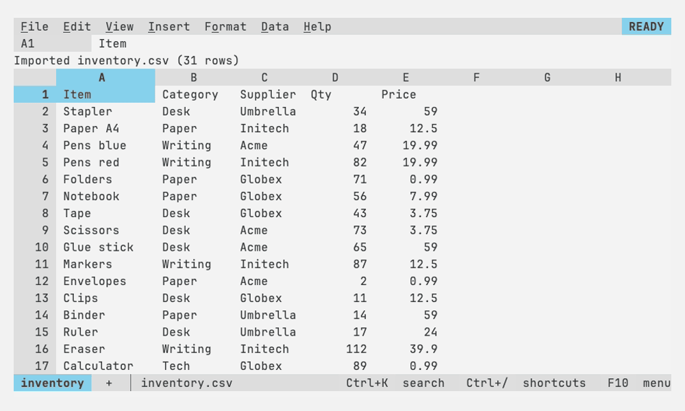

# Working with sheets

How to change what a sheet holds and how it looks, and the tools for
working with its data.

| Page | For |
|---|---|
| [Editing](editing.md) | Selecting, copy and paste, fill, undo, rows and columns, links |
| [Formatting](formatting.md) | Number formats, text styles, column and row formats, widths |
| [Sheets and tabs](sheets-and-tabs.md) | Several sheets: adding, moving, hiding |
| [Freeze, sort and filter](sort-filter.md) | Keeping headers on screen, sorting, filtering by values or conditions |
| [Find and replace](find-replace.md) | Searching one sheet, all of them or a range |
| [Conditional formatting and data validation](rules.md) | Coloring cells by their values; dropdowns, checkboxes and entry rules |
| [Pivot tables](pivots.md) | Summaries of a table on a sheet of their own, and frequency tables |
| [Notes and protection](notes-protection.md) | Notes on cells; ranges that warn before an edit |
| [Charts](charts.md) | Charts that float over the grid |
| [Macros](macros.md) | Recording and running what you do |
| [Locale](locale.md) | Decimal commas, date order, currency and `;` in formulas, as a country writes them |
