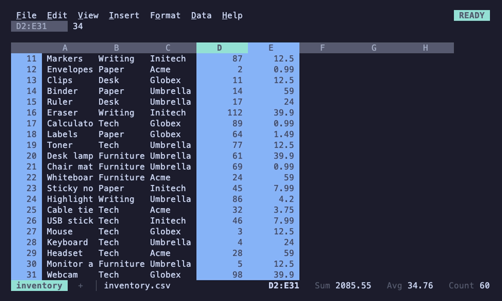

# Editing

## Selection

Shift+arrows, a mouse drag or Shift+click select a range; Ctrl+arrows jump
to the edge of the data (add Shift to select as you go); Ctrl+A selects the
data around the active cell, then everything; Ctrl+Space and Shift+Space
select whole columns and rows. The active cell stays distinct from the rest
of the selection, and the status line shows Sum, Avg and Count, dropping the
ones that don't fit on a narrow terminal.

## Copy, paste and fill

Ctrl+C, Ctrl+X and Ctrl+V work as in Sheets: relative references shift,
absolute ones don't, cut and paste moves cells and the formulas that point
at them follow. Ctrl+Shift+V pastes values only, keeping the destination's
formats.

Formats travel with the cells. A pasted or moved cell shows what its
source showed, whether the format was the cell's own or came from its
row, its column or the whole sheet, and pasting plain cells into a
currency column leaves them plain. Whole columns or rows (Ctrl+Space,
Shift+Space) copied and pasted at the top of a column, or the start of a
row, take their column or row formats along, so a pasted column is
currency all the way down, not only where it had data; cut and pasted,
they move them, leaving the source columns plain. Pasted anywhere else,
they paste as a block of the cells that hold something. A block cut and
pasted leaves the cells it came from plain, as Sheets does, even where
a formatted column or row crosses them. Vim's `yy` and `dd` copy whole
rows, so `p` and `P` bring their row formats along. Formulas reading
a column whose format changes, blank cells included, show the new format
at once (`=B5*2` shows currency when column B becomes currency). Copies also go to the
system clipboard as tab-separated text (OSC 52, so it works over SSH), and
pasting tab-separated or multi-line text from the terminal fills a block.

Ctrl+D and Ctrl+R fill down and right. The fill handle, shown when you hover
the corner of the selection, can be dragged to continue a series: 1, 2, 3;
2, 4, 6; Jan, Feb; Mon, Tue; dates by day or month; Item 1, Item 2. Ctrl+Enter
while typing enters the same entry into every selected cell.

## Undo

Ctrl+Z undoes and Ctrl+Y or Ctrl+Shift+Z redoes, 100 steps deep, across
every sheet: undo shows the sheet a step changed. Every change is covered:
typing, clearing, paste, fill, sort, insert and delete, formats, widths,
names, charts, freeze, filters, pivot tables, and adding, deleting,
renaming, moving and duplicating sheets. A multi-cell change is one step,
and the context line says what was undone, e.g. `Undid: clear B3:B5`.

## Rows and columns

Insert and delete rows and columns from the Insert and Edit menus, the
right-click menus, or Ctrl+Alt+= and Ctrl+Alt+- (rows, or columns when whole
columns are selected). Formulas, names, charts, filters and widths follow.
Widths and the formats of whole columns and rows are in
[formatting](formatting.md).

## Links

Cells that hold an `http`, `https` or `mailto` URL, and `=HYPERLINK(url,
[label])`, are terminal hyperlinks (OSC 8): Cmd- or Ctrl-click opens them in
terminals that support it.
