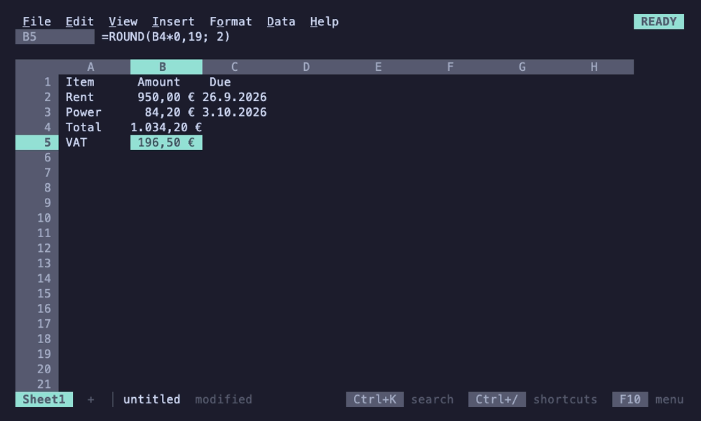

# Locale

A file's locale says how its numbers, dates, currency and formulas are
typed and shown, as File > Settings > Locale does in Google Sheets. In
German (Germany) a sheet shows `1.234,56 €` and `26.9.2026`, takes
`1,5` as a number, and formulas separate their arguments with `;`:
`=ROUND(A1*1,19; 2)`.

## Choosing one

File > Settings > Locale lists the locales with a sample of each; type
a language, country or tag to narrow it, Enter picks. The first entry,
Default, follows the [`locale` setting](../reference/config.md#locale),
which new sheets use and which reads `LC_ALL`, `LC_NUMERIC` or `LANG`
(`de_DE.UTF-8`) when nothing sets it. A locale picked here is saved in
the file, marks it modified and undoes with Ctrl+Z.

| Tag | Locale | Number | Date | Currency |
|---|---|---|---|---|
| `en-US` | English (United States) | 1,234.56 | 9/26/2026 | $1,234.56 |
| `en-GB` | English (United Kingdom) | 1,234.56 | 26/9/2026 | £1,234.56 |
| `en-CA` | English (Canada) | 1,234.56 | 2026-09-26 | $1,234.56 |
| `en-AU` | English (Australia) | 1,234.56 | 26/9/2026 | $1,234.56 |
| `de-DE` | German (Germany) | 1.234,56 | 26.9.2026 | 1.234,56 € |
| `de-CH` | German (Switzerland) | 1’234.56 | 26.9.2026 | CHF 1’234.56 |
| `fr-FR` | French (France) | 1 234,56 | 26/9/2026 | 1 234,56 € |
| `fr-CA` | French (Canada) | 1 234,56 | 2026-09-26 | 1 234,56 $ |
| `es-ES` | Spanish (Spain) | 1.234,56 | 26/9/2026 | 1.234,56 € |
| `es-MX` | Spanish (Mexico) | 1,234.56 | 26/9/2026 | $1,234.56 |
| `it-IT` | Italian (Italy) | 1.234,56 | 26/9/2026 | 1.234,56 € |
| `pt-BR` | Portuguese (Brazil) | 1.234,56 | 26/9/2026 | R$ 1.234,56 |
| `pt-PT` | Portuguese (Portugal) | 1 234,56 | 26/9/2026 | 1 234,56 € |
| `nl-NL` | Dutch (Netherlands) | 1.234,56 | 26-9-2026 | € 1.234,56 |
| `sv-SE` | Swedish (Sweden) | 1 234,56 | 2026-09-26 | 1 234,56 kr |
| `da-DK` | Danish (Denmark) | 1.234,56 | 26.9.2026 | 1.234,56 kr. |
| `nb-NO` | Norwegian (Norway) | 1 234,56 | 26.9.2026 | kr 1 234,56 |
| `fi-FI` | Finnish (Finland) | 1 234,56 | 26.9.2026 | 1 234,56 € |
| `pl-PL` | Polish (Poland) | 1 234,56 | 26.9.2026 | 1 234,56 zł |
| `cs-CZ` | Czech (Czechia) | 1 234,56 | 26.9.2026 | 1 234,56 Kč |
| `ru-RU` | Russian (Russia) | 1 234,56 | 26.9.2026 | 1 234,56 ₽ |
| `tr-TR` | Turkish (Türkiye) | 1.234,56 | 26.9.2026 | ₺1.234,56 |
| `ja-JP` | Japanese (Japan) | 1,234.56 | 2026/9/26 | ¥1,234.56 |
| `zh-CN` | Chinese (China) | 1,234.56 | 2026/9/26 | ¥1,234.56 |

Dates show day and month without leading zeros, as en-US's do, so most
fit a default column; ISO dates keep theirs. Spaces in numbers are
no-break spaces, so a number never breaks across lines; when typing
one, an ordinary space does.

## What follows the locale

- **Typing.** Numbers, percentages, currency and dates are read the
  locale's way: `1.234,5`, `12,5 %`, `12,50 €` and `26.09.2026` in
  German. A date of numbers follows the locale's order (day first in
  most of Europe, year first in Japan and Sweden); `2026-09-26`, month
  names in English (`26 Sep 2026`) and times (`14:30`) read the same
  everywhere. What isn't a value in the locale stays text: `$5` is text
  in German, `9/26/2026` in British English.
- **Showing.** Automatic and every number format use the locale's
  decimal and thousands separators. Currency, Date, Time and Date time
  (Format > Number) show the locale's symbol and order; a
  [custom format](formatting.md) keeps its own symbols and order, only
  its separators follow the locale, as in Sheets.
- **Month and day names.** `mmm`, `mmmm`, `ddd` and `dddd` in a format
  show the locale's language (`Sa 26. September` in German), in the
  form a date with its day takes where the language has one (Polish
  `26 września 2026`, but `wrzesień 2026`); `AM/PM` shows 午前 and 午後
  in Japanese and 上午 and 下午 in Chinese. A format tagged with a
  locale as Excel writes them (`[$-407]mmmm`) shows that locale's
  names. Dates typed with the locale's month names (`26. Okt. 2026`)
  are read as dates too.
- **Formulas.** Where the decimal separator is a comma, arguments are
  separated by `;` and the values of an array's row by `\`: `=IF(A1>1,5;
  "yes"; "no")`, `={1\2;3\4}`. Function names stay in English, as in
  Sheets. The formula bar, editing a cell and the function hints
  (`ROUND(value; [places])`) all use the locale's form, as do formulas
  in [conditional formatting, data validation](rules.md) and filter
  conditions. A formula that doesn't parse says so in the locale's
  syntax: `Expected ; or ) in ROUND`.
- **Filters and text conditions.** A filter's list of values shows them
  as the sheet does (`1.234,50`), and conditions on text (contains,
  starts with, is exactly) test the text the locale shows, in filters
  and conditional formats alike, so their values are kept as typed.
- **The clipboard and CSV files.** Copying writes numbers with the
  locale's decimal separator and pasting reads text the locale's way.
  CSV files are [read and written](../files/README.md) in the locale
  too.
- **The status line.** Sum and Avg of the selection.

## What doesn't

The file stores everything the same way in every locale, so a sheet
opens with the same values wherever it's opened: entries as typed in
en-US (`1,234.5`, `09/26/2026`, `=ROUND(A1*1.19, 2)`; see
[the file format](../files/format.md)). Switching the locale redraws
the sheet and changes no value. Functions compute the same everywhere
too: `VALUE("1,5")` and `TEXT(A1, "0.00")` read and write en-US's form
in any locale, and macros and their [API](../reference/macro-api.md)
set and read entries in en-US's form.

[Excel files](../files/excel.md) are downloaded with the locale's
Currency, Date, Time and Date time formats, tagged with it as Excel
writes them (`#,##0.00\ [$€-407]`, `[$-407]d.m.yyyy`), so Excel shows
them as the sheet does. Opened in a sheet of the same locale they are
those formats again; in another they keep their symbol and order as
custom formats.
