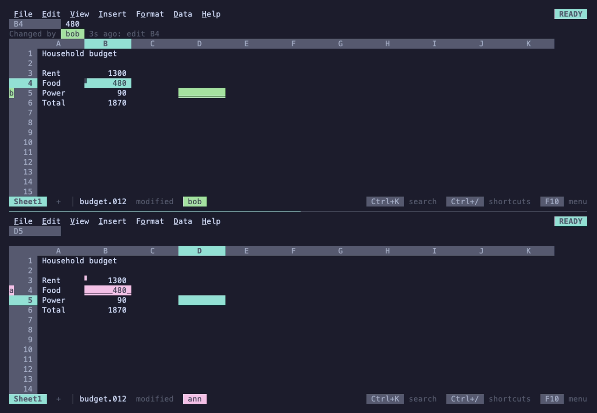

# Serving over SSH

`012 serve` runs an SSH server that gives every session its own 012, in
the client's own terminal, on the files of one directory. It's for
reaching your sheets from another machine or a tablet with an SSH app,
without installing anything there, and for working on one workbook
together: sessions that open the same file share it, each with its own
cursor, and every change reaches the others as it's made
([Sharing a workbook](#sharing-a-workbook)).

```sh
012 serve ~/sheets                 # serve ~/sheets on 127.0.0.1:2312
ssh -p 2312 localhost              # from this machine, on a new sheet
ssh -t -p 2312 localhost budget.012   # opening budget.012 from ~/sheets
ssh -t -p 2312 localhost @standup     # joining the named room standup
```

A file name after the host opens that file, as `012 budget.012` does
locally: a `.012` sheet, a new sheet to be saved under that name when
there's no such file, or a file to import (`data.csv`). A name starting
with `@` joins a named room instead. It must be one word (quote a name
with spaces twice: `ssh -t host "'my book.012'"`) and needs `-t`, since
ssh only asks for a terminal on its own when there's no command.

```
012 serve [--listen addr] [--authorized-keys file] [--host-key file]
          [--idle-timeout 30m] [--max-sessions 8] [--share edit|view|off]
          [--log file] [--otlp url] [dir]
```

| Flag | Default | What |
|---|---|---|
| `dir` | `.` | The served directory. Sessions open, save, import and download only inside it |
| `--listen` | `127.0.0.1:2312` | Address to listen on. Loopback only unless you change it |
| `--authorized-keys` | `~/.ssh/authorized_keys` | Public keys allowed in, in OpenSSH's format |
| `--host-key` | `<config dir>/012/ssh_host_ed25519_key` | The server's key, generated on first run |
| `--idle-timeout` | `30m` | End a session after this long without input, keeping its unsaved changes; `0` never does |
| `--max-sessions` | `8` | Sessions at once; more are turned away with a message |
| `--share` | `edit` | Sessions opening the same file share it: `edit`, everyone edits; `view`, one writes and the others follow; `off`, each session gets a copy of its own |
| `--log`, `--otlp` | off | Telemetry, as for the app ([Observability](../contributing/observability.md)) |

The config directory is `os.UserConfigDir()`: `~/Library/Application
Support` on macOS, `~/.config` on Linux. On start, 012 prints the served
directory, the address, the host key's fingerprint and the command to
connect.

## Setup

1. Put the public keys that may connect in an authorized_keys file. Your
   own `~/.ssh/authorized_keys` works, or keep a separate one for 012:

   ```sh
   cat ~/.ssh/id_ed25519.pub > ~/.config/012/authorized_keys
   chmod 600 ~/.config/012/authorized_keys
   012 serve --authorized-keys ~/.config/012/authorized_keys ~/sheets
   ```

2. Connect with `ssh -p 2312 host`. The first time, check the host key
   fingerprint ssh shows against the one 012 printed, or add the key to
   `known_hosts` yourself from `ssh_host_ed25519_key.pub` next to it.

3. To reach it from another machine, prefer keeping 012 on loopback and
   tunnelling through the machine's own sshd
   (`ssh -L 2312:127.0.0.1:2312 host`, then `ssh -p 2312 localhost`), or
   a private network such as Tailscale with `--listen 100.x.y.z:2312`.
   Listening beyond loopback prints a warning.

Stop the server with Ctrl+C. Running sessions end with it, keeping
their unsaved changes (see [Unsaved work](#unsaved-work)).

## Security model

The server exposes the files of one directory to whoever holds one of
the authorized keys. Everything else is closed.

- **Authentication.** Public keys only, checked against the
  authorized_keys file, which is read again on every login so edits
  apply at once. No passwords, no keyboard-interactive, no certificates.
  The file must not be writable by group or others, as with sshd's
  `StrictModes`. Keys carrying options 012 can't honor (`command=`,
  `from=`, `no-pty`, `restrict` without `pty`, `expiry-time=`,
  `cert-authority` and so on) are skipped, so a key restricted to, say,
  a backup command never gets a spreadsheet. The user name is logged but
  not checked.
- **Host key.** An ed25519 key generated on first run, written `0600`
  in a `0700` directory. 012 refuses to start if the key is readable by
  others.
- **What a session can do.** Run 012, nothing else; no command is
  executed, unless the server's config turns on notebooks' nushell
  cells (see [Notebooks](#notebooks)). A shell request starts 012 on a new sheet. An exec request
  is accepted only with a terminal (`ssh -t`) and only when it is one
  word, which is taken as a file name and never run: it resolves inside
  the served directory like a name typed in File > Open, and anything
  that doesn't (see Files below), or holds control characters, ends the
  session with the reason before 012 starts. Other exec requests
  (`ssh host cat /etc/passwd`, `ssh -t host sh -c id`, any exec without
  a terminal) are refused, as are subsystems (`sftp`, `scp`), local and
  remote port forwarding and X11; agent forwarding requests are
  accepted by the SSH library but never used. A shell without a
  terminal is told to use `ssh -t` and closed.
- **Files.** Names typed in File > Open, Save as, Import and Download,
  and a file name given on the ssh command line, resolve inside the
  served directory. Refused, with "outside the served directory":
  absolute paths, `..` that climbs out, hidden files and directories
  (`.env`, `.git`, `.ssh`, `.012-recovery`), and symbolic links that
  lead outside or nowhere. Links that stay inside work. Error messages
  name files relative to the served directory, not where it is on the
  server. Files are written with the server's user and permissions;
  recovery files are the one thing 012 writes that no one named, always
  in `.012-recovery/` (see [Unsaved work](#unsaved-work)).
- **JEV.** On only when the server process's own environment has
  `TYPESAFE_API_KEY`; sessions never read `.env` files. Every session
  has its own answer cache, and all of them spend the server's key.
- **Logs.** Logins, rejected keys, failed handshakes, sessions turned
  away and session ends go to stderr and to telemetry as `ssh.*` events
  with the user name, the key's SHA256 fingerprint and the remote
  address, never file contents or cells.

| Event | When | Attributes |
|---|---|---|
| `ssh.session` | a session starts | `user`, `key`, `remote`, `term`, `width`, `height`, `file` (a file was named on the command line; the name isn't logged) |
| `ssh.session_end` | it ends | `user`, `key`, `remote`, `duration`, `idle` (closed for idling), `stopped` (the server stopped), `recovered` (unsaved work was kept) |
| `ssh.rejected` | a key not in authorized_keys | `user`, `key`, `remote` |
| `ssh.full` | a session turned away at `--max-sessions` | `user`, `key`, `remote` |
| `ssh.failed` | a handshake or login fails | `remote`, `error` |
| `ssh.auth_error` | authorized_keys can't be read or parsed | `error` |

The `frames` summaries and the `ssh_sessions` gauge cover every session
together: telemetry is per process.

What it doesn't protect against: someone who can already write to the
served directory on the server (a symbolic link swapped in between the
check and the open), and anything a holder of an authorized key does
with the files they're given.

## Sharing a workbook

Sessions that open the same file (by any name that leads to it) are in
one room, and so are those joining the same named room (`@standup`,
which starts as a new sheet until someone saves it under a name). A
room is one workbook the server holds: every session sees every change
as it's made, whoever made it, while keeping its own cursor, scroll,
selection, sheet shown, theme and modes. A session on a new sheet or an
imported file has a workbook of its own until it's saved and opened
again.



**Who is where.** Each other person in the room has a color: their
pointer's cell is drawn in it, double-underlined, their initial is on
that row's header, and their name is on the status line. A cell someone
else changed in the last 30 seconds has a `▘` in its corner, and the
context line on it says who changed it and how; on someone's pointer it
says who is there, and whether they're typing. **File > Who's here**
lists everyone with the cell they're on, and picking one goes there.

**Editing together.** Everyone edits (with `--share edit`). The server
takes each session's keys and clicks in turn, so every change is made
whole, in one order, through the one path every change takes in 012:
two entries in one cell leave the later one, and the one who typed
over the other's change is told, as is the one typing while someone
else changed the cell.

**Undo is yours.** Ctrl+Z takes back your own latest change, even when
others changed other cells since: theirs stay. When someone changed the
same cells after you (the same cells, widths, formats, names or rules,
or rows and columns inserted or deleted on that sheet, or any change to
the list of sheets), undo refuses and says who: take back yours by
hand, or ask them. Redo is yours on the same terms. Formulas that read
a cell you undid recalculate as usual.

**One writer.** With `--share view`, the first in a room writes and
the others follow: they move, scroll, select, copy and look around as
they like, but can't change the workbook, and the status line says who
writes. The writer hands writing over with **File > Hand over writing**;
when the writer leaves, whoever has been there longest writes.

**Saving is the room's.** Any session saves the one workbook to its
file, and the others' `modified` clears with it. Quitting while others
are in the room asks nothing: they still have the workbook. The last
one to leave is asked about unsaved changes as in a local 012, and the
last session to end without quitting keeps them (see
[Unsaved work](#unsaved-work)).

**What runs is the room's.** Files linked to the workbook are followed
once for everyone, and notebook cells run once: any session may run or
stop them, everyone sees them running and their outputs, and they go on
when the one who started them leaves, until the last one does.

## Each session

Besides the shared workbook, every session is a separate 012 with
nothing shared but the process: its own cursor and selection, undo of
its own changes, clipboard, theme, JEV cache and terminal state. What
it learns about the terminal comes from the client: the window size and
its changes, the colors (from the `TERM` the client sends), the light or
dark background, kitty or sixel graphics, and the clipboard, which
Ctrl+C sets on the client's machine through OSC 52.

[Macros](../sheets/macros.md) can be recorded, run, renamed and deleted in a
session, but not edited as scripts: that would start an editor on the
server. A file's macros ask for trust once per session, since the
session isn't the server's own computer, and scripts have no file,
network or clock access in any case. A macro running in a shared
workbook is one change: the others' keys wait until it ends.

## Notebooks

A session opens [notebooks](../nushell/notebooks.md) and shows their
cells and saved outputs, but runs none of their cells: a cell is a
program on the server, with the server's user and every file it can
reach, well beyond the served directory. `serve-shell = on` in the
server's config lets sessions run them, as the user 012 serve runs as,
following the `shell` option as the local app does; a file's cells still
ask once per session before they run. Only turn it on when everyone holding an
authorized key may run programs on the server. The same setting decides
whether nu is started to [highlight and check](../nushell/notebooks.md#writing-a-cell)
the cell being written; without it, 012's own highlighting answers.

## Unsaved work

A session that ends without the user quitting, because it was idle for
`--idle-timeout`, because the server is stopping (Ctrl+C, SIGTERM), or
because 012 [stopped on an internal error](../files/saving.md#if-012-crashes)
(whose report goes to the server's log), keeps its unsaved changes: the whole workbook is written to
`.012-recovery/<name>-<time>.012` in the served directory, and the
client's terminal is told where before the connection closes:

```
012: closed after 30m0s without input
012: unsaved changes kept in .012-recovery/budget-20260927-140203.012; open budget.012 again to restore them
```

The next session opening `budget.012` (from File > Open or
`ssh -t host budget.012`) asks on the context line: Enter restores them
as unsaved changes to `budget.012`, D deletes them, Esc leaves them for
next time. Saving a restored workbook removes its recovery file, and
saving over a file that changed on disk still asks first. A sheet never
saved is kept as `(untitled)-<time>.012` and offered when a session
starts on a new sheet.

In a shared workbook, only the last session in the room keeps them:
one that ends while others remain leaves the workbook to them, and says
so when it idled out. Restoring kept changes opens the room again on
them, once nobody else is in it.

It stays small: nothing is kept for a workbook without changes or with
no cells, and only the newest three files per name are kept. The
directory is created `0700` and its files `0600`, and it's hidden, so no
name typed in a session reaches it; only 012 itself reads and writes
it. A session whose client just goes away (a dropped connection)
keeps nothing, and neither does quitting, which asks about unsaved
changes as the local app does.

## Files changed elsewhere

Saving over a file that changed on disk since it was opened or last
saved (another program wrote it, or a session with `--share off`) asks
first on the context line: Enter overwrites it, S saves under another
name, Esc cancels. The same check protects the local app from other
programs writing the file.

## Limits

- An idle session is closed without saving over its file; unsaved
  changes go to a recovery file instead.
- A dropped connection loses unsaved changes, unless others share the
  workbook.
- Sessions in one room take turns: a long change (a sort of a million
  rows, a macro) makes the others wait for it.
- Each session holds its screen's buffers, about a megabyte, plus the
  sheets it opens; sessions sharing a file hold one workbook between
  them. A change reaches the others' screens within a frame. Fifty
  sessions typing at once get their frames as fast as ten do: see
  [Bounds of support](../contributing/limits.md#serving-over-ssh) for
  the measurements.
