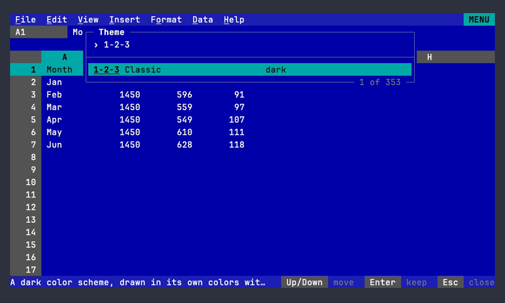

# Themes

A theme is a terminal color scheme: the 16 ANSI colors plus a background,
a foreground and a selection color, the same shape Ghostty, kitty, iTerm2,
Alacritty and VHS themes have. 012 has no theme format of its own to learn:
any scheme works, and so does any Ghostty theme file.

```
# ~/.config/012/config
theme = terminal                                   # the default
theme = Dracula                                    # one scheme
theme = light:Catppuccin Latte,dark:Catppuccin Mocha  # follow the terminal
```

- **`terminal`** (the default) draws with the terminal's own palette, as
  ANSI color numbers, with a dark and a light variant picked from the
  terminal's background. It looks the way your terminal is set up.
- **Any other name** is a color scheme. 012 draws its roles in the
  scheme's colors (true color), fills the whole screen with the scheme's
  background, and draws the menu bar, the column headers and the status
  line as solid bands, in the manner of 1-2-3 and classic terminal
  programs. The terminal's own palette is never changed.
- **`light:A,dark:B`** picks A on a light terminal and B on a dark one,
  and switches when the terminal does (for example with the system's
  appearance, in terminals that report it).

File > Settings > Theme opens a picker: type to search the names. A
search starting with "dark" or "light" lists only the schemes of that
kind (by `meta.isDark`, so "light" leaves out dark schemes such as Bright
Lights), the rest of it searching their names: "light sol" finds
Solarized Light. The highlighted theme is drawn live, Enter keeps it and
writes `theme = ...` to the config file, and Esc goes back to the theme you
had. With a `light:`/`dark:` pair, the picker changes the one in use.
`012 config themes` lists every theme, with a `*` on the current one.



## Built-in schemes

012 embeds the 348 schemes of [VHS](https://github.com/charmbracelet/vhs)
(Dracula, Nord, Gruvbox, Catppuccin, Solarized, Tokyo Night, One Dark,
Rose Pine and hundreds more), so names are the ones VHS's `Set Theme`
takes, plus **1-2-3 Classic**: CGA colors on a blue screen. Names match
without regard to case, and then without regard to spaces, hyphens and
underscores, so `tokyo-night` finds `TokyoNight`.

## Your own schemes

Put a file in the `themes` directory next to the config file
(`~/.config/012/themes/` on Linux; `012 config path` shows where the
config is) and use its file name as the theme. A file with a built-in's
name replaces it. Three formats are read:

- **Ghostty** (copy any Ghostty theme unchanged):

  ```
  palette = 0=#1d1f21
  palette = 1=#cc6666
  # ... through 15
  background = #1d1f21
  foreground = #c5c8c6
  selection-background = #373b41
  ```

- **kitty**: `color0 #1d1f21` through `color15`, `background`,
  `foreground` and `selection_background`.
- **VHS JSON**: one scheme or a list, with `black` ... `brightWhite`,
  `background`, `foreground`, `selection` and `meta.isDark` (a `.json`
  file; `purple` and `selectionBackground` are accepted too).

A scheme needs a background and a foreground; ANSI colors it leaves out
are xterm's. Other keys (fonts, cursor colors) are ignored.

## How roles get their colors

Every role in `internal/ui/theme` (the cell pointer, selection, headers,
menus, errors, links, chart series and so on) is defined on the ANSI
colors and the background and foreground: the pointer is black on cyan,
headers are bright white on bright black (black on white on light
terminals), errors are red. The terminal theme sends those color numbers;
a scheme replaces each with its own color. Then, so every scheme reads
well:

- the selection uses the scheme's selection color, when it has one;
- the menu bar and status line are the background moved 12% toward the
  text color; the column header row is filled with the header color;
- a background role too close to the screen's background is moved apart;
- text below its contrast minimum against its background (WCAG 4.5:1 for
  text, 3:1 for hints, lines and chart axes, 2:1 for unavailable items)
  is moved toward the scheme's text color, or toward black or white, just
  far enough to reach it.

A test runs every built-in scheme through this and checks those minimums
for cell text, text on the bars, the selection, the headers and every
other role (`TestEveryThemeReadable`). Charts, as text and as kitty
images, use the scheme's colors too.

Conditional formats ([data.md](../sheets/rules.md#conditional-formatting)) name
their colors (red, yellow, green, cyan, blue, magenta) rather than
giving RGB, and each is an ANSI slot, so they follow the theme too: a
text color is the slot on the cell (`RuleText`), a fill the slot as a
background with black or bright white text, whichever reads better
(`RuleFill`), and a text color on a fill (`RuleOn`) takes the fill's
ink where it wouldn't read on it. These roles are corrected and checked
like the others, and the terminal theme's are checked against the two
reference palettes. A color scale blends the slots of its points, the
scheme's colors or the terminal's own (asked for with OSC 4 at startup,
xterm's when it doesn't answer), in 32 shades between two points; text
on a shade is the scheme's text or background color (the terminal's
bright white or black), whichever reads better, or pure black or white
where neither reaches 4.5:1. A test checks the shades of every pair of
colors under every scheme.

The roles for the bars are `MenuBarRow`, `FormulaBarRow`, `ContextRow`,
`ColumnHeaderRow` and `StatusBarRow` (a background and a text color for
the whole line, out to the terminal's edge, under overlays too), with
`RowHeader` for the row numbers and `Screen` for everything else. The
terminal theme leaves them empty, so it looks as it always has.

## Credits

The built-in schemes are VHS's `themes.json` (MIT License, Copyright (c)
2022-2023 Charmbracelet, Inc.; see [NOTICE](../../NOTICE)), which credits
each scheme's authors in its `meta.credits`. The contrast correction is
adapted from the theme package of puzzletea, by the same author.
